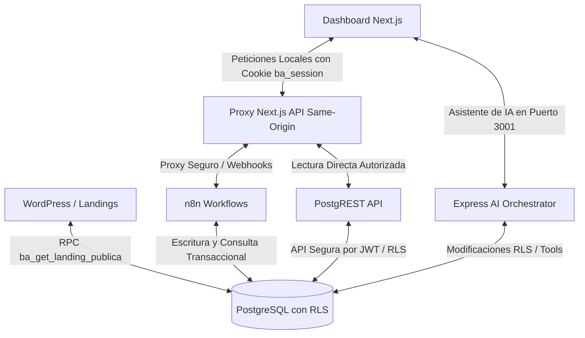
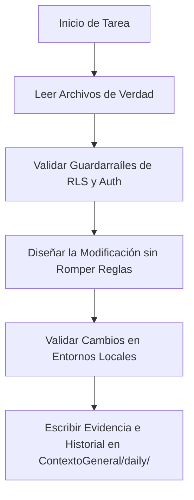

# BarberAgency - Documento Maestro del Workspace

Este archivo centraliza el contexto, arquitectura, guardarraíles, comandos, variables de entorno y flujos de trabajo de los dos repositorios que componen la plataforma **BarberAgency**: un SaaS multi-inquilino (*multi-tenant*) para la gestión de barberías.

---

## 📖 1. Visión General del SaaS

**BarberAgency** es una plataforma SaaS multi-tenant diseñada para permitir a los dueños de barberías automatizar la captación de clientes, reservas de turnos, recordatorios y la administración de sus negocios (barberos, servicios, horarios, finanzas e inventario).

### Componentes Clave:
*   **Base de Datos Relacional**: PostgreSQL con políticas de seguridad estricta a nivel de fila (RLS).
*   **Capa de API Declarativa**: PostgREST, que expone de forma directa y segura la estructura DB.
*   **Automatización de Negocio**: n8n, encargado de gestionar los webhooks y lógica pesada.
*   **Panel Administrativo**: Dashboard interactivo para dueños y barberos desarrollado en Next.js (App Router).
*   **Landing Pages y Reservas**: Sitios web autogenerados con WordPress y plantillas HTML dinámicas.
*   **Orquestador de Agentes de IA**: Servidor Express para ejecutar tareas complejas en lenguaje natural estructurado.

---

## 🗺️ 2. Mapa y Roles de los Repositorios

El workspace está dividido en dos repositorios hermanos:

```txt
~/github/
├── barberagency-core/       # Core, Base de Datos, n8n, Agentes de IA y Templates
└── panel_de_barberia/       # Dashboard administrativo en Next.js
```

### [barberagency-core](file:///root/github/barberagency-core) (El Backend e Inteligencia)
*   **Rol**: Administra la persistencia de datos (PostgreSQL), la lógica automatizada (n8n), las plantillas de landing pages y el sistema de agentes de IA.
*   **Core Tecnológico**: Node.js/Express, PostgreSQL, n8n, OpenRouter API y plantillas de diseño.

### [panel_de_barberia](file:///root/github/panel_de_barberia) (El Panel Operativo)
*   **Rol**: Interfaz de usuario donde los clientes del SaaS configuran su barbería, editan la landing page visualmente, gestionan las citas del día, controlan las finanzas y el inventario.
*   **Core Tecnológico**: Next.js 16 (App Router), React 19, TypeScript, Tailwind CSS v4, Lucide React.

---

## 📐 3. Arquitectura General y Flujo de Datos

El flujo de interacción entre los componentes sigue una arquitectura desacoplada y orientada a eventos/servicios, donde **PostgreSQL** es el único punto de verdad inalterable.



### Flujos Clave:
1.  **Hidratación del Panel**: El Dashboard consulta al Proxy de Next.js (`/api/dashboard/state`), el cual valida al usuario a través de `/api/session/me` e interroga a PostgreSQL para recuperar las citas, barberos y configuraciones correspondientes únicamente al tenant autenticado.
2.  **Agendamiento de Turnos**: El cliente final interactúa con la landing pública en WordPress, consulta slots disponibles a través del webhook `/reservas/slots` de n8n y reserva usando `/reservas/create`. n8n valida la disponibilidad en PostgreSQL e inserta la cita de forma atómica.
3.  **Publicación de Sitios**: El dashboard actualiza el perfil público en el editor visual (`/api/editor/publish`) e impacta sobre PostgreSQL. WordPress usa la función nativa `ba_get_landing_publica(slug)` para reflejar el cambio inmediatamente.

---

## 🛡️ 4. Reglas Críticas y Guardarraíles (*Guardrails*)

> [!IMPORTANT]
> Todo desarrollo en BarberAgency debe alinearse estrictamente con estas directrices para evitar brechas de seguridad o caídas del servicio.

*   **Aislamiento Multi-Tenant Absoluto**: 
    *   Cualquier consulta y operación de escritura en base de datos debe filtrar estrictamente usando `barberia_id`.
    *   No se debe saltar o eludir en ningún caso las políticas de seguridad **RLS (Row Level Security)** en PostgreSQL.
*   **Autoridad de Identidad**:
    *   La cookie `ba_session` (JWT) es la única autoridad de sesión.
    *   `localStorage`, `sessionStorage`, `query params` o `slugs` **NUNCA** se deben usar para conceder accesos o autorizar privilegios.
*   **Validación Anti-solapamiento de Turnos**:
    *   Las citas no se pueden cruzar para un mismo barbero.
    *   Se debe validar que toda cita caiga dentro del rango activo de los `horarios` configurados para el barbero.
*   **Bypass de Proxy Prohibido**:
    *   El frontend del Dashboard no debe invocar directamente webhooks de n8n privados ni funciones RPC de base de datos. Toda comunicación pasa por el Same-Origin Proxy de Next.js (`/api/...`).
*   **Códigos de Respuesta en n8n**:
    *   `201` -> Éxito de creación.
    *   `409` -> Conflicto de solapamiento de horario (citas duplicadas/clash).
    *   `400` -> Fallo de validación de datos.

---

## 📁 5. Estructura de Carpetas Importante

### [barberagency-core](file:///root/github/barberagency-core)
*   **[agentes/js/](file:///root/github/barberagency-core/agentes/js)**: Contiene la lógica del orquestador de agentes de IA.
    *   [server.js](file:///root/github/barberagency-core/agentes/js/server.js): Entry point Express (Puerto 3001).
    *   [jefe.js](file:///root/github/barberagency-core/agentes/js/jefe.js): Ruteador y selector de agentes (`decidePlan()`).
    *   [agentManager.js](file:///root/github/barberagency-core/agentes/js/agentManager.js): Motor de ejecución secuencial con auto-stop inteligente.
    *   [loadMasterContext.js](file:///root/github/barberagency-core/agentes/js/loadMasterContext.js): Carga la documentación técnica como contexto de sistema.
    *   [tools.js](file:///root/github/barberagency-core/agentes/js/tools.js): Herramientas permitidas para los agentes (`createFile`, `runSQL`, `callAPI`).
*   **[ContextoGeneral/](file:///root/github/barberagency-core/ContextoGeneral)**: Carpeta raíz de reglas, habilidades y especificaciones.
    *   **[ContextoGeneral/skills/](file:///root/github/barberagency-core/ContextoGeneral/skills)**: Archivos `.md` que configuran la especialización de los agentes (`arquitecto`, `backend`, `database`, `frontend`). *Nota: Existe una discrepancia donde el código busca los agentes en `/agentes/skills/`, lo cual requiere especial atención al configurar/ejecutar el backend.*
    *   **[ContextoGeneral/rules/](file:///root/github/barberagency-core/ContextoGeneral/rules)**: Reglas globales del sistema.
    *   **[ContextoGeneral/docs/](file:///root/github/barberagency-core/ContextoGeneral/docs)**: Documentos de verdad, contratos de endpoints y especificaciones de base de datos.
*   **[app/database/](file:///root/github/barberagency-core/app/database)**: Esquemas SQL y migraciones de PostgreSQL.
*   **[project/templates/](file:///root/github/barberagency-core/project/templates)**: Código de plantillas base de landing pages y editores CSS.

### [panel_de_barberia](file:///root/github/panel_de_barberia)
*   **[src/app/](file:///root/github/panel_de_barberia/src/app)**: Enrutado dinámico en base al App Router.
    *   `api/session/me/` y `api/dashboard/state/`: Endpoints de sesión e hidratación canónicos.
    *   `citas/`, `barberos/`, `clientes/`, `servicios/`, `configuracion/`: Páginas del panel de control.
*   **[src/components/](file:///root/github/panel_de_barberia/src/components)**: Componentes visuales modulares del dashboard.
*   **[docs/](file:///root/github/panel_de_barberia/docs)**: Análisis, bugfixes y bitácoras de cambios visuales.

---

## 🚦 6. Comandos Útiles por Repositorio

### [barberagency-core](file:///root/github/barberagency-core)
```bash
# Instalar dependencias del orquestador
npm install

# Iniciar el servidor Express de agentes de IA
node agentes/js/server.js

# Probar la API de agentes con script de prueba
node agentes/js/testAgent.js
```

### [panel_de_barberia](file:///root/github/panel_de_barberia)
```bash
# Instalar dependencias del dashboard
npm install

# Ejecutar el servidor de desarrollo local
npm run dev

# Ejecutar el linter estricto de código
npm run lint

# Validar la compilación para producción (Build)
npm run build
```

---

## 🔑 7. Variables de Entorno Esperadas

### Backend / Core (`barberagency-core`)
El backend utiliza las siguientes variables, usualmente declaradas en el entorno del proceso o un archivo `.env`:
*   `OPENROUTER_API_KEY`: API Key oficial para consultar los modelos de OpenRouter (`openai/gpt-4o-mini` y `openai/gpt-4o`).

### Dashboard (`panel_de_barberia`)
Definidas en el archivo `panel_de_barberia/.env.local` usando como guía el archivo [panel_de_barberia/.env.local.example](file:///root/github/panel_de_barberia/.env.local.example):
*   `NEXT_PUBLIC_API_BASE_URL`: URL del backend de la aplicación.
*   `NEXT_PUBLIC_APP_URL`: URL base del dashboard.
*   `SESSION_ME_ENDPOINT`: Endpoint interno del proxy para autenticación (`/api/session/me`).
*   `DASHBOARD_STATE_ENDPOINT`: Endpoint para la carga de datos estructurados de la barbería.
*   `POSTGREST_URL`: Dirección de comunicación con la capa PostgREST.

---

## 🤖 8. Flujo de Trabajo Recomendado para Agentes de IA

Si eres un agente de IA operando en BarberAgency, sigue este flujo riguroso antes de cualquier acción:



### Archivos de Lectura Obligatoria (Antes de modificar código):
1.  **[BARBERAGENCY_MASTER.md](file:///root/github/barberagency-core/BARBERAGENCY_MASTER.md)** (Este documento).
2.  **[CLAUDE.md](file:///root/github/barberagency-core/CLAUDE.md)** en `barberagency-core/`.
3.  **[FuenteDeVerdad_PRODUCCION.md](file:///root/github/barberagency-core/ContextoGeneral/docs/FuenteDeVerdad_PRODUCCION.md)**: El manifiesto del PostgreSQL como fuente única de verdad.
4.  **[FuenteDeVerdad_ENDPOINTS_CANONICOS.md](file:///root/github/barberagency-core/ContextoGeneral/docs/FuenteDeVerdad_ENDPOINTS_CANONICOS.md)**: Matriz que indica qué rutas son válidas, duplicadas o riesgosas.

### Cosas que NO se deben modificar sin autorización expresa:
1.  **El esquema base de PostgreSQL**: No modifiques tipos, triggers, ni constraints de citas sin antes validar el impacto total en los webhooks de n8n.
2.  **El sistema de Cookies/Sesiones (`ba_session`)**: El mecanismo de descifrado y validación de seguridad de Next.js Same-Origin Proxy debe permanecer intacto.
3.  **El diseño "Header Glass"**: Las propiedades CSS de glassmorphism y elementos interactivos del menú superior de navegación pública no deben ser alterados.
4.  **Logotipo del SaaS**: Los logos, paletas de colores corporativos e isotipos en SVG o png deben preservarse.
5.  **Temas Claro / Oscuro**: El soporte dual de renderizado de las plantillas públicas no debe romperse al modificar las variables CSS del proyecto.

---

## 📋 9. Contexto Especial y Pendientes Técnicos Actuales

### Estética Especial de BarberAgency
*   **Header Glass**: La cabecera superior del sitio usa un efecto translúcido ("glass") que es la identidad de marca.
*   **Soporte de Color**: Las plantillas deben soportar esquemas de modo claro (`light`) y oscuro (`dark`) sin perder accesibilidad.
*   **Fidelidad de Datos**: El dashboard debe cargar y sincronizar de forma impecable las barberías asociadas al usuario, servicios y horarios. Las URLs públicas generadas y los códigos QR de acceso dinámico deben responder al slug configurado en base de datos.

### ⚠️ Pendientes Técnicos / Deuda de Arquitectura Identificada:
1.  **Discrepancia en la Carga de Skills de Agentes**:
    *   La base de código en [agentManager.js](file:///root/github/barberagency-core/agentes/js/agentManager.js) y [loadMasterContext.js](file:///root/github/barberagency-core/agentes/js/loadMasterContext.js) busca archivos `.md` de habilidades en la carpeta `/agentes/skills/` (la cual no existe). Actualmente residen únicamente en [ContextoGeneral/skills/](file:///root/github/barberagency-core/ContextoGeneral/skills). Se requiere crear un enlace simbólico (symlink) o actualizar las rutas relativas de carga en JS.
2.  **Seguridad en Ventas y POS**:
    *   El endpoint proxy de POS `/api/pos` (definido en `_work_panel_de_barberia/src/app/api/pos/route.ts`) se encuentra marcado como **RIESGOSO** ya que realiza un bypass de verificación de la cookie de sesión `ba_session`. Debe ser securizado con validación JWT rigurosa.
3.  **Remoción de Endpoints Duplicados**:
    *   El endpoint `/api/auth/login` debe ser removido de forma definitiva en favor de la ruta oficial y canónica `/api/session/login`.
4.  **Consolidación de Escrituras Legacy**:
    *   Varias llamadas RPC directas en base de datos (como `ba_sync_registro_collections`, `ba_sync_registro_horarios`, `ba_publicar_barberia` y `ba_publicar_landing_completa`) son de tipo **LEGACY** y deben reemplazarse a medio plazo por las llamadas canónicas a través del proxy de Next.js y los flujos integrados de n8n.
5.  **Endpoints de Productos e Inventarios**:
    *   Las rutas `/api/productos` y `/api/gastos` se encuentran planificadas en el *roadmap* técnico pero actualmente están pendientes de implementación completa y validación transaccional.
