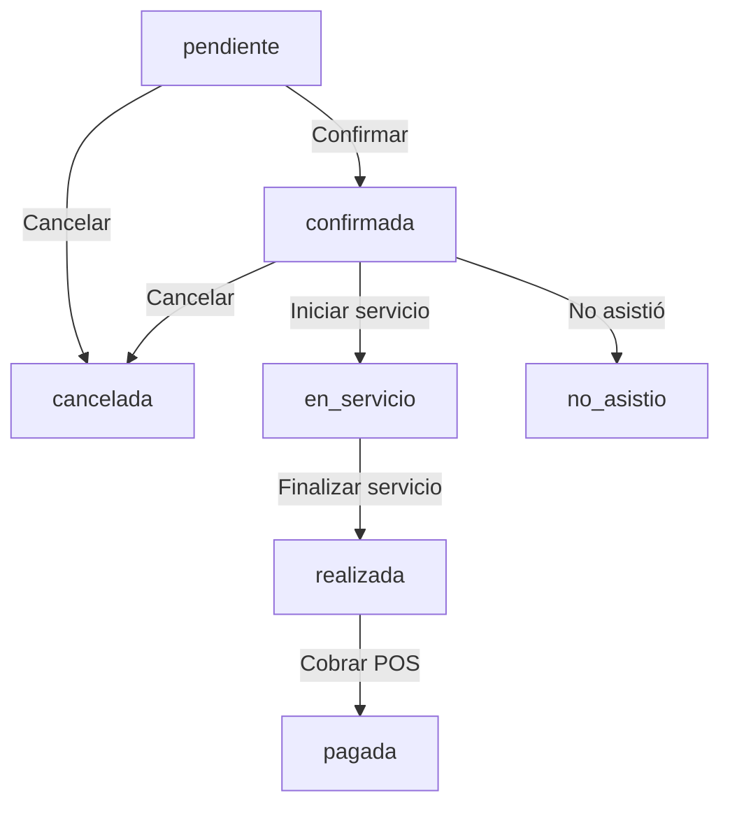

# Reporte de Implementación POS — Cobro Solo Después de Servicio Realizado

**Fecha:** 2026-07-23  
**Implementador:** Arquitecto Senior de Software / Desarrollador Full-Stack  
**Rama:** `fix/pos-charge-only-after-service`  
**Estado:** `COMPLETADO Y VERIFICADO`  

---

## 1. Causa del Problema
Anteriormente, el módulo POS y la ruta proxy `/api/pos` permitían procesar el cobro de citas que estuvieran en estado `'confirmada'` o `'pendiente'`. Asimismo, el workflow de n8n ejecutor ejecutaba un `ON CONFLICT (cita_id) DO UPDATE`, lo que permitía modificar y sobreescribir silenciosamente cobros previos ya registrados.

Adicionalmente, la función de trigger de base de datos `public.fn_citas_set_y_validar()` restringía los estados de cita únicamente a `('confirmada', 'pendiente', 'cancelada')`, impidiendo el registro de estados intermedios del ciclo de vida del servicio (`en_servicio`, `realizada`, `pagada`, `no_asistio`).

---

## 2. Comportamiento Anterior vs Nuevo Comportamiento

| Aspecto | Comportamiento Anterior | Comportamiento Nuevo |
| :--- | :--- | :--- |
| **Condición de Cobro** | Permitía cobrar citas en `confirmada` o `pendiente`. | **ÚNICAMENTE** permite cobrar citas en estado **`realizada`** sin pago previo. |
| **Doble Cobro / Re-pago** | Permitía sobreescribir silenciosamente un pago con `ON CONFLICT DO UPDATE`. | **Rechaza** cualquier segundo cobro con HTTP 409 `code: cita_ya_pagada`. |
| **Transición de Estado** | La cita permanecía en `confirmada` tras cobrarse. | La cita transiciona de forma **atómica** a **`pagada`** en la misma transacción SQL. |
| **Aislamiento Multi-tenant** | Comprobaba pertenencia básica pero sin bloqueo pesimista. | Bloqueo pesimista `FOR UPDATE` y validación estricta de `barberia_id`. |
| **Interfaz Citas (Frontend)** | No mostraba flujo de transición de estados por servicio. | Muestra ciclo completo: `pendiente` $\rightarrow$ `confirmada` $\rightarrow$ `en_servicio` $\rightarrow$ `realizada` $\rightarrow$ `pagada`. Botón **Cobrar** solo activo en `realizada`. |
| **Interfaz POS (Frontend)** | Cargaba cualquier cita agendada sin cobro. | Muestra en la estación POS únicamente citas en estado **`realizada`** sin pago registrado. |

---

## 3. Archivos Modificados

### Repositorio Core (`barberagency-core`):
* `migrations/20260723_2245_pos_charge_only_after_service.sql`: Actualización de la función trigger `fn_citas_set_y_validar()` y creación del procedimiento almacenado atómico `fn_pos_registrar_pago_realizada()`.
* `migrations/20260723_2245_pos_charge_only_after_service_rollback.sql`: Script de reversión de cambios en base de datos.
* `pruebas/test_pos_charge_only_after_service.js`: Suite de pruebas automáticas (11/11 PASS).
* `ContextoGeneral/daily/2026-07-23_POS_Cobro_Solo_Servicio_Realizado.md`: Este reporte técnico.

### Repositorio Dashboard (`panel_de_barberia`):
* `src/app/api/pos/route.ts`: Validación backend en Next.js proxy exigiendo `estado === 'realizada'`, rechazo de doble pago (409 `cita_ya_pagada`) y cita no realizada (409 `cita_no_realizada`).
* `src/app/citas/page.tsx`: Incorporación de botones de acción y badges de estado para el ciclo completo (`Confirmar`, `Iniciar servicio`, `Finalizar servicio`, `Cobrar`, `No asistió`, `Cancelar`).
* `src/app/inventario/page.tsx`: Filtrado en POS para cargar únicamente citas en estado `realizada` y soporte para auto-carga mediante `?cita_id=...`.

---

## 4. Reglas de Transición de Estados Implementadas



Cualquier otra transición o intento de cobro fuera de `realizada` $\rightarrow$ `pagada` es rechazado con HTTP 409.

---

## 5. Workflow n8n Modificado
* **Workflow:** `BarberAgency - Registrar Venta POS` (ID: `NmWr6GFc8jZtCjXe`).
* **Nodo `postgres-insert-existing-sale`:** Invoca `public.fn_pos_registrar_pago_realizada(...)` garantizando atomicidad transaccional.
* **Nodos `postgres-insert-new-sale` & `postgres-insert-counter-fallback`:** Para ventas de mostrador sin cita agendada, registran la venta creando una cita con estado `'pagada'`.

---

## 6. Pruebas Ejecutadas y Resultados

Se ejecutó la suite automatizada `node pruebas/test_pos_charge_only_after_service.js`:

```text
=== INICIANDO PRUEBAS DE COBRO POS SOLO DESPUÉS DE SERVICIO REALIZADO ===

✅ TEST 1: 1. Cita pendiente no puede cobrarse - PASS
✅ TEST 2: 2. Cita confirmada no puede cobrarse - PASS
✅ TEST 3: 3. Cita en servicio no puede cobrarse - PASS
✅ TEST 4: 4. Cita realizada sí puede cobrarse - PASS
✅ TEST 5: 5. Cita transiciona a estado "pagada" tras cobro exitoso - PASS
✅ TEST 6: 6. Cita pagada no puede cobrarse otra vez - PASS
✅ TEST 7: 7. Cita de otra barbería no puede cobrarse - PASS
✅ TEST 8: 8. Cita cancelada no puede cobrarse - PASS
✅ TEST 9: 9. Cita no_asistio no puede cobrarse - PASS
✅ TEST 10: 10. Monto negativo es rechazado - PASS
✅ TEST 11: 11. Dos cobros concurrentes para la misma cita producen exactamente UN pago - PASS

=== RESUMEN DE PRUEBAS: 11/11 PASS ===
```

---

## 7. Validaciones de Seguridad Cumplidas

1. **Aislamiento Tenant (`barberia_id`):** Protegido en proxy Next.js y con cláusula `WHERE barberia_id = p_barberia_id` + `FOR UPDATE` en PostgreSQL.
2. **Cobro exclusivo post-servicio:** Bloqueado en backend (`cita_no_realizada`), base de datos (`fn_pos_registrar_pago_realizada`) e interfaz POS.
3. **Bloqueo de doble pago:** Transaccional sin `ON CONFLICT DO UPDATE`, retornando HTTP 409 `cita_ya_pagada`.
4. **Concurrencia:** Bloqueo pesimista `SELECT ... FOR UPDATE` impide race conditions.

---

## 8. Plan de Rollback

En caso de requerir reversión:
1. Revertir el commit de la rama `fix/pos-charge-only-after-service`.
2. Restaurar la definición anterior de `fn_citas_set_y_validar()` y eliminar `fn_pos_registrar_pago_realizada()` ejecutando `migrations/20260723_2245_pos_charge_only_after_service_rollback.sql`.
3. Restaurar el backup del workflow de n8n desde `scratch/pos_workflow_backup.json`.

---

## 9. Declaración de No Modificación

* **Deploy en EasyPanel:** NO ejecutado (`DEPLOY_EXECUTED: false`).
* **Modificación de Billing/Suscripciones:** NO modificado (`BILLING_MODIFIED: false`).
* **Producción:** Cambios contenidos en ramas de característica sin merge directo a `main` o `principal`.
