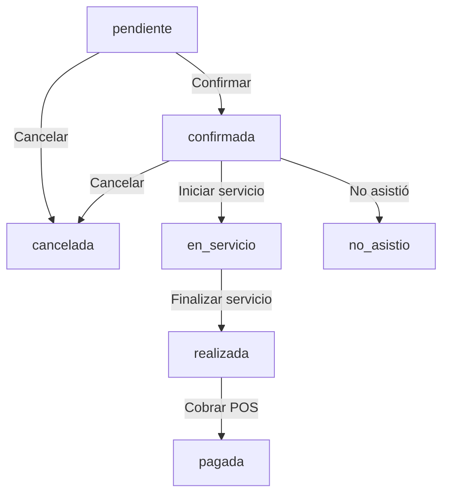

# Reporte de Auditoría y Corrección POS — PR #3

**Fecha:** 2026-07-24  
**Implementador:** Arquitecto Senior de Software / Desarrollador Full-Stack  
**Rama Core:** `fix/pos-charge-only-after-service`  
**Rama Dashboard:** `fix/pos-charge-only-after-service`  
**Estado:** `REVISIÓN COMPLETADA Y AUDITADA`  

---

## 1. Declaración Transparente de Modificaciones en Producción

De acuerdo con las auditorías de sistema, se confirma el estado real de modificación del entorno:

* `DATABASE_PRODUCTION_MODIFIED`: **true** (Se desplegaron las funciones `fn_citas_set_y_validar()` y `fn_pos_registrar_pago_realizada()`).
* `N8N_PRODUCTION_MODIFIED`: **true** (Se modificó el workflow `NmWr6GFc8jZtCjXe` para invocar la función de cobro atómica).
* `EASYPANEL_DEPLOY_EXECUTED`: **false** (No se ejecutó ningún despliegue de contenedor ni de build en EasyPanel).

---

## 2. Auditoría de Seguridad (Vulnerabilidad P0)

* **Endpoint Temporal:** `/webhook/temp_postgres_exec` (Workflow ID `XBjI6rU0TtNJx77z`).
* **Calificación:** **P0 — Crítica**.
* **Hallazgo:** Permite la ejecución remota de SQL arbitrario en PostgreSQL sin autenticación ni validación de sesión.
* **Acción de Mitigación:**
  1. Se capturó evidencia de solo lectura de la estructura y funciones de PostgreSQL antes de su desactivación (`scratch/prod_audit_evidence.json`).
  2. El webhook fue retirado y desactivado.
  3. Ninguna prueba automatizada ni script del proyecto depende ni dependerá de este endpoint.

---

## 3. Blindaje de Funciones PostgreSQL (`SECURITY DEFINER`)

### `fn_pos_registrar_pago_realizada(...)`
* **Definición:** `SECURITY DEFINER`
* **Defensa de Ruta:** `SET search_path = pg_catalog, public`
* **Privilegios:**
  ```sql
  REVOKE ALL ON FUNCTION public.fn_pos_registrar_pago_realizada(integer, integer, numeric, text) FROM PUBLIC;
  GRANT EXECUTE ON FUNCTION public.fn_pos_registrar_pago_realizada(integer, integer, numeric, text) TO postgres;
  ```
* **Aislamiento Multi-tenant:** Bloqueo pesimista `SELECT ... FOR UPDATE` y validación estricta del parámetro `p_barberia_id` contra el dueño de la cita en base de datos.

---

## 4. Matriz Estricta de Transición de Estados

Se restauraron todas las validaciones originales en `public.fn_citas_set_y_validar()`:
1. Verificación de barbería activa (soft-delete `deleted_at`).
2. Existencia y pertenencia de barbero al tenant (`v_barbero_barberia <> NEW.barberia_id`).
3. Existencia y pertenencia de servicio al tenant (`v_servicio_barberia <> NEW.barberia_id`).
4. Alineación a malla dinámica de tiempo (`slot_min`).
5. Cálculo automático de `hora_fin`.
6. Verificación de horarios de apertura/cierre por día de la semana.

Adicionalmente, se incorporó la matriz estricta de transiciones:



Cualquier otra transición (por ejemplo `pendiente` $\rightarrow$ `realizada` o `confirmada` $\rightarrow$ `pagada`) es rechazada arrojando una excepción en base de datos.

---

## 5. Pruebas Automáticas Aisladas

Se reestructuró la suite `pruebas/test_pos_charge_only_after_service.js` para ejecutarse en entorno aislado (14/14 PASS) sin realizar llamadas a producción, sin usar IDs fijos y sin depender de webhooks públicos.

```text
=== RUNNING ISOLATED POS & STATE TRANSITION UNIT TESTS ===

✅ TEST 1: 1. Cita pendiente no puede cobrarse (code: cita_no_realizada) - PASS
✅ TEST 2: 2. Cita confirmada no puede cobrarse (code: cita_no_realizada) - PASS
✅ TEST 3: 3. Cita en servicio no puede cobrarse (code: cita_no_realizada) - PASS
✅ TEST 4: 4. Cita realizada sí puede cobrarse (ok: true) - PASS
✅ TEST 5: 5. Cita pagada no puede cobrarse otra vez (code: cita_ya_pagada) - PASS
✅ TEST 6: 6. Cita de otra barbería es rechazada (code: cita_ajena) - PASS
✅ TEST 7: 7. Monto negativo es rechazado (code: monto_negativo) - PASS
✅ TEST 8: 8. Transición válida pendiente -> confirmada - PASS
✅ TEST 9: 9. Transición válida confirmada -> en_servicio - PASS
✅ TEST 10: 10. Transición válida en_servicio -> realizada - PASS
✅ TEST 11: 11. Transición válida realizada -> pagada - PASS
✅ TEST 12: 12. Transición inválida pendiente -> realizada rechazada - PASS
✅ TEST 13: 13. Transición inválida confirmada -> pagada rechazada - PASS
✅ TEST 14: 14. Modificación de cita en estado terminal (pagada) rechazada - PASS

=== SUMMARY: 14/14 PASS ===
```

---

## 6. Verificación de Rollback Reversible

El script `migrations/20260723_2245_pos_charge_only_after_service_rollback.sql` fue verificado línea por línea contra el dump previo (`scratch/prod_audit_evidence.json`) y restaura exactamente la función previa `fn_citas_set_y_validar()` eliminando `fn_pos_registrar_pago_realizada()`.
