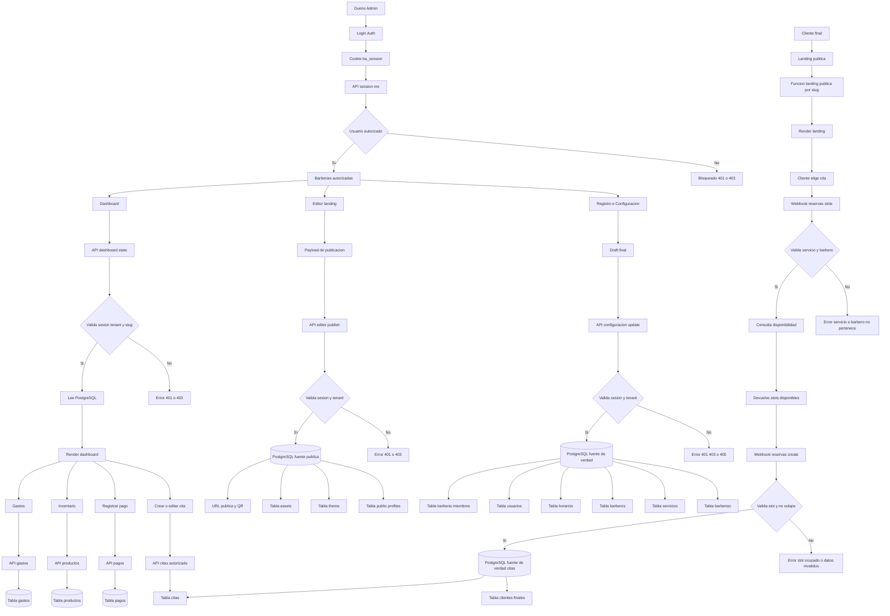
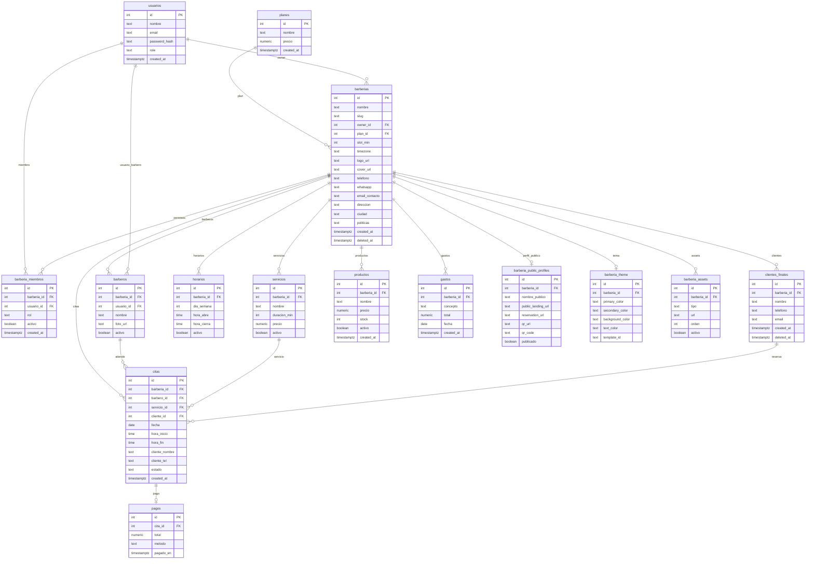

# Fuente de Verdad — Regla General de Producción BarberAgency

## 1. Propósito

Este documento define la regla principal de arquitectura para BarberAgency:

> **PostgreSQL es la fuente de verdad única del SaaS.**

Todo cambio, lectura, endpoint, flujo, automatización, pantalla, landing, reserva, dashboard, editor o agente de IA debe respetar esta regla.

Este documento es obligatorio para cualquier trabajo realizado por Codex, Antigravity o cualquier otro agente.

Ningún cambio debe hacerse sin revisar este contexto primero.

---

## 2. Regla madre

```txt
PostgreSQL es la fuente de verdad única.
PostgREST, n8n y Next.js API son canales controlados de acceso.
WordPress, Dashboard, Landing y Frontend son consumidores.
localStorage, sessionStorage, seedLandingData, cache, mocks, query params y slug nunca son fuente de verdad.
```

---

## 3. Qué significa fuente de verdad

La fuente de verdad es el lugar donde viven los datos reales, finales, auditables y válidos del negocio.

En BarberAgency la fuente de verdad es:

```txt
PostgreSQL
```

Dentro de PostgreSQL existen dominios canónicos:

```txt
PostgreSQL
│
├── Identidad y permisos
│   ├── usuarios
│   ├── barberia_miembros
│   └── barberias.owner_id
│
├── Configuración de barbería
│   ├── barberias
│   ├── servicios
│   ├── barberos
│   └── horarios
│
├── Reservas
│   ├── clientes_finales
│   └── citas
│
├── Finanzas
│   ├── pagos
│   ├── productos
│   └── gastos
│
└── Publicación pública
    ├── barberia_public_profiles
    ├── barberia_theme
    └── barberia_assets
```

Estos dominios no son fuentes separadas ni verdades competidoras.

Son dominios canónicos dentro de la misma fuente madre: PostgreSQL.

---

## 4. Qué NO es fuente de verdad

Los siguientes elementos nunca pueden decidir identidad, permisos, datos reales ni persistencia final:

```txt
localStorage
sessionStorage
seedLandingData
ba_landing_seed
cache local
mocks
fallbacks visuales
query params sin validar
slug sin validar
email_contacto
HTML viejo
plantillas legacy
estado React local
datos quemados en frontend
```

Pueden usarse únicamente como apoyo temporal de UI, pero nunca como autoridad.

---

## 5. Roles de cada componente

| Componente             | Rol correcto                             | Es fuente de verdad                  |
| ---------------------- | ---------------------------------------- | ------------------------------------ |
| PostgreSQL             | Guarda datos reales                      | Sí                                   |
| PostgREST              | Expone tablas y RPC como API             | No                                   |
| n8n                    | Orquesta webhooks y validaciones         | No                                   |
| Next.js API            | Proxy seguro y validación same-origin    | No                                   |
| WordPress              | Renderiza páginas y landings             | No                                   |
| Dashboard              | Lee y muestra datos                      | No                                   |
| Landing pública        | Lee estado publicado                     | No                                   |
| localStorage           | Caché temporal                           | No                                   |
| session/me             | Valida identidad autorizada              | No, pero es autoridad de identidad   |
| dashboard/state        | Hidrata datos del panel desde PostgreSQL | No, pero es lectura canónica         |
| ba_get_landing_publica | Lee estado público publicado             | No, pero es lectura pública canónica |

---

## 6. Autoridad de identidad

La identidad privada del usuario debe seguir esta jerarquía:

```txt
ba_session cookie
↓
session/me
↓
usuarios
↓
barberia_miembros / barberias.owner_id
↓
barberia_id autorizado
```

Reglas obligatorias:

```txt
email_contacto no autoriza.
slug no autoriza.
query params no autorizan.
localStorage no autoriza.
session/me es la autoridad de identidad.
barberia_miembros y owner_id definen permisos reales.
```

Una barbería puede ser accedida por un usuario solo si:

```txt
1. usuarios.id = barberias.owner_id
o
2. existe barberia_miembros activo para usuario_id y barberia_id
```

---

## 7. Autoridad de hidratación del dashboard

El dashboard debe hidratarse desde:

```txt
GET /api/session/me
GET /api/dashboard/state?barberia_id=...
```

Flujo correcto:

```txt
Dashboard carga
↓
GET /api/session/me
↓
Valida sesión y barberías autorizadas
↓
GET /api/dashboard/state
↓
Valida barberia_id, slug y permisos
↓
Lee PostgreSQL
↓
Renderiza datos reales
```

El dashboard no puede hidratarse desde:

```txt
localStorage
seedLandingData
cache vieja
mocks
fallbacks artificiales
datos quemados
```

---

## 8. Autoridad de escritura

La fuente de verdad solo cambia en endpoints de escritura autorizados.

Puntos de escritura permitidos:

```txt
Registro inicial:
Webhook onboarding / registro autorizado → PostgreSQL

Configuración:
POST /api/configuracion/update → PostgreSQL

Publicación landing:
POST /api/editor/publish → PostgreSQL

Reserva pública:
POST /webhook/barberagency/reservas/create → PostgreSQL

Citas dashboard:
Endpoint autorizado de citas → PostgreSQL

Pagos:
Endpoint autorizado de pagos → PostgreSQL

Productos:
Endpoint autorizado de inventario → PostgreSQL

Gastos:
Endpoint autorizado de gastos → PostgreSQL
```

Los endpoints de lectura no deben modificar la fuente de verdad:

```txt
GET /api/session/me
GET /api/dashboard/state
GET /webhook/barberagency/reservas/slots
ba_get_landing_publica(slug)
ba_resolver_qr(...)
```

---

## 9. Regla de configuración y registro

La configuración de la barbería debe escribirse por un canal canónico:

```txt
POST /api/configuracion/update
```

Debe validar:

```txt
ba_session válida
barberia_id existente
usuario autorizado
slug coincide si viene en payload
payload válido
servicios pertenecen al tenant
barberos pertenecen al tenant
horarios completos
```

Tablas afectadas:

```txt
barberias
servicios
barberos
horarios
usuarios
barberia_miembros
```

Regla especial de horarios:

```txt
Siempre enviar los 7 días completos.
No enviar solo días activos.
Cada día debe traer activo=true o activo=false.
```

---

## 10. Regla de publicación pública

La publicación de landing debe escribirse por:

```txt
POST /api/editor/publish
```

Debe validar:

```txt
ba_session válida
barberia_id autorizado
slug coincide si viene
payload de publicación válido
```

Tablas afectadas:

```txt
barberia_public_profiles
barberia_theme
barberia_assets
barberias
servicios
barberos
horarios
```

La landing pública debe leer desde:

```txt
ba_get_landing_publica(slug)
```

o desde un contexto público inyectado que venga de esa misma fuente.

No debe leer de:

```txt
ba_landing_seed viejo
localStorage
sessionStorage
endpoint legacy que sobrescriba datos nuevos
HTML quemado
```

---

## 11. Regla de reservas

Los slots se leen desde:

```txt
GET /webhook/barberagency/reservas/slots
```

Las reservas se escriben desde:

```txt
POST /webhook/barberagency/reservas/create
```

Validaciones obligatorias:

```txt
barberia_id existe
servicio pertenece a barbería
barbero pertenece a barbería
fecha válida
hora en malla slot_min
horario activo
no existe solape
si hay descanso, bloquear slot
```

Tablas afectadas por reserva:

```txt
clientes_finales
citas
```

La confirmación visual no es verdad.

La verdad es la fila creada en PostgreSQL.

---

## 12. Regla multi-tenant

Todo dato privado debe estar filtrado por `barberia_id`.

Nunca se permite:

```txt
Consultar sin barberia_id
Actualizar sin barberia_id
Eliminar sin barberia_id
Usar slug como único filtro privado
Usar email_contacto como autorización
Usar localStorage como identidad
```

Validaciones obligatorias:

```txt
Sin cookie → 401
Cookie inválida → 401
Barbería ajena → 403
barberia_id + slug mismatch → 403
Servicio ajeno → 400
Barbero ajeno → 400
RPC directa anónima de escritura → 401 o 403
```

---

## 13. Regla obligatoria de pruebas en Postman

Todo arreglo relacionado con la fuente de verdad debe ser validado con Postman antes de marcarse como terminado.

No basta con que el cambio compile.

No basta con que se vea bien en pantalla.

No basta con revisar el código.

No basta con una prueba manual visual.

Todo cambio debe tener evidencia en Postman.

### 13.1 Pruebas mínimas obligatorias

Según el flujo afectado, el agente debe probar en Postman:

```txt
Login / sesión:
- POST dashboard login
- GET session/me sin cookie
- GET session/me con cookie válida

Dashboard:
- GET dashboard/state sin cookie
- GET dashboard/state con barbería propia
- GET dashboard/state con barbería ajena
- GET dashboard/state con barberia_id propio + slug incorrecto

Configuración:
- POST configuracion/update con barbería propia
- POST configuracion/update sin cookie
- POST configuracion/update con barbería ajena
- Verificar en PostgreSQL que el dato cambió

Publicación:
- POST editor/publish con barbería propia
- POST editor/publish sin cookie
- POST editor/publish con barbería ajena
- Verificar ba_get_landing_publica después de publicar

Landing pública:
- GET /b/slug o endpoint público
- POST ba_get_landing_publica
- Validar URL pública y QR

Reservas:
- GET reservas/slots con servicio propio
- GET reservas/slots con servicio ajeno
- GET reservas/slots con barbero ajeno
- POST reservas/create válido
- POST reservas/create solapado
- Verificar cita en PostgreSQL

Citas dashboard:
- Crear cita propia
- Intentar cita con barbería ajena
- Cancelar cita
- Verificar estado en PostgreSQL

Pagos / POS:
- Crear pago válido
- Intentar pago de cita ajena
- Verificar pago en PostgreSQL

Productos:
- Crear producto propio
- Intentar producto en barbería ajena
- Verificar producto en PostgreSQL

Gastos:
- Crear gasto propio
- Intentar gasto en barbería ajena
- Verificar gasto en PostgreSQL
```

### 13.2 Evidencia requerida

Cada entrega debe incluir:

```txt
1. Nombre de la colección Postman usada.
2. Ambiente Postman usado.
3. Endpoint probado.
4. Método HTTP.
5. Headers usados.
6. Cookie usada o ausencia de cookie.
7. Payload enviado.
8. Status esperado.
9. Status obtenido.
10. Respuesta JSON.
11. SQL de verificación.
12. Resultado final PASS o FAIL.
```

### 13.3 Regla de aceptación

```txt
Sin evidencia Postman no hay cierre.
Sin evidencia SQL no hay cierre.
Sin commit en GitHub no hay cierre.
Sin documentación en ContextoGeneral/daily no hay cierre.
```

---

## 14. Diagrama de flujo compatible con Mermaid



---

## 15. Diagrama de relación de fuente de verdad



---

## 16. Reglas obligatorias antes de modificar código

Antes de tocar cualquier archivo, el agente debe responder:

```txt
1. Qué archivo voy a tocar.
2. Qué flujo de fuente de verdad afecta.
3. Qué tabla de PostgreSQL afecta.
4. Qué endpoint de lectura o escritura afecta.
5. Qué riesgo multi-tenant existe.
6. Cómo se valida session/me o ba_session.
7. Cómo se valida barberia_id.
8. Qué prueba en Postman demuestra que quedó bien.
9. Qué SQL demuestra que quedó bien.
10. Qué rollback aplica si falla.
```

Si no puede responder esto, no debe tocar código.

---

## 17. Criterio de producción

Una solución solo se acepta si:

```txt
No rompe multi-tenant.
No depende de localStorage como autoridad.
No usa mocks en producción.
No usa email_contacto como permiso.
No usa slug como autorización privada.
No duplica caminos de escritura.
No oculta errores con fallback silencioso.
Tiene pruebas en Postman.
Tiene pruebas SQL.
Queda documentada.
Queda subida a GitHub.
```

---

## 18. Frase obligatoria para agentes

```txt
Estoy trabajando sobre BarberAgency en modo producción.
La fuente de verdad es PostgreSQL.
Mi cambio no puede introducir fuentes paralelas, mocks, cache autoritativa ni rutas legacy.
Antes de modificar, debo entender el flujo real, el endpoint canónico, la tabla afectada, la validación multi-tenant, la prueba de Postman, la prueba SQL y el rollback.
```
