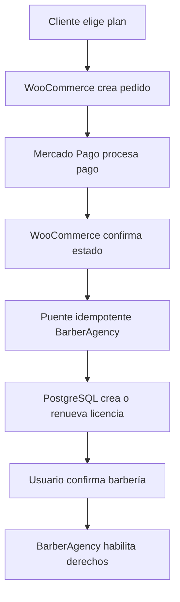

# PAGOS Y LICENCIAS — IMPLEMENTACIÓN MASTER

## WooCommerce + Mercado Pago + BarberAgency

```text
DOCUMENT_VERSION = 2.5
DOCUMENT_DATE = 2026-08-10
TIMEZONE = America/Bogota
EXECUTION_AUTHORITY = THIS_DOCUMENT_AFTER_OWNER_APPROVAL
LEGACY_35_TASK_ROADMAP = SUPERSEDED
NEW_IMPLEMENTATION_TASKS = 12
TASK_000_TO_TASK_006 = CLOSED
TASK_007_STATUS = CLOSED_WITH_DEFERRED_PRODUCTION_ROTATION
SEC_003_STATUS = CLOSED_APPROVED
SEC_002_STATUS = DEFERRED_TO_FINAL_SECURITY_GATE
JWT_AUTH_ACCOUNT = TEST_CREDENTIAL_UNCHANGED
ROTATION_DURING_WC_001_TO_WC_011 = NO
JWT_ROTATION_NOW = DEFERRED_BY_OWNER
JWT_ROTATION_AFTER_ALL_PAYMENT_TESTS = REQUIRED
JWT_SECRET_CHANGED = NO
SESSIONS_INVALIDATED = NO
CURRENT_TASK = WC-012
WC_001_STATUS = CLOSED_APPROVED
WC_001_RENEWAL_MODEL = MANUAL
WC_001_RENEWAL_MODEL_APPROVED_BY_OWNER = YES
WC_001_CONTRACTS_STATUS = APPROVED
WC_002_STATUS = CLOSED_APPROVED
WC_002_AUTHORIZED = YES
WC_002_CLOSED = YES
WC_002_CLOSED_APPROVED = YES
WC_002_CLOSURE_DATE = 2026-08-03
WC_002_REVIEW = APPROVED
WC_003_READY_FOR_OWNER_AUTHORIZATION = YES
WC_003_AUTHORIZED = YES
WC_003_STATUS = CLOSED_APPROVED
WC_003_CLOSED_APPROVED = YES
WC_003_CLOSURE_DATE = 2026-08-03
WC_003_CONTRACT_VERSION = WC-003.v1
WC_004_READY_FOR_OWNER_AUTHORIZATION = YES
WC_004_AUTHORIZED = YES
WC_004_STATUS = CLOSED_APPROVED
WC_004_LOCAL_IMPLEMENTATION_PREPARED = YES
WC_004_STAGING_TESTS_PASSED = NOT_RUN_REMOTE
WC_004_LOCAL_POSTGRES_RUNTIME_VALIDATION = PASSED
WC_004_RLS_RUNTIME_VALIDATION = PASSED
WC_004_CONSTRAINTS_RUNTIME_VALIDATION = PASSED
WC_004_IDEMPOTENCY_RUNTIME_VALIDATION = PASSED
WC_004_GRANTS_RUNTIME_VALIDATION = PASSED
WC_004_ROLLBACK_RUNTIME_VALIDATION = PASSED
WC_004_STAGING_EQUIVALENT_VALIDATION = PASSED_LOCAL_EQUIVALENT
WC_004_CLOSED_APPROVED = YES
WC_005_AUTHORIZED = YES
WC_005_STATUS = CLOSED_APPROVED
WC_005_CLOSED_APPROVED = YES
WC_005_EVIDENCE = docs/wc-005-paid-order-bridge-evidence.md
WC_005_LOCAL_TEST = pruebas/test_wc005_paid_order_bridge.js
WC_005_LOCAL_TEST_RESULT = PASS
WC_006_AUTHORIZED = YES
WC_006_STATUS = CLOSED_APPROVED
WC_006_CLOSED_APPROVED = YES
WC_006_EVIDENCE = docs/wc-006-license-transition-evidence.md
WC_006_LOCAL_TEST = pruebas/test_wc006_license_transition_contract.js
WC_006_LOCAL_TEST_RESULT = PASS
WC_007_AUTHORIZED = YES
WC_007_STATUS = CLOSED_APPROVED
WC_007_CLOSED_APPROVED = YES
WC_007_EVIDENCE = docs/wc-007-license-assignment-evidence.md
WC_007_LOCAL_TEST = pruebas/test_wc007_license_assignment_contract.js
WC_007_LOCAL_TEST_RESULT = PASS
WC_008_STATUS = CLOSED_APPROVED
WC_008_CLOSED_APPROVED = YES
WC_008_EVIDENCE = docs/wc-008-session-access-evidence.md
WC_008_LOCAL_TEST = pruebas/test_wc008_session_access_contract.js
WC_008_LOCAL_TEST_RESULT = PASS
WC_009_AUTHORIZED = YES
WC_009_STATUS = CLOSED_APPROVED
WC_009_CLOSED_APPROVED = YES
WC_009_EVIDENCE = docs/wc-009-entitlement-publication-evidence.md
WC_009_LOCAL_TEST = pruebas/test_wc009_entitlement_publication_contract.js
WC_009_LOCAL_TEST_RESULT = PASS
WC_010_STATUS = CLOSED_APPROVED_LOCAL_NO_REAL_LEGACY_BACKFILL
WC_010_EVIDENCE = docs/wc-010-legacy-backfill-simulation-evidence.md
WC_010_LOCAL_TEST = pruebas/test_wc010_legacy_backfill_simulator.js
WC_010_LOCAL_TEST_RESULT = PASS
WC_010_REAL_LEGACY_DATA_USED = NO
WC_010_REAL_BACKFILL_EXECUTED = NO
WC_011_STATUS = CLOSED_APPROVED
WC_011_TESTS_RUN = 18
WC_011_TESTS_PASS = 18
WC_011_TESTS_FAIL = 0
WC_012_STATUS = LOCAL_STAGING_COMPLETE
LOCAL_STAGING_RESULT = PASS
INDEPENDENT_REVIEW = PASS
WC012_LOCAL_STAGING_COMPLETE = YES
EVIDENCE_OVERSTATEMENT_FOUND = NO
MISSING_MANDATORY_LOCAL_TEST = NO
LOCAL_REMEDIATION_IMPLEMENTED = YES
LOCAL_TESTS_STATUS = PASS
PRODUCTION_MIGRATIONS_APPLIED_BY_THIS_TASK = NO
REMOTE_N8N_CHANGED_BY_THIS_TASK = NO
CHECKOUT_PRO_PREFERENCE_CREATION = PASS
BARBERAGENCY_BACKEND_E2E = PASS
CHECKOUT_PRO_BROWSER_SANDBOX = BLOCKED_EXTERNAL_PROVIDER_SANDBOX_UI
CHECKOUT_PRO_BROWSER_E2E = BLOCKED_EXTERNAL_PROVIDER_SANDBOX_UI
DIRECT_MERCADOPAGO_TEST_PAYMENT = PASS
REAL_MP_TEST_WEBHOOK = PASS
WEBHOOK_SIGNATURE = PASS
PAYMENT_TRANSACTION = PASS
INVOICE_PAID = PASS
SUBSCRIPTION = PASS
WC006_LICENSE = PASS
WC007_NO_AUTO_ASSIGNMENT = PASS
DUPLICATE_IDEMPOTENCY = PASS
REPLAY_PROTECTION = PASS
CONCURRENCY = PASS
OUTBOX = PASS
OUTBOX_RETRY = PASS
RECOVERY = PASS
RECOVERY_IDEMPOTENCY = PASS
TENANT_ISOLATION = PASS
SECURITY_NEGATIVE_MATRIX = PASS
WC004_WC012_REGRESSIONS = PASS
SANDBOX_PAYMENT_PERFORMED = YES_TEST_API_ONLY
REAL_PAYMENT = NO
JWT_SECRET_CHANGED = NO
JWT_ROTATION = DEFERRED
SANDBOX_TEST_AUTHORIZED = NO
PRODUCTION_DEPLOYMENT_AUTHORIZED = NO
PRODUCTION_TOUCHED = NO
PRODUCTION_ACCESS = NO
PRODUCTION_DEPLOYMENT = NO
PRODUCTION_PAYMENT = NO
WC_012_STAGING_TESTS_RUN = 5
WC_012_STAGING_TESTS_PASS = 5
WC_012_STAGING_TESTS_FAIL = 0
WC_012_PRODUCTION_MIGRATIONS = APPLIED_REPORTED_VERIFIED
WC_012_BA_APP = PASS_REPORTED
WC_012_RLS = PASS_REPORTED
WC_012_N8N_BILLING = PASS_REPORTED
PRODUCTION_BACKUP = PASS_OWNER_VERIFIED
PRODUCT_ID = 4224
VARIATION_ID = 4225
TERM = monthly
AMOUNT = 50000_COP
MERCADOPAGO_CHECKOUT_MODE = SANDBOX_OWNER_VERIFIED
REAL_PAYMENT = NO
CARD_DATA_ENTERED = NO
PAYMENT_SUBMITTED = NO
PRE_PAYMENT_GATE = LOCAL_STAGING_COMPLETE_HOLD_BEFORE_PRODUCTION
CHECKOUT_READY_FOR_REAL_PAYMENT = NO
CURRENT_BLOCKER = PRODUCTION_GATE_REQUIRES_SEPARATE_EXPLICIT_AUTHORIZATION
NEXT_ACTION = HOLD_BEFORE_PRODUCTION
CANONICAL_COMMERCIAL_PAGE = /planes/
COMPRAR_PLAN_ROUTE = INVALID_LEGACY_ASSUMPTION
NEW_LOCAL_WC_PLUGIN_INSTALL_AUTHORIZED = NO
PUSH_AUTHORIZED = NO
HISTORY_REWRITE_AUTHORIZED = NO
```

---

## Consolidación del handoff completo WC-011 / WC-012 — 2026-08-06

Esta sección incorpora el handoff completo entregado por el Owner el 2026-08-10 sobre el trabajo realizado hasta el 2026-08-06. Complementa la actualización operativa anterior y no autoriza pagos ni cambios adicionales. Si una comprobación fue ejecutada por el agente y no observada directamente por el Owner, conserva la clasificación `REPORTED`.

### Matriz de evidencia

| Hecho | Estado | Fuente de evidencia |
|---|---|---|
| Staging Docker local aislado | PASS | Reporte técnico y ejecución del agente |
| Suite WC-011 | 18/18 PASS | Reporte de pruebas |
| Suite preparatoria WC-012 en staging | 5/5 PASS | Reporte de pruebas |
| Backup productivo previo a WC-012 | PASS | Confirmado manualmente por el Owner en EasyPanel |
| Migraciones productivas | APPLIED / VERIFIED | Reportado por el agente |
| `ba_app`, mínimo privilegio, RLS y FORCE RLS | PASS | Reportado por el agente |
| Conexión n8n a PostgreSQL productivo | PASS | Confirmada visualmente mediante prueba de conexión |
| Producto, variación, término e importe | PASS | Confirmados manualmente en checkout |
| Checkout efectivo de Mercado Pago | SANDBOX / FAIL para producción | Confirmado manualmente por el Owner |
| Pago real o datos de tarjeta | NO | Confirmado por el Owner |

### Infraestructura reproducible de WC-011

Se sustituyó el staging remoto inicialmente considerado por un staging Docker local aislado, evitando costo adicional y cambios productivos. El stack incluyó PostgreSQL 17, PostgREST, n8n, WordPress, MariaDB y Mailpit sobre la red `barberagency-wc011-staging-net`, con identidad positiva en `public.environment_identity` y roles `anon`/`authenticated`.

El bundle reproducible incluyó `README.md`, `staging.env.example`, `startup-guard.sh`, `test-startup-guard.sh`, `manifest.json`, `postgres-identity-bootstrap.sql`, `postgres-security-verification.sql`, `apply.sh`, `verify-connectivity.sh`, `backup.sh`, `verify-backup.sh`, `restore.sh` y `master-preflight.sh`. La credencial TEST real de Mercado Pago se mantuvo fuera de Git mediante `staging.env` ignorado.

Hotfixes y dependencias identificados durante E2E:

- `jwt_user_id()` en el bootstrap/harness: corrección exclusiva de staging/pruebas para interpretar `request.jwt.claims`.
- `subscriptions.estado`: dependencia legítima del esquema legacy usada por `tiene_acceso()`.
- `pgcrypto`: extensión requerida declarada de forma idempotente.
- `TRUNCATE ... CASCADE`: limpieza destructiva permitida únicamente en el entorno E2E local para tablas append-only.
- `20260803_1400_wc011_harden_payment_reconciliation.sql`: corrección productiva versionada para reconciliar de forma idempotente pagos pendientes posteriormente aprobados mediante el conflicto parcial `(provider, provider_ref) WHERE provider_ref IS NOT NULL`.

El staging se reconstruyó desde volúmenes limpios sin SQL manual posterior. Resultado consolidado:

```text
FRESH_VOLUMES = YES
MANUAL_SQL_AFTER_REBUILD = NONE
WC_011_TESTS = 18/18_PASS
WC_012_STAGING_TESTS = 5/5_PASS
```

### Manifiesto productivo aplicado

Después del backup y del preflight, el agente reportó como aplicadas y verificadas estas cinco migraciones, en este orden:

1. `20260713_2033_add_billing_auditor_readonly.sql`
2. `20260713_2034_harden_billing_audit_access.sql`
3. `20260803_1200_wc004_license_schema.sql`
4. `20260803_1400_wc011_harden_payment_reconciliation.sql`
5. `20260803_1500_wc012_provision_ba_app.sql`

No debe repetirse su aplicación a ciegas. Cualquier acción futura debe comenzar con inspección idempotente y evidencia del estado real.

### Seguridad, mínimo privilegio y recuperación

La migración `20260803_1500_wc012_provision_ba_app.sql` creó el rol `ba_app` sin `SUPERUSER`, `BYPASSRLS`, `CREATEDB` ni `CREATEROLE`, otorgando únicamente las operaciones requeridas para registrar/procesar webhooks y gestionar el outbox. Las pruebas negativas reportaron:

```text
DIRECT_FORBIDDEN_WRITE = DENIED
CROSS_TENANT = DENIED
DDL = DENIED
ROLE_ESCALATION = DENIED
LEAST_PRIVILEGE = PASS
```

El recovery determinista quedó cubierto por `payment_reconciliation_recovery.js` para: pago aprobado sin webhook, webhook recibido con procesamiento fallido y entrega fallida del outbox. La segunda ejecución no duplicó efectos contractuales.

```text
RECOVERY_IDEMPOTENCY = PASS
MANUAL_SQL_REQUIRED = NO
MANUAL_ARBITRARY_CURL_REQUIRED = NO
```

### Alcance exacto de producción

El backup confirmado por el Owner fue `pre-wc012-production-2026-08-06`, ruta `barberagency/barberagencycol/2026-08-06T19:01:30.620Z.sql.gz`, tamaño `119 kB`. La credencial productiva correcta de n8n fue `Postgres account`, contra el host interno `barberagency_barberagencycol`, base `barberagency`, puerto `5432`, SSL deshabilitado. Las credenciales `Postgres POS TEST` y `Postgres account 2` no constituyen evidencia de la conexión productiva principal.

Los IDs productivos confirmados son:

| Periodo | Variación | Importe |
|---|---:|---:|
| Mensual | `4225` | `50.000 COP` |
| Trimestral | `4226` | `142.500 COP` |
| Semestral | `4227` | `270.000 COP` |
| Anual | `4228` | `510.000 COP` |

Producto padre: `4224`, **Plan Suscripción Barbería**. El único pago controlado previsto continúa siendo la variación mensual `4225` por `50.000 COP`, pero actualmente no está autorizado.

### Corrección del gate y continuidad obligatoria

El gate automático previo reportó `MERCADOPAGO = PASS` y `CHECKOUT_READY = YES`. La evidencia manual posterior (`sandbox.mercadopago.com.co`, etiqueta **Sandbox** y aviso de pagos ficticios) tiene prioridad y corrige ese veredicto:

```text
MERCADOPAGO_EFFECTIVE_MODE = SANDBOX
MERCADOPAGO_PRODUCTION_CHECKOUT = FAIL
PRE_PAYMENT_GATE = BLOCKED
REAL_PAYMENT_ATTEMPTED = NO
REAL_PAYMENT = NO
```

La próxima investigación debe rastrear la fuente efectiva de la preferencia: configuración WooCommerce/plugin Mercado Pago, credenciales TEST versus producción, variables de entorno, código custom, n8n, endpoints, caché/configuración persistida, hardcodes y selección de `sandbox_init_point` frente a `init_point`.

No debe repetirse WC-011 ni ejecutarse un pago durante el diagnóstico. Tras una corrección mínima y causal, se abrirá un checkout nuevo solamente para verificar que desaparecieron el dominio y la etiqueta Sandbox manteniendo producto `4224`, variación `4225`, término `monthly`, moneda `COP` e importe `50.000`; luego se detendrá antes de introducir tarjeta y se solicitará autorización humana separada.

---

## Actualización operativa vigente — 2026-08-10

Este bloque reemplaza únicamente los estados operativos anteriores de `WC-011` y `WC-012`. El resto del documento se conserva como arquitectura, contratos e historial. Ante cualquier contradicción con una sección histórica posterior, prevalece esta actualización.

### Estado confirmado

- `WC-011` quedó completada y aprobada en staging Docker local: `18/18 PASS`.
- Las comprobaciones preparatorias de `WC-012` quedaron reportadas como `5/5 PASS`.
- El Owner confirmó un backup real de producción exitoso: `pre-wc012-production-2026-08-06`, ruta `barberagency/barberagencycol/2026-08-06T19:01:30.620Z.sql.gz`, tamaño `119 kB`.
- Las cinco migraciones productivas, `ba_app`, RLS/FORCE RLS y los workflows de billing fueron reportados como aplicados y verificados. Estas afirmaciones deben conservar su evidencia antes del pago real.
- El checkout mostró correctamente el producto `4224`, la variación mensual `4225`, el término `monthly` y el importe de `50.000 COP`.
- La evidencia manual del navegador demostró que el checkout efectivo continúa en `sandbox.mercadopago.com.co` y muestra la etiqueta **Sandbox**.
- No se ingresaron datos de tarjeta, no se envió el pago y no hubo cobro real.

### Bloqueo actual

```text
WC_011 = CLOSED_APPROVED
WC_012 = IN_PROGRESS
PRE_PAYMENT_GATE = BLOCKED
CHECKOUT_READY_FOR_REAL_PAYMENT = NO
BLOCKER = MERCADOPAGO_SANDBOX_CHECKOUT_IN_PRODUCTION_FLOW
```

La declaración histórica `CHECKOUT_READY = YES` queda invalidada para pago real. La evidencia efectiva del navegador tiene prioridad sobre cualquier configuración nominal que indique producción.

### Siguiente acción autorizada

Diagnosticar y corregir exclusivamente la fuente efectiva del checkout Sandbox: WooCommerce, plugin Mercado Pago, credenciales TEST/productivas, código custom, n8n, variables de entorno, endpoint de creación de preferencia, hardcodes y selección entre `sandbox_init_point` e `init_point`.

Después de la corrección se abrirá un checkout nuevo, sin ingresar tarjeta y sin pagar, y se comprobará:

```text
SANDBOX_LABEL = ABSENT
SANDBOX_DOMAIN = ABSENT
PRODUCT_ID = 4224
VARIATION_ID = 4225
TERM = monthly
AMOUNT = 50000_COP
PAYMENT_SUBMITTED = NO
```

Solo después podrá declararse `PRE_PAYMENT_GATE = PASS` y solicitar al Owner autorización separada para un único pago real controlado.

### Restricciones vigentes

- No rotar todavía el JWT; la decisión expresa del Owner es hacerlo después de finalizar todas las pruebas de pagos.
- No invalidar sesiones todavía.
- No introducir tarjeta ni efectuar pagos durante el diagnóstico.
- No repetir `WC-011` completa sin una causa técnica nueva y demostrable.
- No realizar un despliegue general ni modificar workflows ajenos a billing.
- No exponer secretos, guardar tokens en Git, borrar datos productivos ni manipular licencias o suscripciones para simular un pago.
- No avanzar automáticamente al pago real.

---

# 1. Propósito

Este documento reemplaza como ruta ejecutiva el roadmap técnico anterior de 35 TASK para pagos y licencias.

La nueva implementación utiliza:

- WooCommerce como motor de productos, pedidos y checkout.
- Mercado Pago como procesador de pagos integrado con WooCommerce.
- PostgreSQL como fuente única de verdad de licencias, asignaciones, vigencias y acceso a BarberAgency.
- WordPress como superficie comercial.
- n8n únicamente para integraciones y automatizaciones justificadas; no como fuente de verdad financiera ni de licencias.

El documento anterior se conserva como evidencia histórica. Sus decisiones comerciales aprobadas y registros de auditoría continúan vigentes cuando no contradigan esta arquitectura.

## 1.1 Snapshot ejecutivo vigente — lectura obligatoria

Este bloque prevalece sobre cualquier registro histórico o diagnóstico anterior incluido en este archivo. Ningún agente puede degradar un hecho confirmado a `NO`, `NOT_IMPLEMENTED` o `NOT_VERIFIABLE` por no encontrar su implementación en el repositorio local.

```text
STATE_SNAPSHOT_DATE = 2026-08-03
STATE_SNAPSHOT_AUTHORITY = OWNER_CONFIRMED_RUNTIME_PLUS_OBSERVED_TEST
COMMERCIAL_PLANS_PAGE = /planes/
WOOCOMMERCE_INSTALLED = YES
MERCADOPAGO_CHECKOUT_PRO_INSTALLED = YES
MERCADOPAGO_TEST_MODE_OBSERVED = YES
TEST_ORDER = 4241
TESTED_TERM = monthly
TESTED_PRICE = 50000_COP
MERCADOPAGO_PREFERENCE_CREATED = YES
PAYMENT_APPROVED = NO
PAYMENT_ID_RECEIVED = NO
LICENSE_GRANTED = NO
NEW_LOCAL_PLUGIN_INSTALLED = NO
WC_002_STATUS = CLOSED_APPROVED
WC_002_CLOSED = YES
WC_002_CLOSED_APPROVED = YES
WC_002_CLOSURE_DATE = 2026-08-03
WC_002_REVIEW = APPROVED
WC_003_AUTHORIZED = YES
WC_003_STATUS = CLOSED_APPROVED
WC_003_CLOSED_APPROVED = YES
WC_003_CLOSURE_DATE = 2026-08-03
```

### Flujo confirmado hasta el alcance observado

```text
/planes/
→ selección mensual
→ checkout WooCommerce por 50000 COP
→ pedido TEST #4241
→ preferencia Mercado Pago en TEST
→ pago no completado
→ ninguna licencia creada
```

`/planes/` es la página comercial canónica. No se afirma todavía, sin evidencia adicional, si ella misma implementa el handler del checkout o si sus botones delegan en un producto, variación, carrito, shortcode, snippet, plugin u otra ruta interna.

### Cierre aprobado de WC-002

La revisión humana aprobó la evidencia runtime no sensible de `WC-002` el 2026-08-03.

```text
WC_002_REVIEW = APPROVED
WC_002_STATUS = CLOSED_APPROVED
WC_002_CLOSED_APPROVED = YES
WC_002_CLOSURE_DATE = 2026-08-03
PRODUCT_NAME = BarberAgency Full - Software para barberias
PRODUCT_ID = 4224
PUBLIC_PLAN_CODE = barberagency_full
CANONICAL_COMMERCIAL_PAGE = /planes/
PRODUCT_PAGE = /producto/software-para-barberias-y-reservas-barberagency/
MONTHLY_VARIATION_ID = 4225
MONTHLY_PARAMETER = attribute_periodo=monthly
MONTHLY_PRICE = 50000 COP
QUARTERLY_VARIATION_ID = 4226
QUARTERLY_PARAMETER = attribute_periodo=quarterly
QUARTERLY_PRICE = 142500 COP
SEMIANNUAL_VARIATION_ID = 4227
SEMIANNUAL_PARAMETER = attribute_periodo=semiannual
SEMIANNUAL_PRICE = 270000 COP
ANNUAL_VARIATION_ID = 4228
ANNUAL_PARAMETER = attribute_periodo=annual
ANNUAL_PRICE = 510000 COP
MONTHLY_RUNTIME_EVIDENCE = TEST_ORDER_4241_OWNER_CONFIRMED
MONTHLY_CHECKOUT_REPEATED = NO
QUARTERLY_CHECKOUT_VERIFIED = YES
SEMIANNUAL_CHECKOUT_VERIFIED = YES
ANNUAL_CHECKOUT_VERIFIED = YES
MERCADOPAGO_VISIBLE_AT_CHECKOUT = YES
NEW_ORDER_CREATED = NO
PAYMENT_EXECUTED = NO
PAYMENT_APPROVED = NO
LICENSE_GRANTED = NO
PUBLIC_SKU = EMPTY
INTERNAL_ADMIN_SKU = NOT_VERIFIED
SKU_BLOCKS_WC_002_CLOSURE = NO
CURRENCY = COP
CURRENCY_ADMIN_CONFIGURATION_DIRECTLY_VERIFIED = NO
CURRENCY_EVIDENCE_SUFFICIENT_FOR_WC_002 = YES
WC_003_READY_FOR_OWNER_AUTHORIZATION = YES
WC_003_AUTHORIZED = YES
WC_003_STATUS = CLOSED_APPROVED
WC_003_CLOSED_APPROVED = YES
WC_003_CLOSURE_DATE = 2026-08-03
WC_003_CONTRACT_VERSION = WC-003.v1
WC_004_READY_FOR_OWNER_AUTHORIZATION = YES
WC_004_AUTHORIZED = YES
WC_004_STATUS = CLOSED_APPROVED
WC_004_LOCAL_IMPLEMENTATION_PREPARED = YES
WC_004_STAGING_TESTS_PASSED = NOT_RUN_REMOTE
WC_005_AUTHORIZED = YES
```

El HTML público presentó `data-product_sku=""`; no se inventa SKU. El SKU administrativo interno queda como limitación informativa no bloqueante. La configuración ISO de moneda no fue inspeccionada directamente en `wp-admin`; COP queda suficientemente respaldado por el maestro, la evidencia Owner del pedido TEST `#4241`, los precios aprobados y el formato público observado.

Los pendientes activos previos de `WC-002` sobre identificación de Product ID, Variation IDs y verificación de `quarterly`, `semiannual` y `annual` quedan cerrados por evidencia aprobada. No se debe repetir la prueba mensual ni crear otro pedido para demostrar lo ya confirmado, salvo autorización humana expresa y una razón técnica nueva.

## 1.2 Protocolo antirregresión documental

Antes de diagnosticar o implementar, todo agente debe aplicar estas reglas en orden:

1. Leer primero el snapshot ejecutivo vigente y después el historial.
2. Separar siempre `CONFIRMADO`, `PENDIENTE` y `SUPUESTO`; un supuesto nunca puede convertirse en decisión técnica.
3. Si el repositorio local no contiene una pieza confirmada en runtime, registrar `IMPLEMENTATION_LOCATION = NOT_YET_IDENTIFIED`; no concluir que la función no existe.
4. No cambiar rutas, componentes o estados basándose en nombres heredados. La ruta se valida contra el snapshot y la evidencia runtime más reciente.
5. No crear sustitutos para componentes existentes hasta identificar la implementación vigente y demostrar que falta realmente.
6. No repetir diagnósticos cerrados. Cada tarea debe comenzar con una tabla `HECHOS YA CONFIRMADOS / PENDIENTES REALES`.
7. Un bloque histórico no puede sobrescribir el snapshot. Toda contradicción se marca `SUPERSEDED`, no se ejecuta.
8. Ninguna TASK se declara completa sin sus criterios de cierre, y ninguna TASK incompleta autoriza automáticamente la siguiente.
9. Antes de proponer código se exige un control de consistencia: tarea actual, ruta canónica, componentes instalados, evidencia de runtime, acciones prohibidas y siguiente pendiente mínimo.
10. Si aparece una contradicción nueva, el agente se detiene y la reporta en una sola frase concreta; no abre otra auditoría general ni inventa una arquitectura alternativa.

```text
RUNTIME_EVIDENCE_OVERRIDES_STALE_DOCUMENTATION = YES
OWNER_CONFIRMED_FACTS_MAY_NOT_BE_DOWNGRADED_BY_LOCAL_ABSENCE = YES
UNKNOWN_IMPLEMENTATION_LOCATION_MEANS_NONEXISTENT = NO
HISTORICAL_BLOCKS_ARE_EXECUTABLE = NO
GENERAL_REDIAGNOSIS_AUTHORIZED = NO
ONE_TASK_AT_A_TIME = YES
```

---

# 2. Regla de transición

```text
OLD_ROADMAP_EXECUTABLE = NO
OLD_35_TASKS_CANCELLED_AS_EXECUTION_ROUTE = YES
HISTORICAL_EVIDENCE_PRESERVED = YES
COMMERCIAL_DECISIONS_PRESERVED = YES
NEW_ROUTE_USES_WC_PREFIX = YES
```

Las nuevas tareas se identifican como `WC-001` a `WC-012`. Este prefijo evita confundirlas con las TASK históricas y con la `TASK-007` de seguridad ya cerrada dentro de su alcance de pruebas.

Las condiciones que bloquearon originalmente la implementación posterior a `WC-001` fueron:

1. obtener aprobación expresa de la Propietaria sobre este documento;
2. cerrar en `WC-001` las decisiones arquitectónicas pendientes, incluido el modelo de renovación;
3. definir contratos y criterios de aceptación verificables.

Estas condiciones ya fueron satisfechas para abrir `WC-002`. Esta lista se conserva como gate histórico y no debe interpretarse como un bloqueo vigente.

La rotación de credenciales externas no bloquea `WC-001` a `WC-011`. Queda trasladada al gate final de seguridad de `WC-012`, inmediatamente antes de habilitar producción.

```text
TEST_CREDENTIALS_ALLOWED_DURING_DEVELOPMENT = YES
EXTERNAL_ROTATIONS_DURING_WC_001_TO_WC_011 = PROHIBITED
DEFERRED_ROTATION_IS_COMPLETED = NO
FINAL_SECURITY_GATE_REQUIRED = YES
```

---

# 3. Autoridades y fuentes de verdad

| Dominio | Fuente de verdad |
|---|---|
| Productos, pedidos y estado comercial del checkout | WooCommerce |
| Confirmación del pago del proveedor | Mercado Pago, recibida mediante la integración oficial |
| Licencias, asignación a barberías, vigencia y acceso | PostgreSQL de BarberAgency |
| Sesión y derechos visibles para el usuario | PostgreSQL mediante contrato seguro de sesión |
| Automatizaciones | n8n, sin autoridad para inventar precio, vigencia o derechos |
| Evidencia de ejecución | Este maestro y documentos de evidencia asociados |

## 3.1 Reglas de frontera

```text
FRONTEND_CAN_DEFINE_PRICE = NO
FRONTEND_CAN_DEFINE_VALIDITY = NO
WOOCOMMERCE_CAN_DIRECTLY_GRANT_APP_ACCESS = NO
MERCADOPAGO_CAN_DIRECTLY_ASSIGN_BARBERSHOP = NO
N8N_CAN_DEFINE_ENTITLEMENT = NO
N8N_CAN_BECOME_SOURCE_OF_TRUTH = NO
POSTGRESQL_OWNS_LICENSE_STATE = YES
LICENSE_ASSIGNMENT_REQUIRES_CONFIRMATION = YES
```

---

# 4. Decisiones comerciales preservadas

## D-001 — Periodo de gracia

- Duración: 3 días.

## D-002 — Acceso durante y después de la gracia

Durante la gracia:

- dashboard accesible con aviso;
- editor en solo lectura;
- reservas existentes gestionables;
- pago habilitado.

Después de la gracia:

- dashboard limitado a cuenta y pago;
- editor bloqueado;
- reservas administrativas en solo lectura;
- pago habilitado.

## D-003 — Publicación pública

- Durante la gracia, la landing continúa publicada.
- Después de la gracia, la landing se suspende con aviso.
- Se bloquean nuevas reservas.
- Los datos se preservan.

## D-004 — Cancelación

- La cancelación se hace efectiva al finalizar el periodo pagado.
- Se permite excepción administrativa auditable.

## D-005 — Selección de licencias

- Cero licencias disponibles: dirigir a compra.
- Una licencia: preselección permitida, con confirmación.
- Varias licencias: selección manual.
- No existe asignación automática silenciosa.
- La reasignación debe ser controlada y auditable.

La traducción técnica de estas decisiones a WooCommerce se valida en `WC-001` y se implementa en las tareas posteriores.

## 4.1 Decisión comercial aprobada — modelo de renovación

La Propietaria aprobó el 2026-08-03 la renovación manual mediante una nueva compra en cada periodo.

El cliente vuelve a realizar el pago para renovar. BarberAgency automatiza la validación del pedido pagado, la extensión de la licencia, los avisos de vencimiento, los tres días de gracia y las restricciones posteriores. No se realizarán débitos recurrentes ni se almacenará un medio de pago para cobro automático.

No se asumirá que el plugin de checkout de Mercado Pago implementa cobros recurrentes. Si se elige renovación automática, antes de aprobar `WC-001` se debe verificar:

- compatibilidad técnica y comercial de la solución elegida;
- eventos de renovación, fallo, reintento, cancelación y vencimiento;
- costos y licenciamiento del componente de suscripciones;
- soporte real en Sandbox y producción;
- responsabilidad canónica de WooCommerce, Mercado Pago y PostgreSQL en cada transición.

```text
RENEWAL_MODEL = MANUAL
RENEWAL_MODEL_APPROVED_BY_OWNER = YES
AUTOMATIC_RENEWAL_ASSUMED = NO
AUTOMATIC_RENEWAL = DEFERRED
FUTURE_HYBRID_OR_AUTOMATIC_MIGRATION = ALLOWED_AFTER_SEPARATE_APPROVAL
PRODUCT_CONFIGURATION_ALLOWED = NO_UNTIL_WC_001_CLOSES
```

## 4.2 Evidencia WordPress/WooCommerce — estado vigente

La Propietaria aportó evidencia visual del runtime el 2026-08-03. No se modificó configuración.

```text
WOOCOMMERCE_ACTIVE = YES
WOOCOMMERCE_VERSION_OBSERVED_PREVIOUSLY = 10.9.4
MERCADO_PAGO_PLUGIN_ACTIVE = YES
MERCADO_PAGO_PLUGIN_VERSION_OBSERVED_PREVIOUSLY = 8.9.0
SUBSCRIPTION_OR_RECURRING_PLUGIN_FOUND = NO
PLAN_PAGE_EXISTS = YES
PLAN_PAGE_CANONICAL_ROUTE = /planes/
MONTHLY_CHECKOUT_OBSERVED = YES
MONTHLY_CHECKOUT_PRICE = 50000_COP
TEST_ORDER_4241_CREATED = YES
MERCADOPAGO_TEST_PREFERENCE_CREATED = YES
PAYMENT_APPROVED = NO
LICENSE_GRANTED = NO
PRODUCT_NAME = BarberAgency Full - Software para barberias
PRODUCT_ID = 4224
PUBLIC_PLAN_CODE = barberagency_full
PRODUCT_PAGE = /producto/software-para-barberias-y-reservas-barberagency/
MONTHLY_VARIATION_ID = 4225
MONTHLY_PARAMETER = attribute_periodo=monthly
MONTHLY_PRICE = 50000_COP
QUARTERLY_VARIATION_ID = 4226
QUARTERLY_PARAMETER = attribute_periodo=quarterly
QUARTERLY_PRICE = 142500_COP
SEMIANNUAL_VARIATION_ID = 4227
SEMIANNUAL_PARAMETER = attribute_periodo=semiannual
SEMIANNUAL_PRICE = 270000_COP
ANNUAL_VARIATION_ID = 4228
ANNUAL_PARAMETER = attribute_periodo=annual
ANNUAL_PRICE = 510000_COP
MONTHLY_RUNTIME_EVIDENCE = TEST_ORDER_4241_OWNER_CONFIRMED
MONTHLY_CHECKOUT_REPEATED = NO
QUARTERLY_CHECKOUT_VERIFIED = YES
SEMIANNUAL_CHECKOUT_VERIFIED = YES
ANNUAL_CHECKOUT_VERIFIED = YES
MERCADOPAGO_VISIBLE_AT_CHECKOUT = YES
NEW_ORDER_CREATED = NO
PAYMENT_EXECUTED = NO
LICENSE_GRANTED = NO
PUBLIC_SKU = EMPTY
INTERNAL_ADMIN_SKU = NOT_VERIFIED
SKU_BLOCKS_WC_002_CLOSURE = NO
CURRENCY = COP
CURRENCY_ADMIN_CONFIGURATION_DIRECTLY_VERIFIED = NO
CURRENCY_EVIDENCE_SUFFICIENT_FOR_WC_002 = YES
```

La afirmación anterior de que los enlaces canónicos apuntaban a `/comprar-plan/` queda anulada. La página vigente es `/planes/`. El mensual ya alcanzó el checkout y produjo el pedido de prueba `#4241`; los IDs y los tres periodos restantes quedaron verificados y aprobados para cierre documental de `WC-002` sin efectuar pagos ni conceder licencias.

---

# 5. Arquitectura objetivo



## 5.1 Principios obligatorios

- Un pedido pagado no asigna silenciosamente una barbería.
- Un mismo evento no puede crear dos licencias ni dos renovaciones.
- Los importes se validan contra el producto y la variación vendidos.
- El acceso se calcula desde el estado canónico de PostgreSQL.
- Los retornos del navegador no se consideran prueba de pago.
- Los webhooks y callbacks deben ser autenticados o verificados mediante el mecanismo oficial disponible.
- Toda transición sensible debe dejar auditoría.
- No se almacenan secretos en código, documentación ni historial nuevo.
- Reembolsos, devoluciones, contracargos, disputas y reversiones no pueden ignorarse.
- Una modificación manual del pedido no concede, extiende, cancela ni revoca derechos sin pasar por reglas canónicas auditables.

---

# 6. Ruta oficial — 12 TASK

| ID | Título | Fase | Estado |
|---|---|---|---|
| WC-001 | Aprobar arquitectura y contratos WooCommerce–BarberAgency | A | CLOSED_APPROVED |
| WC-002 | Configurar productos, variaciones, precios y Mercado Pago | B | CLOSED_APPROVED |
| WC-003 | Definir identidad de cliente, pedido y referencia canónica | B | CLOSED_APPROVED |
| WC-004 | Implementar esquema aditivo de licencias y auditoría | C | CLOSED_APPROVED |
| WC-005 | Implementar puente idempotente de pedidos pagados | C | CLOSED_APPROVED |
| WC-006 | Implementar creación, renovación y cancelación de licencias | D | CLOSED_APPROVED |
| WC-007 | Implementar asignación confirmada de licencia a barbería | D | CLOSED_APPROVED |
| WC-008 | Integrar sesión, cuenta, onboarding y estados de acceso | E | CLOSED_APPROVED |
| WC-009 | Aplicar gracia, suspensión, reactivación y publicación | E | CLOSED_APPROVED |
| WC-010 | Tratar suscripciones existentes y migración controlada | F | CLOSED_APPROVED |


| WC-011 | Ejecutar pruebas integrales y aprobación de staging | F | CLOSED_APPROVED — 18/18 PASS |
| WC-012 | Ejecutar pago real controlado y salida a producción | G | LOCAL_STAGING_COMPLETE — HOLD_BEFORE_PRODUCTION |

---

# 7. Fases A–G

| Fase | Objetivo | TASK |
|---|---|---|
| A | Cerrar arquitectura, contratos y criterios de aceptación | WC-001 |
| B | Configurar comercio, planes, precios e identidad del pedido | WC-002, WC-003 |
| C | Construir persistencia canónica y recepción idempotente | WC-004, WC-005 |
| D | Crear, renovar, cancelar y asignar licencias | WC-006, WC-007 |
| E | Conectar experiencia, sesión y restricciones de acceso | WC-008, WC-009 |
| F | Tratar legado y aprobar pruebas completas en staging | WC-010, WC-011 |
| G | Validar pago real y desplegar de forma controlada | WC-012 |

Una fase no equivale a una TASK. Existen 7 fases y 12 TASK.

---

# 8. Definición resumida de las 12 TASK

## WC-001 — Aprobar arquitectura y contratos WooCommerce–BarberAgency

Define contratos, responsables, estados, eventos, idempotencia, fallos, rollback y criterios de aceptación. Confirma cómo se aplican D-001 a D-005 y aprueba el modelo de renovación manual, automático o híbrido.

**Termina cuando:** el modelo de renovación, la arquitectura y los contratos reciben revisión independiente y aprobación humana.

## WC-002 — Configurar productos, variaciones, precios y Mercado Pago

Configura el producto BarberAgency, periodos mensual, trimestral, semestral y anual, precios canónicos, moneda COP y medio de pago.

**Termina cuando:** catálogo y checkout funcionan en Sandbox sin conceder licencias todavía.

## WC-003 — Definir identidad de cliente, pedido y referencia canónica

Define el vínculo seguro entre usuario BarberAgency, cliente WooCommerce, pedido, producto, periodo y futura licencia.

**Termina cuando:** cada pedido puede correlacionarse sin ambigüedad y sin confiar en datos manipulables del navegador.

### Cierre aprobado de WC-003

`WC-003` queda cerrada el 2026-08-03 con contrato local y pruebas determinísticas.

```text
WC_003_STATUS = CLOSED_APPROVED
WC_003_CLOSED_APPROVED = YES
WC_003_CLOSURE_DATE = 2026-08-03
WC_003_CONTRACT_VERSION = WC-003.v1
WC_003_CONTRACT_IMPLEMENTATION = app/backend/wc003_canonical_identity_contract.js
WC_003_CONTRACT_EVIDENCE = docs/wc-003-canonical-identity-contract.md
WC_003_TEST = pruebas/test_wc003_canonical_identity_contract.js
WC_003_TEST_COMMAND = node pruebas/test_wc003_canonical_identity_contract.js
WC_003_TEST_RESULT = PASS
WC_003_SOURCE_SYSTEM = woocommerce
WC_003_IDEMPOTENCY_KEY = source_system + ':' + source_event_id
WC_003_CANONICAL_REFERENCE = wc:{woocommerceOrderId}:item:{woocommerceOrderItemId}
WC_003_OWNER_SOURCE_ALLOWED = server_session | server_account_link | admin_reconciliation
WC_003_OWNER_SOURCE_REJECTED = browser_query | return_url | checkout_form | client_storage
WC_003_BROWSER_CONTROLLED_FIELDS_TRUSTED = NO
WC_003_LICENSE_ASSIGNMENT = requires_explicit_barbershop_confirmation
ORDER_CREATED = NO
PAYMENT_EXECUTED = NO
PAYMENT_APPROVED = NO
LICENSE_GRANTED = NO
WC_004_READY_FOR_OWNER_AUTHORIZATION = YES
WC_004_AUTHORIZED = YES
WC_004_STATUS = CLOSED_APPROVED
WC_004_LOCAL_IMPLEMENTATION_PREPARED = YES
WC_004_STAGING_TESTS_PASSED = NOT_RUN_REMOTE
WC_005_AUTHORIZED = YES
```

El contrato normaliza `sourceSystem`, `sourceEventId`, `woocommerceOrderId`, `woocommerceOrderItemId`, `woocommerceCustomerId`, `barberagencyUserId`, producto, variación, periodo, moneda, importe y objetivo opcional de renovación. Rechaza owner, precio, periodo o licencia objetivo cuando provienen solo de datos manipulables del navegador.

## WC-004 — Implementar esquema aditivo de licencias y auditoría

Crea o ajusta únicamente las estructuras necesarias para licencias, asignaciones, eventos, auditoría y restricciones.

**Termina cuando:** migraciones, RLS, roles, constraints y rollback pasan revisión y pruebas en staging.

### Implementación local preparada de WC-004

`WC-004` cuenta con migración aditiva versionada, rollback, evidencia local y prueba estática determinística. No se declara cerrada porque el criterio del maestro exige revisión y pruebas en staging.

```text
WC_004_AUTHORIZED = YES
WC_004_STATUS = CLOSED_APPROVED
WC_004_LOCAL_IMPLEMENTATION_PREPARED = YES
WC_004_MIGRATION = migrations/20260803_1200_wc004_license_schema.sql
WC_004_ROLLBACK = migrations/20260803_1200_wc004_license_schema_rollback.sql
WC_004_EVIDENCE = docs/wc-004-license-schema-evidence.md
WC_004_STATIC_TEST = pruebas/test_wc004_license_schema_static.js
WC_004_STATIC_TEST_COMMAND = node pruebas/test_wc004_license_schema_static.js
WC_004_STATIC_TEST_RESULT = PASS
WC_004_RUNTIME_TEST = pruebas/test_wc004_license_schema_runtime.js
WC_004_RUNTIME_TEST_COMMAND = node pruebas/test_wc004_license_schema_runtime.js
WC_004_RUNTIME_TEST_RESULT = PASS
WC_004_STAGING_APPLIED = NO
WC_004_STAGING_TESTS_PASSED = NOT_RUN_REMOTE
WC_004_LOCAL_POSTGRES_RUNTIME_VALIDATION = PASSED
WC_004_RLS_RUNTIME_VALIDATION = PASSED
WC_004_CONSTRAINTS_RUNTIME_VALIDATION = PASSED
WC_004_IDEMPOTENCY_RUNTIME_VALIDATION = PASSED
WC_004_GRANTS_RUNTIME_VALIDATION = PASSED
WC_004_ROLLBACK_RUNTIME_VALIDATION = PASSED
WC_004_STAGING_EQUIVALENT_VALIDATION = PASSED_LOCAL_EQUIVALENT
WC_004_CLOSED_APPROVED = YES
WC_005_AUTHORIZED = YES
```

Diseño local preparado:

- `public.business_licenses` para licencias disponibles, asignadas y estados auditables;
- `public.woocommerce_license_order_items` para correlación canónica e idempotente de pedido/item WooCommerce con owner BarberAgency y futura licencia;
- `public.business_license_events` para auditoría sanitizada;
- RLS habilitado y forzado;
- `PUBLIC` sin permisos directos;
- constraints para producto `4224`, variaciones `4225`/`4226`/`4227`/`4228`, moneda `COP`, periodo, importe, idempotencia y no confianza en campos del navegador.

Bloqueo anterior resuelto: la migración y rollback fueron aplicados contra PostgreSQL local desechable equivalente, verificando constraints, RLS, grants, índices, FKs e idempotencia contra motor PostgreSQL real.

## WC-005 — Implementar puente idempotente de pedidos pagados

Recibe el estado válido desde WooCommerce, verifica el pedido y registra el evento sin duplicar efectos. Debe contemplar pagos aprobados, pendientes, fallidos, reembolsados, devueltos, revertidos, disputados y sujetos a contracargo, además de modificaciones manuales de pedidos.

**Termina cuando:** duplicados, reintentos, eventos fuera de orden, reversiones y estados no pagados se manejan correctamente.

## WC-006 — Implementar creación, renovación y cancelación de licencias

Convierte un pedido aprobado en creación o renovación canónica y aplica cancelación al cierre del periodo pagado. Define el efecto preciso de reembolsos, devoluciones, contracargos, disputas, reversiones y cambios manuales de pedido, preservando auditoría y evitando revocaciones o extensiones silenciosas.

**Termina cuando:** las transiciones son atómicas, auditables e idempotentes.

## WC-007 — Implementar asignación confirmada de licencia a barbería

Implementa los casos de cero, una y varias licencias, confirmación explícita y reasignación controlada.

**Termina cuando:** ninguna licencia se asigna silenciosamente y las condiciones de carrera están cubiertas.

## WC-008 — Integrar sesión, cuenta, onboarding y estados de acceso

Actualiza el contrato de sesión y las pantallas para mostrar compra, licencia, barbería asignada y siguiente acción.

**Termina cuando:** frontend y dashboard solo representan el estado canónico y no inventan derechos.

## WC-009 — Aplicar gracia, suspensión, reactivación y publicación

Implementa los efectos aprobados sobre dashboard, editor, reservas y landing pública.

**Termina cuando:** D-001 a D-004 funcionan con fechas límite y zonas horarias verificadas.

## WC-010 — Tratar suscripciones existentes y migración controlada

Aplica la matriz aprobada de suscripciones antiguas, sin convertir registros inválidos o ambiguos en derechos comerciales.

**Termina cuando:** simulación, conciliación, excepciones, aprobación humana y rollback están documentados.

## WC-011 — Ejecutar pruebas integrales y aprobación de staging

Prueba compra, pago aprobado, pendiente y fallido; duplicados; renovación; cancelación; reembolso; devolución; reversión; disputa; contracargo; cambios manuales del pedido; asignación; seguridad; concurrencia; regresión y recuperación.

**Termina cuando:** no existen bloqueos abiertos y staging recibe aprobación independiente y humana.

**Estado vigente:** `CLOSED_APPROVED`. Staging Docker local completó `18/18 PASS`; no repetir la suite completa sin causa técnica nueva.

## WC-012 — Ejecutar pago real controlado y salida a producción

Ejecuta el gate final de seguridad, prepara producción, verifica backups, activa credenciales productivas de Mercado Pago, ejecuta un pago real de bajo riesgo, valida el ciclo completo y activa el despliegue gradual.

**Termina cuando:** las credenciales externas aplazadas fueron rotadas y validadas, el ciclo end-to-end queda comprobado, la observabilidad está activa y existe aprobación final.

**Estado vigente:** `LOCAL_STAGING_COMPLETE`. El alcance local/staging quedó aprobado por revisión independiente (`INDEPENDENT_REVIEW = PASS`) en `HEAD = 94e0e9e1016f7b3a5a6f929fc4d3e0e6d267b823`, con remoto sincronizado `0/0`. No hubo pago real, acceso a producción, despliegue productivo ni rotación JWT. El siguiente estado es `HOLD_BEFORE_PRODUCTION` y cualquier trabajo productivo requiere un gate separado y autorización humana explícita.

**Limitación del proveedor:** `CHECKOUT_PRO_BROWSER_E2E = BLOCKED_EXTERNAL_PROVIDER_SANDBOX_UI`. La UI browser de Mercado Pago Checkout Pro Sandbox no completó la creación de pago aunque la preferencia, seller TEST, buyer TEST y configuración TEST fueron validadas. Esta ruta no se clasifica como `PASS` y no se cuenta silenciosamente como prueba positiva.

---

# 9. Estado heredado de seguridad — TASK-007

`TASK-007` pertenece al trabajo de seguridad iniciado antes de adoptar la ruta WooCommerce. No forma parte de las 12 TASK nuevas. Queda cerrada dentro del alcance autorizado para desarrollo y pruebas, trasladando la rotación externa a un gate final obligatorio antes de producción.

## 9.1 Estado aprobado

```text
TASK_007_FINAL_STATUS = CLOSED_WITH_DEFERRED_PRODUCTION_ROTATION
SEC_003_FINAL_STATUS = CLOSED_APPROVED
SEC_002_STATUS = DEFERRED_TO_FINAL_SECURITY_GATE
JWT_AUTH_ACCOUNT = TEST_CREDENTIAL_UNCHANGED
FINAL_ROTATION_REQUIRED_BEFORE_PRODUCTION = YES
PRODUCTION_RELEASE_ALLOWED_BEFORE_ROTATION = NO
```

Este cierre no afirma que la rotación ya se ejecutó. Autoriza conservar las credenciales actuales únicamente durante desarrollo y pruebas. La credencial definitiva deberá establecerse una sola vez en el gate final.

## 9.2 Gate final de seguridad diferido

> Actualización del Owner (2026-08-10): la rotación JWT no es requisito previo para las pruebas actuales ni para diagnosticar el checkout. Se ejecutará después de finalizar todas las pruebas de pagos. La secuencia histórica siguiente queda subordinada a esta decisión.

Antes del pago real controlado y de cualquier aprobación de producción se debe:

1. rotar `JWT Auth account` y las demás credenciales externas aplazadas;
2. retirar la credencial de prueba;
3. invalidar sesiones firmadas con la clave anterior;
4. comprobar que los 12 nodos consumidores continúan vinculados;
5. validar login con contraseña y Google;
6. validar una nueva `ba_session` mediante `/session/me`;
7. validar checkout con una sesión nueva;
8. confirmar que una sesión anterior sea rechazada;
9. activar y validar credenciales productivas de Mercado Pago;
10. registrar evidencia sin exponer secretos.

---

# 10. Gates obligatorios

| Gate | Condición |
|---|---|
| GATE-A | WC-001 aprobada |
| GATE-B | Checkout Sandbox e identidad del pedido validados |
| GATE-C | Esquema y puente idempotente aprobados |
| GATE-D | Ciclo de licencia y asignación aprobado |
| GATE-E | Acceso, gracia y publicación aprobados |
| GATE-F | Migración y staging aprobados |
| GATE-G0 | Rotaciones externas y sesiones nuevas validadas |
| GATE-G1 | Credenciales productivas de Mercado Pago activas y verificadas |
| GATE-G2 | Pago real controlado, despliegue y producción aprobados |

No se permite saltar gates.

---

# 11. Protocolo de ejecución

Para cada TASK:

1. verificar repositorio, remoto, rama, HEAD y worktree;
2. leer este maestro y la evidencia relacionada;
3. definir alcance autorizado y fuera de alcance;
4. ejecutar una sola TASK;
5. validar sintaxis, comportamiento, seguridad y regresión;
6. actualizar evidencia sin incluir secretos;
7. obtener revisión independiente READ-ONLY;
8. corregir únicamente hallazgos autorizados;
9. crear commit local controlado si la Propietaria lo autoriza;
10. revisar el commit;
11. solicitar autorización humana separada antes de push;
12. actualizar el estado del maestro.

```text
REVIEW_READ_ONLY_AUTHORIZES_WRITE = NO
LOCAL_COMMIT_AUTHORIZES_PUSH = NO
TASK_COMPLETION_AUTHORIZES_NEXT_TASK = NO
OWNER_APPROVAL_REQUIRED = YES
```

---

# 12. Reglas de seguridad

- Nunca mostrar secretos, tokens, credenciales, fragmentos, hashes o fingerprints.
- No abrir `.env` ni almacenes de credenciales sin autorización y necesidad demostrada.
- No guardar secretos en código, documentación, evidencia o logs.
- No mostrar el diff bruto de `SEC-001`.
- No reescribir el historial Git sin plan, backup, coordinación y autorización expresa.
- No usar `git add .` ni `git add -A` en operaciones controladas.
- No realizar push, despliegue, SQL productivo ni cambios en n8n por inferencia.
- No usar el retorno del navegador como confirmación de pago.
- No permitir que n8n o el frontend calculen derechos comerciales.
- No rotar credenciales externas durante `WC-001` a `WC-011`.
- No declarar ejecutada una rotación diferida.
- No iniciar el pago real ni liberar producción sin superar `GATE-G0` y `GATE-G1`.

---

# 13. Registro inicial de estado

| Elemento | Estado | Certeza | Siguiente condición |
|---|---|---|---|
| Roadmap anterior de 35 TASK | Reemplazado como ruta ejecutiva | CONFIRMADO POR DECISIÓN REPORTADA | Conservar solo como historial |
| Ruta WooCommerce + Mercado Pago | Adoptada y en ejecución | CONFIRMADO POR DECISIÓN REPORTADA | Continuar WC-004 solo con autorización humana |
| Cantidad de nuevas TASK | 12 | CONFIRMADO POR DECISIÓN REPORTADA | Mantener alcance aprobado |
| Títulos WC-001 a WC-012 | Ruta ejecutiva aprobada | CONFIRMADO | Ejecutar una TASK a la vez |
| TASK-000 a TASK-006 | Cerradas | CONFIRMADO POR EVIDENCIA REPORTADA | Sin acción |
| TASK-007 | Cerrada con rotación diferida | DECISIÓN APROBADA | Mantener credenciales solo en pruebas |
| SEC-003 | Cerrada y aprobada | CONFIRMADO POR EVIDENCIA REPORTADA | Sin acción |
| SEC-002 | Trasladada al gate final | DECISIÓN APROBADA | Ejecutar en WC-012 antes de producción |
| Credencial JWT de pruebas | Sin cambios | DECISIÓN APROBADA | Retirar en gate final |
| Push | No autorizado | CONFIRMADO | Autorización humana futura |
| Modelo de renovación | Manual | APROBADO POR LA PROPIETARIA 2026-08-03 | Implementar solo después de cerrar contratos |
| Evidencia WooCommerce | Instalado; mensual llegó al checkout por 50000 COP y creó pedido TEST #4241 | CONFIRMADO POR RUNTIME REPORTADO | Identificar IDs y verificar los otros periodos |
| Evidencia Mercado Pago | Checkout Pro instalado; preferencia TEST creada para #4241 | CONFIRMADO POR RUNTIME REPORTADO | Consolidar evidencia no sensible; no repetir pago |
| Plugin de recurrencia | No encontrado | CONFIRMADO POR BÚSQUEDA VISUAL | No requerido para modelo manual |
| Página comercial `/planes/` | Ruta canónica vigente | CONFIRMADO POR LA PROPIETARIA | Preservar y verificar destinos reales de sus botones |
| Ruta `/comprar-plan/` | Supuesto heredado inválido | SUPERSEDED | No usar ni implementar |
| Plugin local nuevo para `/comprar-plan/` | No instalado y no autorizado | CONFIRMADO | Mantener fuera del runtime; no usar como solución de WC-002 |
| WC-001 | Cerrada y aprobada | CONFIRMADO | Sin reapertura salvo contradicción material nueva |
| WC-002 | Cerrada y aprobada con evidencia runtime revisada | CONFIRMADO | Sin acción |
| WC-003 | Cerrada y aprobada con contrato de identidad canónica | CONFIRMADO | Solicitar autorización humana separada para WC-004 |

---

# 14. Contratos aprobados de WC-001 — referencia vigente

Las reglas siguientes constituyen la referencia contractual aprobada para el modelo manual. Cualquier cambio futuro exige una decisión humana explícita y una nueva versión del maestro.

## 14.1 Responsabilidad canónica

| Sistema | Responsabilidad | Prohibición |
|---|---|---|
| WooCommerce | Producto, variación, pedido, moneda, total e historial comercial | No concede acceso a BarberAgency |
| Mercado Pago | Resultado financiero y evidencia del pago, reembolso, disputa o contracargo | No crea ni asigna licencias |
| PostgreSQL | Licencia, owner, asignación, vigencia, estado, entitlement, idempotencia y auditoría | No inventa pagos ni precios |
| Puente BarberAgency | Verificar, normalizar y entregar eventos idempotentes | No confiar en el retorno del navegador |
| n8n | Automatización opcional fuera de la autoridad canónica | No decidir precio, vigencia o derecho |
| WordPress/frontend | Mostrar planes, compra, estado y confirmación | No calcular ni conceder entitlement |

## 14.2 Estados WooCommerce y efecto permitido

| Estado WooCommerce | Efecto sobre licencia |
|---|---|
| `pending` | Registrar intención; no crear, renovar, suspender ni revocar |
| `processing` | Solo es candidato a pago; requiere verificación canónica del pago y del pedido antes de aplicar efecto |
| `completed` | Puede crear o renovar una vez, solo si el pago y el pedido ya fueron verificados |
| `on-hold` | No concede derecho nuevo; conserva la licencia previa sin extenderla |
| `failed` | Cierra o marca fallida la intención; no afecta una vigencia previamente pagada |
| `cancelled` | No concede derecho nuevo; una licencia vigente conserva su `period_end` conforme a D-004 |
| `refunded` | No revoca automáticamente; abre el tratamiento de reembolso definido en 14.7 |
| `trash` o eliminado | Nunca modifica derechos; se conserva la auditoría interna existente |
| Modificación manual | No cambia derechos directamente; genera revisión administrativa auditable |

El estado WooCommerce por sí solo no prueba el pago. La aplicación debe verificar los identificadores, el producto, la variación, la moneda, el importe y la evidencia financiera disponible.

## 14.3 Contrato mínimo del evento

Todo evento normalizado debe incluir o resolver de forma segura:

- `source_system` y `source_event_id` estable;
- `event_type` y fecha del evento;
- `woocommerce_order_id` y `woocommerce_order_item_id`;
- identificador de pago del proveedor cuando exista;
- comprador/owner BarberAgency resuelto del lado servidor;
- producto, variación, periodo, moneda e importe canónicos;
- estado comercial y estado financiero verificados;
- payload original o referencia auditable, con datos sensibles protegidos;
- versión del contrato.

Los datos de `plan`, `term`, precio, owner o licencia recibidos solo desde query string, formulario o retorno del navegador no son autoridad.

## 14.4 Idempotencia

Clave preferida:

```text
IDEMPOTENCY_KEY = source_system + ':' + source_event_id
```

Si una fuente no entrega un ID de evento estable, se usará una clave alternativa versionada, construida con identificadores canónicos del pedido, ítem, pago, tipo de evento y versión. La alternativa exacta solo se aprobará después de observar payloads reales en `WC-002/WC-005`.

Reglas obligatorias:

- el mismo evento repetido devuelve el resultado previo sin repetir efectos;
- un pedido/ítem pagado no puede crear dos licencias;
- una renovación no puede extender dos veces el periodo;
- claves iguales con payload incompatible se bloquean para reconciliación;
- el registro idempotente y el efecto de licencia deben confirmarse atómicamente.

## 14.5 Creación y renovación manual

Creación:

- un ítem pagado y verificado genera como máximo una licencia disponible asociada al owner;
- el periodo adquirido proviene de la variación canónica, nunca del navegador;
- la licencia no se asigna automáticamente a una barbería;
- el inicio de vigencia se fija al confirmar el pago, según la marca temporal canónica que se concrete en el contrato técnico;
- si el pedido ya fue procesado, se devuelve el resultado existente.

Renovación:

- el cliente realiza una nueva compra;
- la intención de renovar debe identificar de forma segura una licencia del mismo owner;
- si la licencia continúa vigente o está en gracia, se extiende desde el `period_end` vigente, evitando perder días ya pagados;
- si expiró después de la gracia, el nuevo periodo empieza desde la confirmación del nuevo pago;
- una compra sin objetivo de renovación confirmado crea una licencia disponible nueva y no elige silenciosamente una existente;
- conflictos de owner, periodo, licencia o pedido se bloquean para revisión.

## 14.6 Asignación confirmada

- cero licencias disponibles: dirigir a compra;
- una licencia: puede aparecer preseleccionada, pero exige confirmación;
- varias licencias: selección manual obligatoria;
- una licencia ya asignada no aparece como disponible;
- si cambia su disponibilidad antes de confirmar, la operación falla sin sustitución automática;
- la reasignación requiere proceso separado, autorización y auditoría;
- la confirmación debe ejecutarse con control de concurrencia.

## 14.7 Cancelaciones, reembolsos, disputas y contracargos

- cancelación voluntaria: desactiva la futura renovación manual, pero conserva acceso hasta `period_end`;
- reembolso total antes de asignación o uso: revoca la licencia disponible mediante transición auditable;
- reembolso total después de asignación o uso: pasa a `pending_review`; no borra datos ni revoca silenciosamente;
- reembolso parcial: pasa a `pending_review`; no recalcula vigencia automáticamente;
- disputa abierta: registra el riesgo y pasa a `pending_review`, conservando el historial;
- disputa ganada por el comercio: restaura o conserva el estado correspondiente sin duplicar vigencia;
- disputa perdida o contracargo confirmado: pasa a revisión administrativa para suspensión o revocación compensatoria;
- una excepción administrativa debe incluir actor, motivo, fecha, estado anterior y nuevo estado.

## 14.8 Fallos, reintentos, orden y compensación

- no se elimina historial financiero ni de licencias;
- los reintentos reutilizan la misma clave idempotente;
- eventos fuera de orden se comparan con la versión/fecha y el estado canónico antes de aplicar efectos;
- pago aprobado sin pedido válido queda bloqueado para reconciliación;
- pedido marcado pagado sin evidencia financiera suficiente no concede derechos;
- fallos técnicos quedan reintentables con límite y cola de revisión/DLQ;
- el rollback es lógico y compensatorio, nunca borrado destructivo;
- la reversión financiera no se simula desde BarberAgency.

## 14.9 Aplicación de D-001 a D-005

| Decisión | Traducción contractual |
|---|---|
| D-001 | Gracia de tres días después de `period_end`; no equivale a renovación |
| D-002 | El entitlement calculado desde PostgreSQL determina acceso durante y después de la gracia |
| D-003 | La publicación y nuevas reservas dependen del entitlement, no del estado visual del pedido |
| D-004 | La cancelación normal conserva acceso hasta `period_end`; excepción solo auditable |
| D-005 | Toda asignación o reasignación exige confirmación; nunca selección silenciosa |

## 14.10 Decisiones contractuales aprobadas por la Propietaria

La Propietaria aprobó los siguientes criterios para el cierre de `WC-001`:

1. renovación vigente/gracia desde `period_end` y renovación expirada desde la fecha del nuevo pago;
2. compra sin objetivo de renovación confirmado crea una licencia nueva disponible;
3. reembolso total antes de uso revoca; después de uso pasa a revisión;
4. reembolso parcial, disputa y contracargo pasan primero a revisión administrativa;
5. modificaciones manuales de pedidos nunca alteran derechos directamente;
6. n8n puede automatizar, pero queda fuera de toda decisión canónica.

```text
WC_001_RENEWAL_MODEL = MANUAL
WC_001_RENEWAL_MODEL_APPROVED = YES
WC_001_CONTRACTS_APPROVED = YES
WC_001_INDEPENDENT_REVIEW = COMPLETED
WC_001_READY_TO_CLOSE = YES
WC_001_STATUS = CLOSED_APPROVED
WC_002_AUTHORIZED = YES
WC_002_STATUS = CLOSED_APPROVED
WC_002_CLOSED_APPROVED = YES
WC_002_CLOSURE_DATE = 2026-08-03
WC_002_REVIEW = APPROVED
WC_003_READY_FOR_OWNER_AUTHORIZATION = YES
WC_003_AUTHORIZED = YES
WC_003_STATUS = CLOSED_APPROVED
WC_003_CLOSED_APPROVED = YES
WC_003_CLOSURE_DATE = 2026-08-03
WC_003_CONTRACT_VERSION = WC-003.v1
WC_004_READY_FOR_OWNER_AUTHORIZATION = YES
WC_004_AUTHORIZED = YES
WC_004_STATUS = CLOSED_APPROVED
```

---

# 15. Criterios de cierre y próximo paso seguro

`WC-001` a `WC-011` están cerradas y aprobadas dentro de sus alcances. `WC-012` continúa en curso y no autoriza todavía un pago real.

El próximo avance mínimo es diagnosticar y corregir la fuente efectiva del checkout Sandbox. No corresponde repetir la auditoría general, reinstalar WooCommerce/Mercado Pago ni modificar `/comprar-plan/`.

Tras la corrección debe abrirse un checkout nuevo sin introducir tarjeta ni pagar. Solo si desaparecen el dominio y la etiqueta Sandbox, conservando producto `4224`, variación `4225`, término mensual e importe `50.000 COP`, podrá aprobarse el pre-payment gate y solicitarse autorización humana separada para un único pago real controlado.

```text
NEXT_ACTION = HOLD_BEFORE_PRODUCTION
CURRENT_TASK = WC-012
WC_011_STATUS = CLOSED_APPROVED
WC_012_STATUS = LOCAL_STAGING_COMPLETE
LOCAL_STAGING_RESULT = PASS
PRE_PAYMENT_GATE = LOCAL_STAGING_COMPLETE_HOLD_BEFORE_PRODUCTION
CHECKOUT_READY_FOR_REAL_PAYMENT = NO
REAL_PAYMENT = NO
PRODUCTION_TOUCHED = NO
PRODUCTION_ACCESS = NO
PRODUCTION_DEPLOYMENT = NO
PRODUCTION_PAYMENT = NO
JWT_ROTATION = DEFERRED
WC_010A_STATUS = COMPLETED
WC_010B_STATUS = COMPLETED
WC_010C_STATUS = COMPLETED_APPROVED
WC_010_INDEPENDENT_REVIEW = APPROVED
WC_010_STATUS = CLOSED_APPROVED


REPEAT_WOOCOMMERCE_INSTALLATION_CHECK = NO
REPEAT_MERCADOPAGO_INSTALLATION_CHECK = NO
USE_COMPRAR_PLAN_ROUTE = NO
INSTALL_NEW_LOCAL_PLUGIN = NO
CREATE_LICENSE = NO
COMPLETE_PAYMENT = NO
WC_003_AUTHORIZED = YES
WC_003_READY_FOR_OWNER_AUTHORIZATION = YES
WC_003_STATUS = CLOSED_APPROVED
WC_003_CLOSED_APPROVED = YES
WC_003_CLOSURE_DATE = 2026-08-03
WC_004_READY_FOR_OWNER_AUTHORIZATION = YES
WC_004_AUTHORIZED = YES
WC_004_STATUS = CLOSED_APPROVED
WC_004_LOCAL_IMPLEMENTATION_PREPARED = YES
WC_004_STAGING_TESTS_PASSED = NOT_RUN_REMOTE
WC_005_AUTHORIZED = YES

```

No se rotará `JWT Auth account` durante `WC-001` a `WC-011`; esa rotación permanece bloqueada para el gate final de `WC-012`.

---

## Actualización de Diagnóstico WC-012 — 2026-08-10 12:50 COT

* **Fecha y Hora de la Investigación**: 2026-08-10T12:50:00-05:00
* **Componente Creador de la Preferencia**: Workflow de n8n `BA_MP_CREATE_CHECKOUT_PREPAID_SANDBOX` (ID: `uKWA9IwRcUciiuQs`) activo en producción.
* **Causa Raíz**: El nodo de Mercado Pago (`MP API Checkout`) en el workflow utiliza la credencial `BA_MP_SANDBOX_CRED` (ID: `CGRkoVsQuGre5o37`), la cual está vinculada a un Access Token de tipo sandbox (`TEST-`). Al consultar la API de n8n, se constató que no existe ninguna credencial productiva (`APP_USR-`) configurada en el servidor. Por lo tanto, Mercado Pago genera un checkout de pruebas y devuelve el enlace correspondiente (`sandbox.mercadopago.com.co`).
* **Evidencia sin Secretos**:
  - Lista de credenciales de n8n obtenida vía API: solo figura `BA_MP_SANDBOX_CRED` (httpHeaderAuth).
  - JSON del workflow descargado (`uKWA9IwRcUciiuQs`): el nodo `MP API Checkout` (tipo `n8n-nodes-base.httpRequest`) utiliza de forma efectiva la credencial `BA_MP_SANDBOX_CRED`.
* **Cambio Realizado**: Ninguno (bloqueado por credenciales).
* **Verificación del Checkout Nuevo**: Pendiente de las credenciales definitivas.
* **Confirmación de No Pago**: Confirmado (no se ingresaron tarjetas ni se procesaron transacciones).
* **Estado Final de WC-012**: `BLOCKED_MISSING_PRODUCTION_CREDENTIALS`.
* **Próximo Gate**: Configurar la credencial productiva de Mercado Pago en n8n e integrarla al workflow.

---

## Actualización local WC-012 — remediación de seguridad y consistencia — 2026-08-10

Esta actualización registra una remediación local candidata. No sustituye revisión independiente ni autoriza producción, pagos, cambios remotos, credenciales productivas, rotación JWT ni despliegue.

### Alcance local implementado

- Se preparó una migración candidata posterior: `migrations/20260810_1600_wc012_payment_security_remediation.sql`.
- Se preparó rollback operativo seguro: `migrations/20260810_1600_wc012_payment_security_remediation_rollback.sql`.
- Se creó contrato local de validación: `app/backend/wc012_payment_remediation_contract.js`.
- Se creó suite local contractual: `pruebas/test_wc012_payment_remediation_contract.js`.
- Se creó observabilidad READ-ONLY parametrizada: `pruebas/wc012_observability_queries.sql`.
- Se documentó evidencia local: `docs/wc-012-local-payment-remediation-evidence.md`.
- Se sanearon exports locales n8n para usar placeholders y roles separados.

### Estados de control

```text
WC_012_STATUS = IN_PROGRESS
LOCAL_REMEDIATION_IMPLEMENTED = YES
LOCAL_TESTS_STATUS = PARTIAL
PRODUCTION_MIGRATIONS_APPLIED = NO
REMOTE_N8N_CHANGED = NO
SANDBOX_PAYMENT_PERFORMED = NO
REAL_PAYMENT = NO
JWT_SECRET_CHANGED = NO
JWT_ROTATION = DEFERRED
SANDBOX_TEST_AUTHORIZED = NO
PRODUCTION_DEPLOYMENT_AUTHORIZED = NO
REFUND_STATUS = NOT_IMPLEMENTED
CHARGEBACK_STATUS = NOT_IMPLEMENTED
```

### Modelo correctivo local

La migración compartida `20260803_1500_wc012_provision_ba_app.sql` queda conservada como historial y no debe ejecutarse como solución final. El modelo candidato separa privilegios:

- `ba_checkout_app`: solo creación de checkout mediante RPC autorizada.
- `ba_webhook_worker`: registro/procesamiento de webhooks y pagos aprobados mediante RPC autorizadas.
- `ba_outbox_worker`: reclamo y marcado de outbox mediante RPC autorizadas.

La RPC de pago candidata exige binding server-side entre `provider_payment_id`, `provider_event_id`, `preference_id`, `external_reference`, checkout persistido, plan price, plan code, término, monto, moneda, barbería y owner. El monto y moneda se comparan contra el catálogo persistido y no se reemplazan silenciosamente por valores esperados.

### Pendientes obligatorios antes de cualquier pago

```text
REMEDIATION_REVIEW_REQUIRED = YES
REMEDIATION_AUTHORIZED = NO
PRODUCTION_MIGRATIONS_APPLIED = NO
REMOTE_N8N_CHANGED = NO
SANDBOX_TEST_AUTHORIZED = NO
PRODUCTION_DEPLOYMENT_AUTHORIZED = NO
```

### Actualización runtime local — 2026-08-10

```text
POSTGRESQL_STAGING = AVAILABLE
LOCAL_RUNTIME_VALIDATION_EXECUTED = YES
MIGRATION_CLEAN_APPLY = PASS
WC012_REAPPLY = PASS
ROLLBACK_LOCAL_TEST = PASS
AMOUNT_VERIFICATION = PASS
CURRENCY_VERIFICATION = PASS
EXTERNAL_REFERENCE_BINDING = PASS
PREFERENCE_BINDING = PASS
TENANT_BINDING = PASS
PAYMENT_ID_UNIQUENESS = PASS
DUPLICATE_EVENT_IDEMPOTENCY = PASS
CROSS_TENANT_TESTS = PASS
PUBLIC_EXECUTE_HARDENED = YES
SEPARATED_ROLES_IMPLEMENTED = YES
OUTBOX_CONCURRENCY_TEST = PASS
WC_012_LOCAL_TESTS = PASS
LOCAL_TESTS_STATUS = PARTIAL
WEBHOOK_SIGNATURE_VALIDATION = NOT_IMPLEMENTED
WEBHOOK_SIGNATURE_BLOCKS_SANDBOX_PAYMENT = REVIEW_REQUIRED
REMEDIATION_REVIEW_REQUIRED = YES
REMEDIATION_AUTHORIZED = NO
SANDBOX_TEST_AUTHORIZED = NO
PRODUCTION_DEPLOYMENT_AUTHORIZED = NO
```

La validación runtime fue local y desechable. No se aplicó SQL en producción, no se modificó n8n remoto, no se ejecutó pago Sandbox/real, no se desplegó y no se rotó JWT. El estado global queda `PARTIAL` porque los scripts `.sh` del stack WC-011 no pudieron ejecutarse por bloqueo local de WSL y la firma criptográfica de webhook sigue sin implementación contractual verificable.

### Validación final local de seguridad — 2026-08-10

```text
FINAL_LOCAL_SECURITY_VALIDATION = PASS
INDEPENDENT_REVIEW = PASS
WEBHOOK_SIGNATURE_VALIDATION = PASS
WEBHOOK_SIGNATURE_FAIL_CLOSED = PASS
WEBHOOK_REPLAY_PROTECTION = PASS
DIRECT_ROLE_CONNECTION_TESTS = PASS
LEAST_PRIVILEGE_TESTS = PASS
WC_011_SHELL_GUARDS = PARTIAL
WC_011_EQUIVALENT_GUARDS = PASS
CANONICAL_MIGRATION_ORDER = PASS
FRESH_INSTALL_FINAL_STATE = PASS
UPGRADE_FINAL_STATE = PASS
SUPERSEDED_1500_NEUTRALIZED = YES
INSECURE_OPERATIONAL_WINDOW = YES_REDUCED_BY_MANIFEST_ORDER
CROSS_TENANT_TESTS = PASS
CROSS_TENANT_ZERO_SIDE_EFFECTS = PASS
OUTBOX_CONCURRENCY_TEST = PASS
OUTBOX_RETRY_TESTS = PASS
SECURITY_DEFINER_SAFETY = PASS
PUBLIC_EXECUTE_HARDENED = YES
SEPARATED_ROLES_IMPLEMENTED = YES
POSTGRES_OPERATIONAL_CREDENTIAL_REQUIRED = NO
ROLLBACK_LOCAL_TEST = PASS
WC_012_LOCAL_TESTS = PASS
SECRETS_IN_REPOSITORY = NO
REMEDIATION_REVIEW_REQUIRED = YES
REMEDIATION_AUTHORIZED = NO
SANDBOX_TEST_AUTHORIZED = NO
PRODUCTION_DEPLOYMENT_AUTHORIZED = NO
```

Fuentes oficiales usadas para la firma de Mercado Pago:

- `https://www.mercadopago.com.co/developers/en/docs/checkout-pro/additional-settings/optional-notifications`
- `https://www.mercadopago.com.co/developers/es/docs/checkout-api-payments/additional-content/your-integrations/notifications/webhooks`

El primer pago Sandbox todavía no está autorizado. La validación local queda lista para revisión independiente y decisión humana.
### Loop autonomo local WC-012 - 2026-08-10

```text
LOCAL_REMEDIATION_LOOP = COMPLETED
FINAL_LOCAL_SECURITY_VALIDATION = PASS
WEBHOOK_SIGNATURE_COMPONENT = PASS
WEBHOOK_SIGNATURE_WORKFLOW_INTEGRATION = PASS
VALIDATION_BEFORE_FIRST_SIDE_EFFECT = PASS
WEBHOOK_SIGNATURE_FAIL_CLOSED = PASS
WEBHOOK_REPLAY_PROTECTION = PASS
DIRECT_ROLE_CONNECTION_TESTS = PASS
LEAST_PRIVILEGE_TESTS = PASS
WC_011_SHELL_GUARDS = PARTIAL_WSL_E_ACCESSDENIED
WC_011_EQUIVALENT_GUARDS = PASS
CANONICAL_MIGRATION_ORDER = PASS
FRESH_INSTALL_FINAL_STATE = PASS
UPGRADE_FINAL_STATE = PASS
SUPERSEDED_1500_NEUTRALIZED = YES
INSECURE_OPERATIONAL_WINDOW = NO_FOR_CANONICAL_LOCAL_RUNNER
CROSS_TENANT_TESTS = PASS
CROSS_TENANT_ZERO_SIDE_EFFECTS = PASS
OUTBOX_CONCURRENCY_TEST = PASS
OUTBOX_RETRY_TESTS = PASS
SECURITY_DEFINER_SAFETY = PASS
PUBLIC_EXECUTE_HARDENED = YES
SEPARATED_ROLES_IMPLEMENTED = YES
POSTGRES_OPERATIONAL_CREDENTIAL_REQUIRED = NO
ROLLBACK_LOCAL_TEST = PASS
WC_012_LOCAL_TESTS = PASS
SECRETS_IN_REPOSITORY = NO
REMEDIATION_REVIEW_REQUIRED = YES
REMEDIATION_AUTHORIZED = NO
SANDBOX_TEST_AUTHORIZED = NO
PRODUCTION_DEPLOYMENT_AUTHORIZED = NO
```

El runner canonico local usa el manifest `infra/wc011-staging/migrations/manifest.json`, donde `20260810_1600_wc012_payment_security_remediation.sql` queda posterior a `20260803_1500_wc012_provision_ba_app.sql` y neutraliza el rol historico `ba_app` de forma idempotente. No se ejecuto pago Sandbox/real, no se modifico n8n remoto, no se toco produccion, no se roto JWT y no se autoriza WC-013 ni despliegue.

---

## Cierre final local/staging WC-012 — 2026-08-24

Este bloque registra el estado autoritativo vigente para el cierre local/staging de `WC-012`. Reemplaza estados históricos de `WC-012` que indiquen `IN_PROGRESS`, `PARTIAL`, `BLOCKED_BY_SANDBOX_CHECKOUT`, `BLOCKED_MISSING_PRODUCTION_CREDENTIALS` o diagnóstico pendiente de checkout Sandbox, únicamente para el alcance local/staging. No autoriza producción.

```text
WC012_STATUS = LOCAL_STAGING_COMPLETE
LOCAL_STAGING_RESULT = PASS
INDEPENDENT_REVIEW = PASS
WC012_LOCAL_STAGING_COMPLETE = YES
EVIDENCE_OVERSTATEMENT_FOUND = NO
MISSING_MANDATORY_LOCAL_TEST = NO
CURRENT_HEAD = 94e0e9e1016f7b3a5a6f929fc4d3e0e6d267b823
REMOTE_SYNC = 0/0

CHECKOUT_PRO_PREFERENCE_CREATION = PASS
BARBERAGENCY_BACKEND_E2E = PASS
CHECKOUT_PRO_BROWSER_SANDBOX = BLOCKED_EXTERNAL_PROVIDER_SANDBOX_UI
CHECKOUT_PRO_BROWSER_E2E = BLOCKED_EXTERNAL_PROVIDER_SANDBOX_UI
DIRECT_MERCADOPAGO_TEST_PAYMENT = PASS
REAL_MP_TEST_WEBHOOK = PASS
WEBHOOK_SIGNATURE = PASS
PAYMENT_TRANSACTION = PASS
INVOICE_PAID = PASS
SUBSCRIPTION = PASS
WC006_LICENSE = PASS
WC007_NO_AUTO_ASSIGNMENT = PASS

DUPLICATE_IDEMPOTENCY = PASS
REPLAY_PROTECTION = PASS
CONCURRENCY = PASS
OUTBOX = PASS
OUTBOX_RETRY = PASS
RECOVERY = PASS
RECOVERY_IDEMPOTENCY = PASS
TENANT_ISOLATION = PASS
SECURITY_NEGATIVE_MATRIX = PASS
WC004_WC012_REGRESSIONS = PASS

PRODUCTION_TOUCHED = NO
PRODUCTION_ACCESS = NO
PRODUCTION_DEPLOYMENT = NO
PRODUCTION_PAYMENT = NO
REAL_MONEY = NO
JWT_ROTATION = DEFERRED

NEXT_PHASE = HOLD_BEFORE_PRODUCTION
PRODUCTION_WORK_REQUIRES_SEPARATE_EXPLICIT_GATE = YES
```

### Evidencia local/staging aceptada

- Pago directo Mercado Pago TEST `175042424798`: aprobado y acreditado por API TEST, asociado a `external_reference = ba_v1_990012_monthly_74ff6513_1991a1`, `amount = 50000`, `currency = COP`, `collector_id = 3588365540`.
- Webhook real Mercado Pago TEST: recibido y procesado una vez en staging local.
- Conteos contractuales verificados para la referencia anterior: `payment_transaction = 1`, `invoice_paid = 1`, `subscription = 1`, `license = 1`.
- La licencia creada permanece `available` y sin `assigned_barberia_id`, cumpliendo `WC007_NO_AUTO_ASSIGNMENT = PASS`.
- Duplicados, replay, concurrencia, recuperación, recuperación idempotente, outbox, retry de outbox, aislamiento tenant y matriz negativa de seguridad quedaron en `PASS`.
- La regresión `WC004` a `WC012` corresponde al `HEAD` actual `94e0e9e1016f7b3a5a6f929fc4d3e0e6d267b823`.
- La migración `migrations/20260810_1700_wc006_runtime_license_transition.sql` y su rollback están incluidas en el commit `94e0e9e1016f7b3a5a6f929fc4d3e0e6d267b823`, remoto sincronizado `0/0`.

### Limitación de proveedor

Mercado Pago Checkout Pro Sandbox browser UI no completó la creación de pago desde navegador pese a contar con preferencia válida, seller TEST, buyer TEST y configuración TEST. Esta ruta queda clasificada como `BLOCKED_EXTERNAL_PROVIDER_SANDBOX_UI`.

Esta limitación no se clasifica como `PASS`, no se cuenta silenciosamente como prueba positiva y no invalida el backend E2E local/staging ya demostrado mediante API TEST y webhook real.

### Frontera de producción

No se usó producción, no se configuraron credenciales productivas, no se ejecutó pago real, no se desplegó y no se rotó JWT. Cualquier avance a producción requiere un gate posterior, separado y explícitamente autorizado por la Propietaria.
