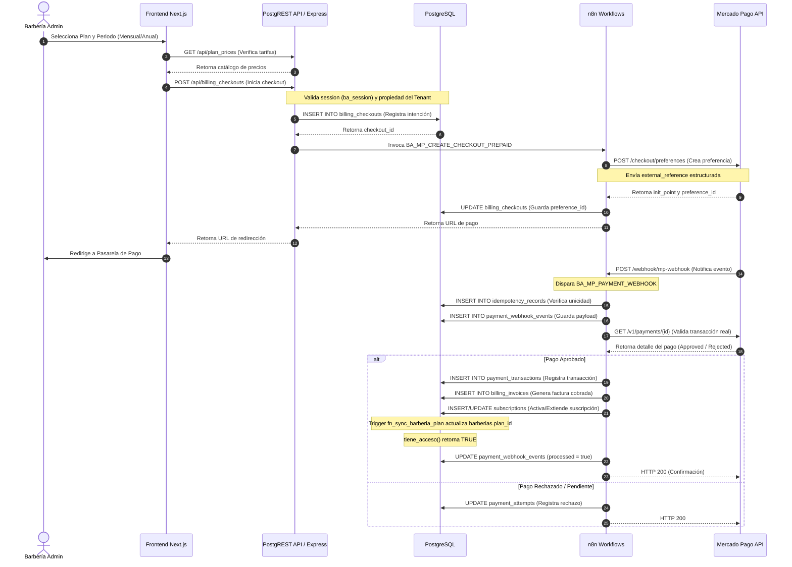
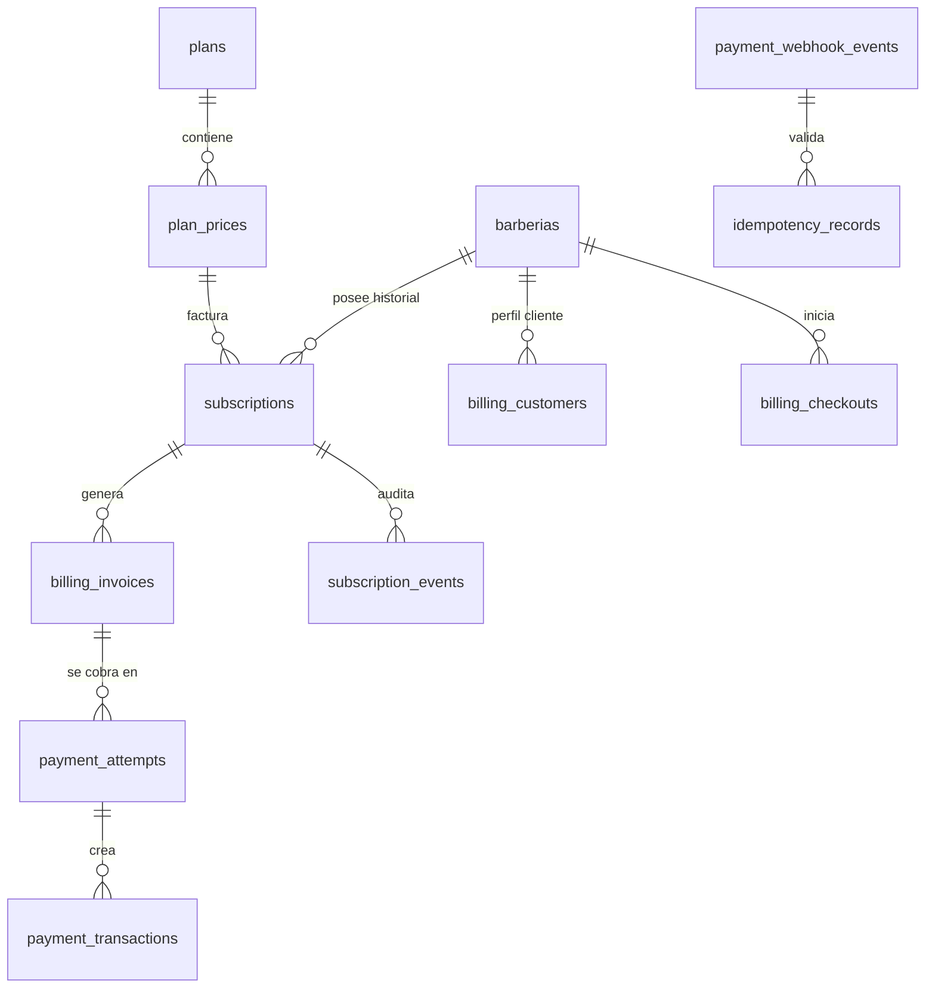
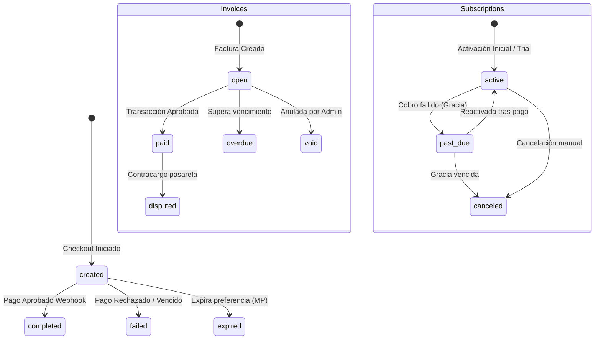

# Arquitectura Objetivo para la Integración de Mercado Pago

Este documento define la arquitectura técnica y el modelo de datos objetivo para integrar **Mercado Pago Colombia** en **BarberAgency** de forma segura, robusta y escalable, bajo un esquema multi-tenant SaaS y PostgREST.

---

## 1. Diagrama de Flujo Técnico Completo



---

## 2. Clasificación de Workflows Existentes (Sección A)

Se auditaron los flujos de n8n existentes en la base actual:

### 2.1. `CREATE_PAYMENT_MP_FIXED` (Workflow ID: `eBUyejoMu0CLmMe9`)
*   **Estado Objetivo:** **Eliminar / Deprecar por completo**.
*   **Componentes Reutilizables:** Estructura básica de llamada HTTP POST al endpoint de preferencias de Mercado Pago.
*   **Componentes a eliminar:** El nodo Webhook de entrada anónimo, los parámetros de precio harcodeados (`20000` COP) y el Access Token en texto plano (`Bearer TEST-767149...`).
*   **Nodos a reescribir:** Todos. La lógica de generación de preferencia debe alimentarse de inputs sanitizados desde la base de datos y no de un POST anónimo del frontend.
*   **Riesgos:** Fuga de secretos, creación de cobros con precios arbitrarios o alterados.
*   **Reemplazo:** Sí, será reemplazado por `BA_MP_CREATE_CHECKOUT_PREPAID` y `BA_MP_CREATE_RECURRING_SUBSCRIPTION`.

### 2.2. `MP_WEBHOOK_SUBSCRIPTION_FIXED` (Workflow ID: `Oss4Znf14ZIi8LMu`)
*   **Estado Objetivo:** **Eliminar / Deprecar por completo**.
*   **Componentes Reutilizables:** Estructura del nodo condicional que filtra eventos `type = payment` y el nodo HTTP GET que valida el pago en Mercado Pago llamando a `/payments/{id}`.
*   **Componentes a eliminar:** Nodo de actualización directa de PostgreSQL `Upsert Subscription` porque utiliza sentencias `ON CONFLICT` restrictivas, no genera facturas, usa fechas de renovación fijas (`30 days`) y actualiza la columna obsoleta `estado`.
*   **Riesgos:** Fallas críticas por colisión de UNIQUEs en base de datos, desactualización de fechas ante reintentos del webhook, asignación incorrecta de planes (`plan_id = 1` Starter por defecto).
*   **Reemplazo:** Sí, será reemplazado por `BA_MP_PAYMENT_WEBHOOK` y `BA_MP_SUBSCRIPTION_WEBHOOK`.

---

## 3. Diseño de Nuevos Workflows (Sección B)

Se define la arquitectura de flujos en n8n necesaria para soportar tanto pagos anticipados por periodos como suscripciones recurrentes automáticas:

### 1. `BA_MP_CREATE_CHECKOUT_PREPAID`
*   **Trigger:** Evento HTTP POST interno / RPC PostgREST.
*   **Endpoint:** `/webhook/barberagency/billing/prepaid-checkout`
*   **Autenticación:** JWT validado por API Gateway (`ba_session`). Requiere rol `admin` u `owner`.
*   **Nodos:**
    1.  `Webhook`: Recibe `barberia_id` y `plan_price_id`.
    2.  `PG - Read Price`: Consulta los detalles de `plan_prices` por ID.
    3.  `PG - Create Attempt`: Inserta registro en `payment_attempts`.
    4.  `HTTP - Create Preference`: POST a `/checkout/preferences` en Mercado Pago.
    5.  `PG - Update Attempt`: Guarda el `preference_id` y `external_reference`.
    6.  `Respond to Webhook`: Retorna el `init_point` al frontend.
*   **Tablas leídas:** `plan_prices`, `barberias`, `usuarios`.
*   **Tablas escritas:** `payment_attempts`, `billing_checkouts`.
*   **Idempotencia:** Genera una clave de idempotencia única `idempotency_key` a partir del hash del `barberia_id` + `plan_price_id` + ciclo actual.
*   **Errores:** Si el plan o barbería no coinciden, retorna HTTP 400. Si la API de Mercado Pago falla, realiza rollback lógico cancelando el intento y retorna HTTP 502.
*   **Respuesta HTTP:** `200 OK` con JSON `{"url": "https://www.mercadopago.com.co/..."}`.

### 2. `BA_MP_PAYMENT_WEBHOOK` (Para Pagos Anticipados)
*   **Trigger:** Notificación HTTP POST de Mercado Pago.
*   **Endpoint:** `/webhook/barberagency/payments/mp-notification`
*   **Autenticación:** Validación criptográfica de firma `x-signature` provista por Mercado Pago.
*   **Nodos:**
    1.  `Webhook`: Recibe el evento de pago.
    2.  `PG - Idempotency Check`: Inserta en `idempotency_records` para descartar duplicados.
    3.  `PG - Log Webhook`: Inserta payload crudo en `payment_webhook_events`.
    4.  `HTTP - Fetch Payment`: GET a `/v1/payments/{id}` en Mercado Pago.
    5.  `IF Approved`: Evalúa estado del pago.
    6.  `PG - Process Invoice`: Crea transacción y factura en `billing_invoices`.
    7.  `PG - Upsert Subscription`: Registra/extiende la suscripción activa.
    8.  `Respond`: Retorna HTTP 200.
*   **Tablas leídas:** `payment_attempts`, `plan_prices`, `subscriptions`.
*   **Tablas escritas:** `idempotency_records`, `payment_webhook_events`, `payment_transactions`, `billing_invoices`, `subscriptions`, `subscription_events`.
*   **Idempotencia:** Controlado a través del token del evento de Mercado Pago (`provider_event_id`).
*   **Rollback:** Si ocurre un error en base de datos durante la actualización, el flujo no responde HTTP 200, forzando a Mercado Pago a reintentar el webhook posteriormente.
*   **Respuesta HTTP:** `200 OK` (vacío).

### 3. `BA_MP_CREATE_RECURRING_SUBSCRIPTION` (Suscripción Automática)
*   **Trigger:** Acción del usuario en el panel (POST).
*   **Endpoint:** `/webhook/barberagency/billing/recurring-subscribe`
*   **Autenticación:** JWT `ba_session`.
*   **Nodos:**
    1.  `Webhook`: Recibe token de tarjeta de crédito e ID del plan.
    2.  `PG - Read Plan`: Obtiene `plan_prices` de tipo recurrente.
    3.  `HTTP - MP Subscribe`: POST a `/v1/preapprovals` de Mercado Pago.
    4.  `PG - Create Subscription`: Inserta suscripción en estado `'incomplete'` o `'active'`.
*   **Tablas leídas:** `plan_prices`, `billing_customers`.
*   **Tablas escritas:** `subscriptions`, `billing_invoices`.
*   **Idempotencia:** Restricción UNIQUE en `billing_customers` que asocia un único ID de suscripción automática activa.
*   **Errores:** Tarjeta rechazada (HTTP 402), token inválido.
*   **Respuesta HTTP:** `200 OK` con el estado inicial de la suscripción.

### 4. `BA_MP_SUBSCRIPTION_WEBHOOK` (Para Cobros Recurrentes)
*   **Trigger:** Webhook de suscripciones de Mercado Pago (`preapproval`).
*   **Endpoint:** `/webhook/barberagency/subscriptions/mp-notification`
*   **Autenticación:** Firma `x-signature`.
*   **Nodos:**
    1.  `Webhook`: Recibe el evento.
    2.  `HTTP - Fetch Subscription`: Valida el estado de la preaprobación en la API de Mercado Pago.
    3.  `IF Event Type`: Enruta según evento (cobro exitoso, cobro fallido, cancelación).
    4.  `PG - Handle Success`: Registra factura cobrada y extiende `period_end`.
    5.  `PG - Handle Failure`: Activa el periodo de gracia y notifica al cliente.
*   **Tablas leídas:** `subscriptions`, `plan_prices`.
*   **Tablas escritas:** `payment_webhook_events`, `billing_invoices`, `subscriptions`, `subscription_events`.
*   **Idempotencia:** Registro del token único de transacción provisto por Mercado Pago.
*   **Respuesta HTTP:** `200 OK`.

### 5. `BA_MP_RECONCILIATION_JOB` (Consistencia Diaria)
*   **Trigger:** Cron Job (Cada 12 horas).
*   **Autenticación:** Solo ejecución interna del sistema (Service Role).
*   **Nodos:**
    1.  `Cron Trigger`: Gatilla el flujo.
    2.  `PG - Fetch Pending Checkouts`: Busca registros en `payment_attempts` con estado `'pending'` creados hace más de 1 hora.
    3.  `Loop`: Recorre cada transacción.
    4.  `HTTP - MP Verify`: Consulta el estado real en Mercado Pago.
    5.  `PG - Sync Status`: Actualiza a `'approved'` o `'rejected'` en lote.
*   **Tablas leídas:** `payment_attempts`.
*   **Tablas escritas:** `payment_attempts`, `billing_invoices`, `subscriptions`.
*   **Respuesta HTTP:** No aplica (Job en background).

### 6. `BA_SUBSCRIPTION_EXPIRATION_JOB`
*   **Trigger:** Cron Job (Diario a las 00:01).
*   **Nodos:**
    1.  `PG - Get Expired Subscriptions`: Busca suscripciones con `period_end < NOW()` y estado `'active'`.
    2.  `Loop`: Recorre registros.
    3.  `PG - Suspend Access`: Actualiza estado a `'past_due'` o `'canceled'`.
    4.  `Email Notification`: Envía alerta al owner del tenant.
*   **Tablas leídas:** `subscriptions`.
*   **Tablas escritas:** `subscriptions`, `subscription_events`.

### 7. `BA_PAYMENT_RETRY_AND_GRACE_JOB`
*   **Trigger:** Cron Job (Diario).
*   **Nodos:**
    1.  `PG - Find Past Due`: Obtiene suscripciones en estado `'past_due'`.
    2.  `IF Exceeded Grace`: Valida si superaron el límite de gracia (ej. 3 días).
    3.  `PG - Block Tenant`: Cambia estado a `'incomplete'` (tiene_acceso() pasa a FALSE).
*   **Tablas leídas:** `subscriptions`, `plan_prices`.
*   **Tablas escritas:** `subscriptions`, `subscription_events`.

---

## 4. Modelo de Datos Mínimo Corregido (Sección C)

Se presenta el diseño físico del esquema relacional corregido en PostgreSQL. **Queda estrictamente prohibido reutilizar la tabla `pagos` de citas para el SaaS**.



### 4.1. Catálogo Comercial

#### Tabla: `public.plans`
```sql
CREATE TABLE public.plans (
  id SERIAL PRIMARY KEY,
  name TEXT NOT NULL UNIQUE,
  description TEXT,
  active BOOLEAN NOT NULL DEFAULT true,
  created_at TIMESTAMPTZ NOT NULL DEFAULT now(),
  updated_at TIMESTAMPTZ NOT NULL DEFAULT now()
);
```

#### Tabla: `public.plan_prices`
```sql
CREATE TABLE public.plan_prices (
  id SERIAL PRIMARY KEY,
  plan_id INT NOT NULL REFERENCES public.plans(id) ON DELETE RESTRICT,
  name TEXT NOT NULL,
  amount NUMERIC(10,2) NOT NULL CHECK (amount >= 0),
  currency TEXT NOT NULL DEFAULT 'COP',
  interval_type TEXT NOT NULL CHECK (interval_type IN ('month', 'year')),
  interval_count INT NOT NULL DEFAULT 1 CHECK (interval_count > 0),
  active BOOLEAN NOT NULL DEFAULT true,
  created_at TIMESTAMPTZ NOT NULL DEFAULT now(),
  updated_at TIMESTAMPTZ NOT NULL DEFAULT now()
);
```

### 4.2. Perfiles y Checkouts

#### Tabla: `public.billing_customers`
```sql
CREATE TABLE public.billing_customers (
  id BIGSERIAL PRIMARY KEY,
  barberia_id INT NOT NULL UNIQUE REFERENCES public.barberias(id) ON DELETE CASCADE,
  provider TEXT NOT NULL DEFAULT 'mercadopago',
  provider_customer_id TEXT NOT NULL,
  billing_email TEXT NOT NULL,
  tax_id TEXT, -- NIT / Rut
  created_at TIMESTAMPTZ NOT NULL DEFAULT now(),
  updated_at TIMESTAMPTZ NOT NULL DEFAULT now()
);
```

#### Tabla: `public.billing_checkouts`
```sql
CREATE TABLE public.billing_checkouts (
  id UUID PRIMARY KEY DEFAULT gen_random_uuid(),
  barberia_id INT NOT NULL REFERENCES public.barberias(id) ON DELETE CASCADE,
  plan_price_id INT NOT NULL REFERENCES public.plan_prices(id) ON DELETE RESTRICT,
  status TEXT NOT NULL DEFAULT 'created' CHECK (status IN ('created', 'expired', 'completed', 'failed')),
  idempotency_key TEXT NOT NULL UNIQUE,
  created_at TIMESTAMPTZ NOT NULL DEFAULT now(),
  expires_at TIMESTAMPTZ NOT NULL
);
```

### 4.3. Entidades Financieras

#### Tabla: `public.billing_invoices`
```sql
CREATE TABLE public.billing_invoices (
  id UUID PRIMARY KEY DEFAULT gen_random_uuid(),
  barberia_id INT NOT NULL REFERENCES public.barberias(id) ON DELETE CASCADE,
  subscription_id BIGINT REFERENCES public.subscriptions(id) ON DELETE SET NULL,
  amount NUMERIC(10,2) NOT NULL CHECK (amount >= 0),
  currency TEXT NOT NULL DEFAULT 'COP',
  status TEXT NOT NULL DEFAULT 'open' CHECK (status IN ('open', 'paid', 'void', 'disputed', 'overdue')),
  due_date TIMESTAMPTZ NOT NULL,
  paid_at TIMESTAMPTZ,
  invoice_pdf_url TEXT,
  created_at TIMESTAMPTZ NOT NULL DEFAULT now()
);
```

#### Tabla: `public.payment_attempts`
```sql
CREATE TABLE public.payment_attempts (
  id UUID PRIMARY KEY DEFAULT gen_random_uuid(),
  barberia_id INT NOT NULL REFERENCES public.barberias(id) ON DELETE CASCADE,
  invoice_id UUID REFERENCES public.billing_invoices(id) ON DELETE CASCADE,
  amount NUMERIC(10,2) NOT NULL CHECK (amount >= 0),
  currency TEXT NOT NULL DEFAULT 'COP',
  provider TEXT NOT NULL CHECK (provider IN ('mercadopago', 'paypal', 'stripe', 'wompi', 'manual')),
  provider_ref TEXT, -- preference_id / checkout_id
  status TEXT NOT NULL DEFAULT 'pending' CHECK (status IN ('pending', 'approved', 'rejected', 'in_process', 'cancelled')),
  created_at TIMESTAMPTZ NOT NULL DEFAULT now()
);
```

#### Tabla: `public.payment_transactions`
```sql
CREATE TABLE public.payment_transactions (
  id UUID PRIMARY KEY DEFAULT gen_random_uuid(),
  payment_attempt_id UUID NOT NULL REFERENCES public.payment_attempts(id) ON DELETE RESTRICT,
  provider_payment_id TEXT NOT NULL, -- ID físico del pago en Mercado Pago
  amount_paid NUMERIC(10,2) NOT NULL CHECK (amount_paid >= 0),
  fee_amount NUMERIC(10,2) NOT NULL DEFAULT 0, -- Comisión retenida
  payment_method_type TEXT NOT NULL, -- PSE, credit_card, cash
  created_at TIMESTAMPTZ NOT NULL DEFAULT now(),
  CONSTRAINT unique_provider_payment UNIQUE (provider_payment_id)
);
```

### 4.4. Control de Acceso y Estado

#### Tabla: `public.subscriptions`
```sql
CREATE TABLE public.subscriptions (
  id BIGSERIAL PRIMARY KEY,
  barberia_id INT NOT NULL REFERENCES public.barberias(id) ON DELETE CASCADE,
  plan_price_id INT NOT NULL REFERENCES public.plan_prices(id) ON DELETE RESTRICT,
  status TEXT NOT NULL DEFAULT 'active' CHECK (status IN ('trialing','active','past_due','canceled','paused','incomplete')),
  period_start TIMESTAMPTZ NOT NULL DEFAULT now(),
  period_end TIMESTAMPTZ,
  provider TEXT NOT NULL DEFAULT 'manual',
  provider_ref TEXT, -- ID de suscripción en Mercado Pago si aplica
  created_at TIMESTAMPTZ NOT NULL DEFAULT now(),
  updated_at TIMESTAMPTZ NOT NULL DEFAULT now()
);

-- Reemplazo de la antigua restricción UNIQUE por índice parcial de suscripción activa única
CREATE UNIQUE INDEX ux_active_subscription_per_barberia
ON public.subscriptions(barberia_id)
WHERE status IN ('active', 'trialing', 'past_due');
```

#### Tabla: `public.subscription_events`
```sql
CREATE TABLE public.subscription_events (
  id BIGSERIAL PRIMARY KEY,
  subscription_id BIGINT NOT NULL REFERENCES public.subscriptions(id) ON DELETE CASCADE,
  event_type TEXT NOT NULL CHECK (event_type IN ('created', 'renewed', 'grace_start', 'suspended', 'reactivated', 'canceled')),
  metadata JSONB,
  created_at TIMESTAMPTZ NOT NULL DEFAULT now()
);
```

### 4.5. Logs e Idempotencia

#### Tabla: `public.payment_webhook_events`
```sql
CREATE TABLE public.payment_webhook_events (
  id UUID PRIMARY KEY DEFAULT gen_random_uuid(),
  provider TEXT NOT NULL,
  provider_event_id TEXT NOT NULL,
  event_type TEXT,
  payload JSONB NOT NULL,
  processed BOOLEAN NOT NULL DEFAULT false,
  error_log TEXT,
  created_at TIMESTAMPTZ NOT NULL DEFAULT now(),
  CONSTRAINT unique_provider_event UNIQUE (provider, provider_event_id)
);
```

#### Tabla: `public.idempotency_records`
```sql
CREATE TABLE public.idempotency_records (
  idkey TEXT PRIMARY KEY, -- Hash o clave generada
  response_payload JSONB NOT NULL,
  created_at TIMESTAMPTZ NOT NULL DEFAULT now()
);
```

---

## 5. Referencias Únicas (`external_reference`) (Sección D)

Para evitar duplicaciones y dar seguridad en la conciliación del webhook, el valor de `external_reference` enviado a Mercado Pago no será únicamente el ID de la barbería. Utilizará una estructura serializada con la siguiente nomenclatura:

```txt
ba_v1_{barberia_id}_{billing_term}_{checkout_id}_{random_hash}
```

### Campos que componen la referencia:
*   `ba_v1`: Prefijo del sistema de BarberAgency y versión del payload para soportar retrocompatibilidad de análisis en el futuro.
*   `barberia_id`: ID del tenant para aplicar RLS y validar el propietario.
*   `billing_term`: Intervalo y cantidad del periodo (`m1` para mensual, `q3` trimestral, `s6` semestral, `y12` anual).
*   `checkout_id`: UUID de la tabla `billing_checkouts` para relacionar directamente el pago con la intención registrada en base de datos.
*   `random_hash`: Cadena alfanumérica aleatoria de 6 caracteres (ej. `x9f2a4`) generada en tiempo de ejecución para evitar colisiones ante la reapertura de checkouts.

---

## 6. Seguridad y Validación (Sección E)

Para blindar el sistema contra fraudes o suplantaciones, se implementa la siguiente matriz de control:

1.  **Validación de Sesión:** El endpoint de checkout en Next.js/PostgREST lee estrictamente el JWT (`ba_session`). Si no existe o expira, retorna HTTP 401 de inmediato.
2.  **Comprobación de Propietario (`owner_id`):** Al procesar un cobro, la base de datos verifica mediante RLS que el `owner_id` de la barbería en `barberias` coincida con el `user_id` decodificado de los claims del JWT.
3.  **Validación criptográfica `x-signature`:** El webhook de entrada valida los headers `x-signature` y `x-request-id` de Mercado Pago utilizando la firma secreta de webhook compartida. 
4.  **Protección de Replay:** Los webhooks registran el `x-request-id` y el timestamp del evento en `payment_webhook_events`. Si el evento tiene una antigüedad mayor a 5 minutos, o si el ID del evento ya fue registrado, se rechaza la ejecución.
5.  **Validación de Monto y Moneda:** El backend compara el monto real cobrado retornado por la consulta asíncrona de Mercado Pago (`https://api.mercadopago.com/v1/payments/{id}`) contra el valor esperado en `plan_prices`. Si el valor es inferior, el estado pasa a `'incomplete'` para evitar activaciones fraudulentas. La moneda debe ser estrictamente `'COP'` (y USD en el futuro).
6.  **Almacenamiento Seguro:** Las credenciales y claves de producción de Mercado Pago se guardarán en las variables del entorno de EasyPanel (`MP_ACCESS_TOKEN`, `MP_WEBHOOK_SECRET`) y no se expondrán en el repositorio.

---

## 7. Control de Idempotencia y Restricciones (Sección F)

Se imponen restricciones físicas en la base de datos para blindar la consistencia de los datos financieros:

*   **Evitar Duplicados de Pago:**
    ```sql
    ALTER TABLE public.payment_transactions 
    ADD CONSTRAINT unique_provider_payment UNIQUE (provider_payment_id);
    ```
*   **Evitar Duplicación de Webhooks:**
    ```sql
    ALTER TABLE public.payment_webhook_events 
    ADD CONSTRAINT unique_provider_event UNIQUE (provider, provider_event_id);
    ```
*   **Garantizar Intención Única de Checkout:**
    ```sql
    ALTER TABLE public.billing_checkouts 
    ADD CONSTRAINT unique_idempotency_key UNIQUE (idempotency_key);
    ```
*   **Control de Doble Transacción por Webhook:** El webhook antes de iniciar cualquier inserción ejecuta una query de validación sobre `idempotency_records` bloqueando por `idkey` mediante transacciones serializables en Postgres (`ISOLATION LEVEL SERIALIZABLE`).

---

## 8. Máquina de Estados (Sección G)

Las entidades transaccionales transitarán a lo largo de los siguientes estados:



### Mapeo de Estados:

| Entidad | Estado Interno | Estado Equivalente Mercado Pago |
| :--- | :--- | :--- |
| **Checkout** | `created` | `pending` |
| **Checkout** | `completed` | `approved` |
| **Checkout** | `failed` | `rejected` / `cancelled` |
| **Suscripción** | `active` | `authorized` / `active` |
| **Suscripción** | `past_due` | `pending` (de cobro recurrente) |
| **Suscripción** | `canceled` | `cancelled` |

---

## 9. Cálculo Matemático de Periodos (Sección H)

El cálculo de fechas evita el uso de `now() + 30 days` estático, aplicando reglas basadas en el intervalo del plan adquirido:

### 9.1. Variables del plan:
*   `I` = Intervalo de tiempo en formato de intervalo PostgreSQL (ej. `1 month`, `3 months`, `1 year` obtenido de `plan_prices`).

### 9.2. Reglas de cálculo de fechas:
1.  **Compra Inicial:**
    *   `period_start` = `NOW()`
    *   `period_end` = `NOW() + I`
2.  **Renovación antes de vencer (Suscripción Activa):**
    *   `period_start` = `current_period_end` (Acumula el tiempo restante)
    *   `period_end` = `current_period_end` + `I`
3.  **Renovación después de vencer (Suscripción Vencida):**
    *   `period_start` = `NOW()` (Reinicia acceso desde el día del pago real)
    *   `period_end` = `NOW() + I`
4.  **Upgrade (Cambio mensual a anual antes de vencer):**
    *   Se calcula el saldo a favor restante de la suscripción actual:
        $$\text{Días restantes} = \text{period\_end} - \text{NOW()}$$
        $$\text{Crédito} = \text{Días restantes} \times \left( \frac{\text{Monto mensual}}{30} \right)$$
    *   El crédito se descuenta de la factura del plan anual y la nueva vigencia se calcula desde `NOW()` hasta `NOW() + 1 year`.
5.  **Cancelación antes de renovación:**
    *   `status` cambia a `'canceled'`.
    *   `period_end` se mantiene intacto. El cliente sigue teniendo acceso hasta la fecha original de vencimiento y se bloquea la siguiente factura.

---

## 10. Plan de Transición Expand/Contract (Sección I)

Se establece la estrategia para migrar producción al nuevo modelo de pagos sin interrupciones del servicio de reservas:

```txt
[Fase 1: Expand]
  --> Ejecutar migraciones para crear nuevas tablas (plan_prices, billing_invoices, etc.)
  --> Poblar tabla `plan_prices` con tarifas de 50.000 COP.
  --> Mantener workflows legacy MP inactivos.

[Fase 2: Migrar Datos Vivos]
  --> Leer las 10 barberías Pro y crearles un registro inicial en `plan_prices` (anual de 99.000 COP legacy para respetar su tarifa contratada).
  --> Poblar su historial en `subscriptions` y asociarles facturas ficticias manuales.

[Fase 3: Sandbox & Deploy]
  --> Subir nuevos workflows a n8n (BA_MP_PAYMENT_WEBHOOK, etc.) en estado inactivo.
  --> Realizar pruebas funcionales en entorno de Sandbox Mercado Pago.
  --> Activar los nuevos workflows y desactivar endpoints viejos en el Gateway.

[Fase 4: Contract]
  --> Cambiar lógica de login/sesión en n8n para no leer `usuarios.plan_id`.
  --> Eliminar de base de datos la columna `usuarios.plan_id`.
  --> Eliminar de base de datos la columna `subscriptions.estado`.
  --> Archivar permanentemente workflows legacy inactivos.
```

---

## 11. Plan de Pruebas y Rollback

### 11.1. Casos de Prueba Críticos en Sandbox:
1.  **Pago PSE Exitoso:** Validar creación de factura `paid`, suscripción `active` y actualización de `barberias.plan_id`.
2.  **Pago Rechazado Tarjeta:** Validar intento como `rejected`, factura en estado `open` y alertas al cliente.
3.  **Webhook Duplicado:** Validar que el segundo evento rebote por idempotencia y no extienda la fecha.
4.  **PSE Pendiente a Aprobado:** Simular delay de 10 minutos y verificar que el reconciliation job sincronice el estado correctamente.

### 11.2. Plan de Rollback:
Si la integración falla en producción:
1.  **Desactivar Webhooks:** Apagar temporalmente el workflow `BA_MP_PAYMENT_WEBHOOK` en n8n.
2.  **Activación manual temporal:** Habilitar suscripciones de forma manual mediante el provider `'manual'` en la tabla `subscriptions` para no bloquear los negocios de los clientes.
3.  **Restauración del catálogo:** Modificar la vista `v_subscription_current` para apuntar temporalmente al estado legacy si es necesario.
