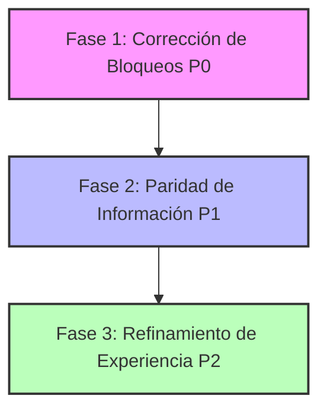

# 📐 REPORTE DE AUDITORÍA: Paridad Responsive PC vs Móvil — Dashboard BarberAgency
**Fecha:** 2026-06-13  
**Auditor:** Antigravity  
**Estado:** Completado (Solo Auditoría - Sin Modificaciones de Código)

---

## 1. Resumen Ejecutivo

Esta auditoría analiza en detalle la paridad responsive entre las vistas de Desktop (PC) y Mobile (Móvil) del dashboard de **BarberAgency**. El objetivo fundamental es asegurar que toda la **información crítica y flujos operativos** estén disponibles y sean completamente funcionales en dispositivos móviles, de acuerdo con la regla de negocio "Producto-Primero" (SaaS Mobile-Parity).

### Diagnóstico General:
Aunque la interfaz implementa esquemas avanzados de adaptación responsive (como la conversión de tablas tradicionales a listados de tarjetas con `data-label` y el plegado del sidebar en un menú de rejilla de 3 columnas), se han detectado **dos fallos críticos de severidad P0** y varios **desajustes de paridad de datos y UI (P1/P2)** que bloquean la operación en dispositivos móviles de 390x844 (iPhone 12/13/14 Pro) y 360x740 (Samsung S20/S21/S22):

1. **[P0] Ausencia de la Agenda de Turnos Diarios en Móvil (Citas):** La vista de citas en móvil oculta completamente la rejilla de slots horarios (`ba-citas-board-desktop`). El contenedor móvil alternativo (`ba-citas-board-mobile`) solo renderiza el calendario del mes, haciendo imposible ver qué horas están ocupadas/libres, qué barbero está asignado a qué hora, o pulsar sobre un slot disponible para cargarlo directamente en el formulario.
2. **[P0] Modal de Detalle de Cita Atrapado bajo el Backdrop (Citas):** En móvil, el detalle de citas (`ba-citas-overlay-card`) cambia su posicionamiento a `static` (flujo inline al final de la página), mientras que el fondo oscuro translúcido (`ba-citas-overlay-backdrop`) permanece como `fixed` ocupando toda la pantalla. Esto oscurece y bloquea toda la interfaz e impide interactuar con la ficha de la cita, la cual queda inservible e inaccesible al final de la página.
3. **[P1] Deformación de Botones en la Tabla de POS (POS / Caja):** La celda de acción (`td[data-label="Accion"]`) en la tabla responsiva móvil de pendientes de cobro no tiene habilitado el salto de línea (`flex-wrap`). Como el botón "Cargar Cita" tiene un ancho del 100%, la etiqueta de texto `"ACCION"` y el botón se solapan violentamente en la misma línea, distorsionando la UI y reduciendo el área interactiva del botón.
4. **[P1] Pérdida de Datos en Lista y Mocking Estático (Clientes):** Las columnas críticas de teléfono (contacto) y fecha de última visita se ocultan por completo en el listado móvil de clientes. Adicionalmente, el popup de detalles en móvil muestra datos estáticos mockeados ("28 Ene - 10:00 AM" y "Corte y Barba") en lugar de heredar los datos dinámicos dinámicamente como lo hace la barra lateral en PC.

---

## 2. Tabla de Diagnóstico por Pantalla

A continuación se detalla el análisis comparativo para cada una de las 11 pantallas del alcance:

| Pantalla | Desktop | Mobile | Diferencia detectada | Severidad | Recomendación |
| :--- | :---: | :---: | :--- | :---: | :--- |
| **1. Panel Principal** | **OK** | **OK** | La fila de acciones de publicación (`ba-action-row`) contiene 5 botones en una cuadrícula rígida de 2 columnas. En pantallas pequeñas (360px) el texto se comprime excesivamente y el último botón queda desalineado en su propia fila. | **P2** | Cambiar a un flujo flexible (`flex flex-wrap`) o reajustar los tamaños de texto y paddings en viewports pequeños. |
| **2. Citas** | **OK** | **FAIL** | **1. Rejilla de slots horaria oculta:** Se esconde `.ba-citas-board-desktop` y el bloque `.ba-citas-board-mobile` solo muestra el calendario mensual; no hay visualización de la disponibilidad del día.<br>**2. Modal inaccesible:** El popup de detalle de cita se vuelve `static` y queda atrapado debajo del backdrop `fixed`, bloqueando la pantalla. | **P0** | **1.** Renderizar la lista de slots horaria del día debajo del calendario en la vista móvil.<br>**2.** Mantener la posición `fixed` en la tarjeta de detalle para móvil con scroll independiente. |
| **3. Clientes** | **OK** | **FAIL** | **1. Información oculta:** Se esconden las columnas de teléfono y última visita en el listado.<br>**2. Datos Hardcoded:** El popup móvil muestra texto estático mockeado ("28 Ene - 10:00 AM") en lugar de cargar las variables dinámicas del cliente seleccionado. | **P1** | **1.** Mostrar el teléfono y la última visita debajo del nombre del cliente en formato stacked.<br>**2.** Vincular el popup móvil con el estado dinámico del cliente seleccionado (`selected`). |
| **4. Barberos** | **OK** | **FAIL** | Las tarjetas de barberos se renderizan en 2 columnas fijas en móvil. En viewports de 360px/390px, el exceso de información (estrellas, botones, badges) provoca que los textos se solapen y los botones se desborden de la tarjeta. | **P1** | Forzar a 1 sola columna (`grid-template-columns: 1fr`) en pantallas inferiores a 680px (mismo comportamiento que el catálogo de servicios). |
| **5. Servicios** | **OK** | **OK** | La rejilla colapsa correctamente a 1 columna. Sin embargo, la tarjeta de detalles del servicio (`ba-services-overlay`) se vuelve `static` en móvil en lugar de ser un modal flotante (comportamiento inconsistente). | **P2** | Estandarizar la superposición de detalles como un modal flotante centralizado (`position: fixed`) en dispositivos móviles. |
| **6. Prog. de Lealtad** | **OK** | **OK** | El layout se apila bien. La rejilla de sellos colapsa de 8 a 4 columnas de forma correcta. Los inputs de las reglas de negocio son editables a pantalla completa. | **P2** | Ajustar márgenes internos leves en la card de sellos para pantallas de 360px. |
| **7. Caja / POS** | **OK** | **FAIL** | **1. Solapamiento en tabla:** La celda de acción comprime el botón y la etiqueta "ACCION" al no tener `flex-wrap`.<br>**2. Fricción en Checkout:** El bloque de cobro rápido se apila debajo del catálogo de servicios, obligando a hacer un scroll muy largo para facturar. | **P0** | **1.** Añadir `flex-direction: column` o `flex-wrap: wrap` en las celdas de acción en móvil.<br>**2.** Diseñar una vista de pestañas ("Catálogo" y "Facturar") o colocar el resumen de cobro arriba en móvil. |
| **8. Configuración** | **OK** | **OK** | El formulario de colores y URLs se apila en una sola columna limpia (`1fr`). La edición de barberos/horarios redirige externamente a WordPress, lo cual es correcto por flujo. | **P2** | Asegurar consistencia visual si en el futuro se amplían campos locales. |
| **9. Soporte** | **OK** | **OK** | Card informativa estática que escala bien a 1 columna. Redirige a WordPress para contacto, lo cual mantiene la paridad. | **P2** | Mantener alineado con el diseño general del dashboard. |
| **10. Sidebar / Nav** | **OK** | **FAIL** | Las pestañas largas de navegación como "Programa de Lealtad" se cortan de forma extraña debido al uso de `overflow-wrap: anywhere` en una cuadrícula móvil ajustada de 3 columnas (88px mín). | **P1** | Usar etiquetas más cortas para móvil (ej. "Programa de Lealtad" -> "Lealtad", "Caja / POS" -> "Caja", "Configuración" -> "Config."). |
| **11. Topbar / Plan** | **OK** | **OK** | El topbar desaparece en móvil y sus acciones (notificaciones, tema, Plan Pro) se trasladan de forma limpia a la cabecera móvil (`ba-mobile-head-row`). | **P2** | El buscador es un div estático con texto y no un input real (limitación funcional compartida con PC). |

---

## 3. Listas de Hallazgos Priorizados

### 🔴 Prioridad P0 (Bloquean Operación Crítica)
1. **Falta de agenda horaria (Citas):** En el móvil, el usuario administrador no puede ver qué slots de horas están ocupados o libres. No se puede auditar visualmente el flujo de reservas diarias.
2. **Ficha de detalle oculta bajo fondo oscuro (Citas):** Al intentar ver el detalle de una cita en móvil, la pantalla se oscurece con el backdrop, pero los datos se renderizan al fondo de la página de forma inaccesible, bloqueando cualquier acción de cierre, edición o eliminación.
3. **Solapamiento etiqueta-botón en POS (Caja/POS):** En la tabla de pendientes de cobro, el botón de "Cargar Cita" se solapa físicamente con la etiqueta "ACCION", lo que puede impedir clics correctos y provoca una experiencia visual rota (distorsión de flexbox).

### 🟡 Prioridad P1 (Información Perdida y Fricción de UX)
1. **Ocultamiento de datos de clientes (Clientes):** Ocultar el teléfono y la última visita en el listado móvil fuerza al usuario a abrir la ficha de cada cliente uno por uno para consultar datos de contacto básicos.
2. **Textos estáticos en popup de cliente (Clientes):** La ventana de detalles del cliente en móvil usa textos estáticos de demostración para la fecha y el servicio, perdiendo la paridad de información dinámica que sí tiene PC.
3. **Colapso visual de barberos (Barberos):** La cuadrícula de 2 columnas para barberos en dispositivos móviles provoca que los textos del rol, estado activo/inactivo y los botones se pisen entre sí en viewports de 360px/390px.
4. **Nombres de navegación cortados (Sidebar):** El texto de las pestañas en el menú de navegación de 3 columnas en móvil se corta aleatoriamente (ej. "Programa de Le" / "altad"), restando legibilidad.

### 🟢 Prioridad P2 (Detalles Visuales y UX Menores)
1. **Fricción por Scroll en POS (POS):** Stackear el catálogo y la tirilla de cobro uno debajo del otro obliga a hacer scroll excesivo en flujos rápidos de venta mostrador.
2. **Ancho del modal de la calculadora (POS):** En pantallas pequeñas de 360px, el modal de la calculadora (`w-full max-w-[340px]`) roza los bordes del dispositivo y produce una sensación de desborde debido a los paddings laterales de 12px de la capa overlay.
3. **Inconsistencia en los overlays de detalles:** Algunos detalles (como el de servicios) se renderizan en el flujo estático de la página, mientras que otros (como el de clientes) se renderizan como modales fijos sobre la pantalla.
4. **Grid de botones de publicación (Panel Principal):** La distribución de 5 botones en una rejilla rígida de 2 columnas deja un espacio en blanco asimétrico en la tercera fila de la tarjeta de publicación.

---

## 4. Descripción Visual de los Fallos Críticos

### A. Agenda Horaria Móvil (Oculta)
```
+---------------------------------------+
|  [ Mes Anterior ]  Junio 2026  [ Siguiente ]  |
+---------------------------------------+
|   L   |   M   |   X   |   J   |   V   |   S   |   D   |
|  01   |  02   |  03   |  04   |  05   |  06   |  07   |
|  08   |  09   |  10   |  11   |  12   | [13]  |  14   |   <-- Calendario interactivo
+---------------------------------------+
|   [!] FIN DE LA PÁGINA / SIN SLOTS    |   <-- Debería renderizar la agenda horaria del día 13/06:
|                                       |       09:00 - Camilo (Disponible)
|                                       |       09:30 - Juan (Corte y Estilo - Confirmada)
+---------------------------------------+
```

### B. Modal de Citas Bloqueado
```
+---------------------------------------+
| ##################################### |
| ############## BACKDROP ############# |
| ############## FIXED 100% ########### |   <-- Capa oscura transparente que cubre todo
| ############## LOCK CLICKS ########## |
| ##################################### |
+---------------------------------------+
| ... [Scroll al final del documento]   |
| [  Tarjeta de Detalle Stática       ] |
| [  Cliente: Juan Perez              ] |   <-- Queda renderizado aquí abajo, oculto
| [  Servicio: Barba Premium          ] |       o inaccesible detrás del backdrop fixed
+---------------------------------------+
```

### C. Solapamiento de Botón en POS
```
+---------------------------------------+
| CLIENTE:   Camilo Rodriguez           |
| HORA:      10:00 AM                   |
| SERVICIO:  Corte Clásico              |
| BARBERO:   Andrés                     |
| ACCION:    [ Cargar Cita ⚡ ]        |   <-- La palabra "ACCION" y el botón de 100%
+---------------------------------------+       comparten línea y se pisan visualmente
```

---

## 5. Archivos y Componentes Probables a Modificar

Para llevar a cabo las correcciones oportunas, los siguientes archivos son los candidatos clave para modificaciones del frontend:

1. **[`_work_panel_de_barberia/src/app/globals.css`](file:///C:/Users/calvi/OneDrive/n8n/Visual%20studio/barberagency-core/_work_panel_de_barberia/src/app/globals.css):**
   - Modificar las reglas responsive de `.ba-overlay-card` para evitar que hereden `position: static` de forma genérica en móvil.
   - Ajustar el selector `.ba-mobile-card-table td[data-label="Accion"]` para habilitar `flex-wrap: wrap` o `flex-direction: column`.
   - Modificar `.ba-barbers-cards-grid` para colapsar a 1 columna bajo 680px.
   - Optimizar el tamaño y espaciado de `.ba-nav-item` para evitar saltos de línea antiestéticos.
2. **[`_work_panel_de_barberia/src/app/citas/page.tsx`](file:///C:/Users/calvi/OneDrive/n8n/Visual%20studio/barberagency-core/_work_panel_de_barberia/src/app/citas/page.tsx):**
   - Integrar la rejilla de visualización de turnos diarios (`agendaHours.map(...)`) dentro del bloque `.ba-citas-board-mobile` para paridad móvil.
3. **[`_work_panel_de_barberia/src/app/clientes/page.tsx`](file:///C:/Users/calvi/OneDrive/n8n/Visual%20studio/barberagency-core/_work_panel_de_barberia/src/app/clientes/page.tsx):**
   - Sustituir los textos mockeados estáticos del popup `ba-client-card-popup` por las variables dinámicas del cliente seleccionado (ej. `selected.lastVisit`, `selected.preferredService`).
   - Modificar la clase del listado móvil para mostrar teléfono y última visita en formato apilado bajo el nombre en lugar de ocultarlos.
4. **[`_work_panel_de_barberia/src/app/inventario/page.tsx`](file:///C:/Users/calvi/OneDrive/n8n/Visual%20studio/barberagency-core/_work_panel_de_barberia/src/app/inventario/page.tsx):**
   - Evaluar la inclusión de un control de pestañas responsivo para alternar de forma cómoda entre la visualización del catálogo de servicios y la tirilla de cobro.

---

## 6. Propuesta de Plan de Corrección por Fases

Se propone el siguiente plan estructurado en 3 fases para subsanar los fallos encontrados sin alterar la lógica de negocio ni el backend:



### 📅 Fase 1: Corrección de Bloqueos Críticos (P0)
* **Objetivos:** Devolver la operabilidad total en móvil a los flujos de Citas y POS.
* **Acciones:**
  1. Corregir el CSS de `.ba-overlay-card` para que mantenga `position: fixed` en móvil y no quede bloqueado detrás de la capa oscura.
  2. Implementar la visualización de la agenda horaria del día seleccionado en la sección móvil de citas.
  3. Modificar la celda de acción en la tabla responsiva de POS para evitar el solapamiento visual del botón "Cargar Cita".
* **Pruebas:** Verificar en emulador móvil que las citas se carguen, se puedan consultar sus detalles en el modal central, y se puedan facturar sin desbordes.

### 📅 Fase 2: Paridad de Información y Datos (P1)
* **Objetivos:** Restaurar datos e información secundaria eliminada o mockeada en móvil.
* **Acciones:**
  1. Habilitar la visibilidad del teléfono y última visita de los clientes en la vista móvil de forma apilada.
  2. Reemplazar los textos mockeados estáticos del modal de cliente por sus variables dinámicas correspondientes.
  3. Cambiar la rejilla de barberos a 1 columna en móvil para evitar el colapso y pisado de textos.
  4. Rediseñar el tamaño y las etiquetas de la barra de navegación móvil (Sidebar) para evitar el corte tosco de palabras.
* **Pruebas:** Asegurar la consistencia de datos dinámicos entre desktop y móvil.

### 📅 Fase 3: Refinamiento de Experiencia y UX (P2)
* **Objetivos:** Optimizar la fluidez operativa y pulir pequeños desajustes visuales.
* **Acciones:**
  1. Implementar la interfaz de pestañas en POS móvil para alternar entre "Catálogo" y "Facturar" rápido sin necesidad de scroll infinito.
  2. Ajustar el ancho máximo de la calculadora a `320px` para pantallas móviles de 360px de ancho.
  3. Estandarizar la superposición de detalles de servicios como un modal centrado en móvil.
  4. Ajustar la alineación del grid de botones en la tarjeta de publicación en el panel principal.
* **Pruebas:** Confirmar que no exista overflow horizontal en ningún viewport (desde 360px hasta superior a 1366px).
