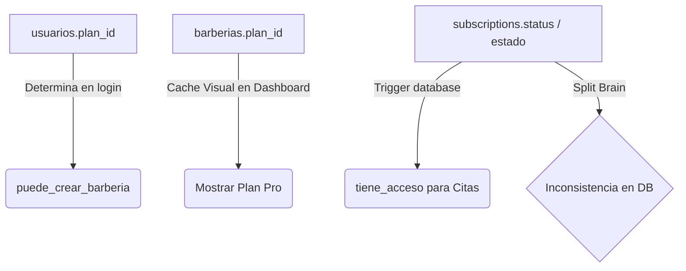
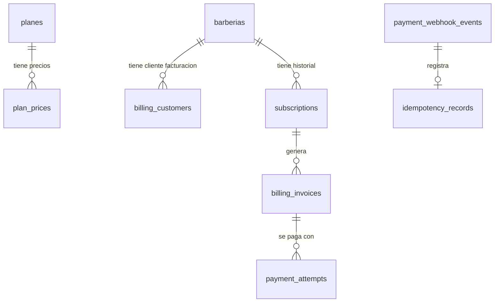

# Diagnóstico de base de datos para planes y pagos

## 1. Resumen ejecutivo

El presente informe contiene el diagnóstico técnico y funcional de la base de datos del proyecto **BarberAgency**, realizado con el objetivo de evaluar su preparación para la implementación del módulo de planes, suscripciones y pagos.

Tras analizar los archivos del proyecto, las especificaciones de producción y realizar consultas directas sobre la base de datos a través de scripts de inspección automatizados (`run_diagnostic.js`), se determina que **el nivel de preparación actual de la base de datos es: BAJO a MEDIO**.

### Hallazgos clave:
1. **Redundancia e inconsistencia en la Fuente de Verdad:** Coexisten múltiples referencias de planes en las tablas `usuarios.plan_id`, `barberias.plan_id` y `subscriptions.plan_id`. 
2. **Problema de Split-Brain de Estado:** La tabla `subscriptions` posee dos columnas de estado redundantes: `status` (definida como `'active'`) y `estado` (definida como `'activa'`). Se descubrió un registro en producción (`barberia_id = 197`) con `status = 'active'` pero con `estado = NULL`. Dado que la función `tiene_acceso()` valida estrictamente la columna `estado`, esta barbería se encuentra bloqueada de recibir citas de forma errónea.
3. **Limitación de Historial:** La tabla `subscriptions` tiene una restricción `UNIQUE (barberia_id)` que imposibilita almacenar el historial de suscripciones y renovaciones de una misma barbería.
4. **Acoplamiento de Registro:** La función de sesión e inicio de sesión en n8n bloquea la creación de barberías si el usuario no cuenta con un `plan_id` en la tabla `usuarios`, lo cual choca con el modelo comercial objetivo donde las suscripciones pertenecen a la barbería (tenant) y no al usuario.
5. **Aislamiento de la tabla `pagos`:** Se verificó que la tabla `pagos` se utiliza exclusivamente para registrar los cobros de citas físicas (POS/Citas de barbería) y no contiene registros de SaaS. Por ende, no debe reutilizarse.

Este diagnóstico proporciona la justificación técnica para normalizar el catálogo, rediseñar el control de accesos e implementar las entidades transaccionales requeridas.

---

## 2. Alcance analizado

El análisis estructural y de datos cubrió las siguientes áreas del proyecto:
1. **Definiciones SQL y Migraciones:** Inspección del archivo maestro de base de datos [bdmaster.md](file:///root/github/barberagency-core/app/database/schema/bdmaster.md) e historial de cambios en [FuenteDeVerdad_PRODUCCION.md](file:///root/github/barberagency-core/ContextoGeneral/docs/FuenteDeVerdad_PRODUCCION.md).
2. **Workflows en n8n:** Análisis de los flujos de login, onboarding, sesión y dashboard state en [onboarding_workflow_LsvB2cGDxvNTSL28.json](file:///root/github/barberagency-core/pruebas/onboarding_workflow_LsvB2cGDxvNTSL28.json), [session_me_workflow.json](file:///root/github/barberagency-core/pruebas/session_me_workflow.json) y [auth_google_session.json](file:///root/github/barberagency-core/pruebas/auth_google_session.json).
3. **Esquema Físico (Metadatos):** Consulta en vivo de tablas, columnas, tipos de datos, llaves primarias, llaves foráneas, índices, restricciones CHECK, RLS (Row Level Security), políticas, triggers y funciones almacenadas en PostgreSQL (guardados en [diagnostic_metadata.json](file:///root/github/barberagency-core/pruebas/diagnostic_metadata.json)).
4. **Datos de Producción:** Inspección del catálogo actual de planes y del estado de las suscripciones existentes.

---

## 3. Inventario de objetos

A continuación se detallan los objetos de base de datos identificados como críticos o relevantes para el sistema de facturación y acceso:

### 3.1. Tablas del esquema `public`
*   **`planes`**: Catálogo de planes de suscripción.
*   **`subscriptions`**: Registro del estado del contrato de SaaS por barbería.
*   **`usuarios`**: Entidad de usuarios administradores/barberos.
*   **`barberias`**: Tenants del SaaS.
*   **`citas`**: Citas agendadas por clientes en las barberías.
*   **`pagos`**: Transacciones financieras asociadas a las citas (POS de barbería).
*   **`barberia_miembros`**: Relaciones de acceso y roles entre usuarios y barberías.

### 3.2. Columnas, tipos y restricciones en tablas core de suscripción

#### Tabla `planes`
*   `id`: `integer` (SERIAL PRIMARY KEY, autoincremental).
*   `nombre`: `text` (UNIQUE, no nulo).
*   `precio`: `numeric(10,2)` (no nulo, por defecto `0.00`, restricción CHECK `precio >= 0`).
*   `created_at`: `timestamp with time zone` (por defecto `now()`).

#### Tabla `subscriptions`
*   `id`: `bigint` (BIGSERIAL PRIMARY KEY, autoincremental).
*   `barberia_id`: `integer` (no nulo, FOREIGN KEY a `barberias(id)` ON DELETE CASCADE).
*   `plan_id`: `integer` (FOREIGN KEY a `planes(id)` ON DELETE SET NULL).
*   `status`: `text` (no nulo, por defecto `'active'`, restricción CHECK `status IN ('trialing','active','past_due','canceled','paused','incomplete')`).
*   `estado`: `text` (nulo permitido, sin valor por defecto).
*   `period_start`: `timestamp with time zone` (no nulo, por defecto `now()`).
*   `period_end`: `timestamp with time zone` (nulo permitido).
*   `provider`: `text` (no nulo, por defecto `'manual'`).
*   `provider_ref`: `text` (nulo permitido).
*   `created_at`: `timestamp with time zone` (no nulo, por defecto `now()`).
*   `updated_at`: `timestamp with time zone` (no nulo, por defecto `now()`).
*   *Restricciones Adicionales:*
    *   CHECK `chk_subscriptions_period`: `period_end IS NULL OR period_end > period_start`
    *   UNIQUE `unique_barberia_subscription`: `UNIQUE (barberia_id)`

#### Tabla `usuarios` (vínculo SaaS)
*   `plan_id`: `integer` (nulo permitido, FOREIGN KEY `fk_usuarios_plan` a `planes(id)` ON DELETE SET NULL).

#### Tabla `barberias` (vínculo SaaS)
*   `plan_id`: `integer` (nulo permitido, FOREIGN KEY `fk_barberias_plan` a `planes(id)` ON DELETE SET NULL).
*   `moneda`: `text` (no nulo, por defecto `'COP'`).

### 3.3. Restricciones UNIQUE e Índices relevantes
*   `planes_nombre_key` (UNIQUE INDEX btree en `planes(nombre)`)
*   `unique_barberia_subscription` (UNIQUE INDEX btree en `subscriptions(barberia_id)`)
*   `ix_subscriptions_barberia_id` (INDEX en `subscriptions(barberia_id)`)
*   `ix_subscriptions_status` (INDEX en `subscriptions(status)`)
*   `ix_subscriptions_period_end` (INDEX en `subscriptions(period_end DESC NULLS LAST)`)
*   `ix_subscriptions_provider_ref` (INDEX en `subscriptions(provider, provider_ref)`)

### 3.4. Vistas
*   **`v_subscription_current`**: Retorna el registro de suscripción más reciente por barbería.
    ```sql
    CREATE OR REPLACE VIEW public.v_subscription_current AS
    SELECT DISTINCT ON (s.barberia_id)
      s.barberia_id,
      s.id AS subscription_id,
      s.plan_id,
      s.status,
      s.period_start,
      s.period_end,
      s.provider,
      s.provider_ref,
      s.created_at,
      s.updated_at
    FROM public.subscriptions s
    ORDER BY s.barberia_id, s.period_start DESC, s.created_at DESC;
    ```

### 3.5. Funciones y Triggers
*   **`tiene_acceso(barberia_id_input integer)`**: Retorna un booleano indicando si la barbería tiene acceso activo.
    ```sql
    CREATE OR REPLACE FUNCTION public.tiene_acceso(barberia_id_input integer)
     RETURNS boolean
     LANGUAGE plpgsql
    AS $function$
    DECLARE
      acceso BOOLEAN;
    BEGIN
      SELECT EXISTS (
        SELECT 1
        FROM subscriptions
        WHERE barberia_id = barberia_id_input
          AND estado = 'activa'
          AND (period_end IS NULL OR period_end > now())
      ) INTO acceso;

      RETURN acceso;
    END;
    $function$
    ```
*   **`validar_acceso_citas()`**: Función disparada por trigger que bloquea la creación de citas si la barbería no tiene acceso activo.
*   **`trigger_validar_acceso_citas`**: Trigger `BEFORE INSERT` en la tabla `citas`.
*   **`trg_subscriptions_set_updated_at`**: Trigger `BEFORE UPDATE` en la tabla `subscriptions` que ejecuta `fn_set_updated_at()`.

### 3.6. Seguridad (RLS) y Permisos
*   **RLS en `subscriptions`**: Habilitado y forzado.
    *   Política `subscriptions_owner_all`: Permite a los usuarios autenticados leer y modificar registros de suscripción de barberías que les pertenezcan (`owner_id = jwt_user_id()`).
*   **Grants**: Rol `authenticated` tiene permisos totales de `SELECT, INSERT, UPDATE, DELETE` en `subscriptions`.

### 3.7. Extensiones
*   `plpgsql` (v1.0)
*   `btree_gist` (v1.7) - Necesario para restricciones de exclusión temporal en citas.
*   `pgcrypto` (v1.3) - Utilizado para encriptación de contraseñas.

---

## 4. Estado actual de planes

La tabla `planes` se utiliza actualmente solo como un catálogo estático y minimalista.

### 4.1. Estructura y Registros actuals
Contiene únicamente 2 registros:
1.  **`id = 1`**: `nombre = 'Starter'`, `precio = 0.00`
2.  **`id = 2`**: `nombre = 'Pro'`, `precio = 99000.00` (COP)

### 4.2. Limitaciones identificadas frente a requerimientos
*   **Precios y periodos:** El precio está guardado directamente en la tabla de planes. No soporta periodos de tiempo (mensual, trimestral, semestral, anual). No soporta versiones de precio históricos.
*   **Moneda:** No tiene campo de moneda (COP/USD) a nivel de plan.
*   **Límites y Funcionalidades:** No define capacidades (ej. límite de barberos, servicios, productos) ni funcionalidades activas por plan.
*   **Vigencia y Estado:** No posee campos para determinar si un plan está activo, pausado o deprecado para nuevos clientes.
*   **Código de dependencias:** 
    *   En `session_me_workflow.json` y `auth_google_session.json` se valida el rol y se hereda el `plan_id` de la tabla `usuarios` para determinar si el usuario puede crear barberías (`puede_crear_barberia`).
    *   Existe un acoplamiento donde los flujos asumen que si `plan_id` no es NULL, entonces el usuario tiene privilegios.

---

## 5. Estado actual de `barberias.plan_id`

La columna `plan_id` en la tabla `barberias` actúa hoy como una referencia de plan denotada a nivel de tenant.

### 5.1. Onboarding y Asignación
Durante el flujo de onboarding ([onboarding_workflow_LsvB2cGDxvNTSL28.json](file:///root/github/barberagency-core/pruebas/onboarding_workflow_LsvB2cGDxvNTSL28.json)), la query de inserción de barberías **no escribe el `plan_id`**, dejándolo por defecto en `NULL`.
*   De las **173 barberías** registradas físicamente en la base:
    *   `162` tienen `plan_id = NULL`.
    *   `1` tiene `plan_id = 1` (Starter).
    *   `10` tienen `plan_id = 2` (Pro).
*   La asignación del plan se realiza de forma manual en la base de datos para habilitar barberías específicas (como se describe en [26-05-26.md](file:///root/github/barberagency-core/ContextoGeneral/daily/Semana25-31-Mayo/26-05-26.md#L66)).

### 5.2. Riesgos de mantener `barberias.plan_id` como Fuente Única de Verdad
*   **Ausencia de Estado Contractual:** Un entero `plan_id` no indica si la barbería pagó, si la suscripción está vencida, si está en periodo de gracia o cancelada.
*   **Divergencia de datos:** Si se actualiza `barberias.plan_id` pero no se genera un registro en `subscriptions`, la barbería tendrá asignado comercialmente el plan Pro, pero su trigger de reservas fallará por falta de suscripción activa.
*   **Acceso sin pago:** Un simple update al `plan_id` en `barberias` desbloquea visualmente opciones, pero el acceso a citas debe depender estrictamente de la pasarela y del webhook de pago.

### 5.3. Recomendación
La columna `barberias.plan_id` debe clasificarse como **campo de caché o desnormalización comercial**. La fuente única de verdad del acceso debe ser la vista `v_subscription_current` que lee contratos válidos. Eventualmente, en una fase posterior, `barberias.plan_id` puede ser removida o enlazarse directamente a una llave foránea `current_subscription_id`.

---

## 6. Estado actual de la tabla `pagos`

### 6.1. Propósito y Estructura
La tabla `pagos` está directamente ligada a la tabla `citas` mediante una restricción de unicidad:
```sql
cita_id INT NOT NULL UNIQUE REFERENCES public.citas(id) ON DELETE CASCADE
```
Registra cobros físicos y POS de las barberías por los servicios prestados a los clientes finales (con métodos de pago `'efectivo'` o `'digital'`).

### 6.2. Conclusión técnica
**¿Debe reutilizarse para suscripciones SaaS? NO.**

#### Justificación:
1.  **Llave Foránea Rígida:** Requiere una relación obligatoria `1:1` con una cita física. Las suscripciones de BarberAgency al SaaS no tienen relación con citas de clientes finales.
2.  **Métodos de Pago:** El check constraint `chk_pagos_metodo` limita los métodos de pago a `efectivo` o `digital`. Un sistema de suscripciones requiere detalles de tarjetas, PSE, Mercado Pago tokens, suscripciones automáticas, transferencias bancarias y estados de cobro.
3.  **Auditoría y Negocio Diferente:** Mezclar ingresos de suscripciones de la plataforma con la facturación diaria de corte de cabello de los barberos destruiría los reportes de caja e inventario del dashboard del barbería.

---

## 7. Búsqueda de datos de pago dispersos

Se realizó una búsqueda exhaustiva en archivos SQL, workflows y configuraciones del proyecto, mapeando el almacenamiento actual de datos de pago y acceso:

| Concepto | Ubicación en Base / Código | Tipo de Dato | Rol / Uso Actual |
| :--- | :--- | :--- | :--- |
| **`plan_id`** | `usuarios.plan_id`<br>`barberias.plan_id`<br>`subscriptions.plan_id` | `integer` | Asociación del plan comercial. Utilizado para habilitación visual y autorización de onboarding. |
| **`precio`** | `planes.precio`<br>`servicios.precio`<br>`productos.precio` | `numeric` | Monto monetario estático de catálogos. |
| **`moneda`** | `barberias.moneda`<br>`barberia_public_profiles.moneda` | `text` | Establecido por defecto en `'COP'`. Indica la divisa de cobro a clientes finales de la barbería. |
| **`pagado` / `total`** | `pagos.total` | `numeric` | Monto pagado por un cliente final en un corte de pelo. |
| **`estado_pago` / `status`** | `subscriptions.status`<br>`subscriptions.estado` | `text` | Estado de la suscripción SaaS. |
| **`provider`** | `subscriptions.provider` | `text` | Indica origen de asignación (`'manual'`, `'manual_test'`). |
| **`provider_ref`** | `subscriptions.provider_ref` | `text` | Referencia de pago manual (ej. `'manual-barberia-186-pro'`). |
| **`vencimiento`** | `subscriptions.period_end` | `timestamptz` | Fecha de expiración de acceso a reservas. |

---

## 8. Fuente única de verdad actual

A día de hoy, el sistema presenta un modelo de verdad fragmentado y propenso a inconsistencias:



*   **Estado de acceso:** Controlado por la función `tiene_acceso()`, la cual depende de que exista un registro con `estado = 'activa'` en la tabla `subscriptions`.
*   **Precio de planes:** Obtenido directamente de `planes.precio`. No existe tabla que almacene el cobro transaccional mensual/anual histórico del SaaS.
*   **Activación/Suspensión:** Se maneja puramente por querys manuales en base de datos.
*   **Riesgo de Frontend:** El frontend Next.js y el botón "Plan Pro" en el sidebar están totalmente harcodeados en el componente `dashboard-shell.tsx`, lo que significa que un usuario con plan inactivo o plan Starter sigue viendo el botón dorado "Plan Pro" en la barra de navegación.

---

## 9. Riesgos críticos

A continuación se listan y evalúan los riesgos de la base de datos actual para soportar el módulo de suscripciones:

### R1: Inconsistencia y Split-Brain de estado (`status` vs `estado`) en `subscriptions`
*   **Clasificación:** **CRÍTICO**
*   **Evidencia:** La tabla `subscriptions` define la columna `status` con default `'active'` y tipo `text`. También posee la columna `estado` (nula, sin restricciones). El registro de la barbería ID 197 posee `status = 'active'` pero `estado = NULL` en la base de datos real.
*   **Impacto:** Dado que la función almacenada `tiene_acceso()` valida `estado = 'activa'`, barberías con suscripciones técnicamente válidas según `status = 'active'` son rechazadas por el trigger `trigger_validar_acceso_citas`, arrojando el error `Necesitas un plan activo para usar las reservas` a sus clientes.
*   **Acción recomendada:** Eliminar la columna `estado` y migrar la lógica de la función `tiene_acceso()` para que lea directamente la columna estandarizada `status` con el valor `'active'`.
*   **Objetos afectados:** Tabla `subscriptions`, función `tiene_acceso()`.

### R2: Restricción UNIQUE en `subscriptions(barberia_id)`
*   **Clasificación:** **CRÍTICO**
*   **Evidencia:** Restricción de base de datos `unique_barberia_subscription` -> `UNIQUE (barberia_id)`.
*   **Impacto:** Esta restricción impide que una barbería tenga más de una fila en la tabla de suscripciones. Si un cliente cancela, renueva, o se le genera un nuevo intento de facturación, se debe sobreescribir la fila existente. Esto rompe la trazabilidad financiera histórica, impide calcular el LTV (Lifetime Value), auditar transacciones pasadas o guardar registros de periodos anteriores.
*   **Acción recomendada:** Eliminar la restricción UNIQUE física. Para validar que solo exista una suscripción activa concurrentemente por barbería, se debe crear un índice parcial único (`UNIQUE INDEX ... WHERE status = 'active'`).
*   **Objetos afectados:** Tabla `subscriptions`, constraint `unique_barberia_subscription`.

### R3: Bloqueo de creación de barberías por `usuarios.plan_id` en workflows de login/sesión
*   **Clasificación:** **ALTO**
*   **Evidencia:** Archivo [auth_google_session.json](file:///root/github/barberagency-core/pruebas/auth_google_session.json#L43) y [session_me_workflow.json](file:///root/github/barberagency-core/pruebas/session_me_workflow.json#L107):
    `CASE WHEN r.plan_id IS NULL THEN false ELSE true END AS puede_crear_barberia`
*   **Impacto:** Un usuario nuevo que se registra por primera vez en la plataforma tendrá su campo `usuarios.plan_id` en NULL por defecto. Al intentar pasar el onboarding, el endpoint `/api/session/me` responderá con `puede_crear_barberia: false`, impidiendo por completo que nuevos usuarios puedan usar el SaaS o registrar su negocio.
*   **Acción recomendada:** Desacoplar la creación de barberías de la tabla `usuarios.plan_id`. Cualquier usuario registrado con rol `admin` debe poder crear una barbería inicial (trial) y la suscripción/plan debe asociarse a la barbería creada, no al usuario global.
*   **Objetos afectados:** Workflows n8n (`login`, `session_me`).

### R4: Falta de versionamiento de precios y periodos de facturación
*   **Clasificación:** **ALTO**
*   **Evidencia:** Tabla `planes` almacena el precio directamente como una columna de la entidad plan.
*   **Impacto:** Si se modifica el precio del plan Pro en la tabla `planes` (ej. de 99.000 COP a 50.000 COP como exige el nuevo requerimiento), todas las suscripciones vigentes de clientes antiguos que hagan referencia a ese plan verían su precio alterado de forma inmediata e histórica. No hay soporte para cobros trimestrales, semestrales o anuales.
*   **Acción recomendada:** Separar el concepto de Plan del concepto de Precio. Crear la tabla `plan_prices` vinculada a `planes` con campos de periodo (`interval_type`, `interval_count`), precio y moneda.
*   **Objetos afectados:** Tabla `planes`.

### R5: Falta de soporte de Idempotencia y registro de Webhooks
*   **Clasificación:** **ALTO**
*   **Evidencia:** Ausencia total de tablas como `idempotency_records` o `payment_webhook_events`.
*   **Impacto:** Mercado Pago puede reintentar webhooks repetidamente si ocurren latencias de red. Sin control de idempotencia, el backend podría procesar el mismo pago múltiples veces, extendiendo el periodo de acceso del cliente de forma fraudulenta o duplicando facturas.
*   **Acción recomendada:** Crear una tabla de registro de eventos de webhooks y una tabla de llaves de idempotencia para asegurar operaciones atómicas.
*   **Objetos afectados:** Arquitectura de pasarela.

---

## 10. RLS y seguridad

La arquitectura multi-tenant de BarberAgency se apoya fuertemente en PostgREST y RLS por propietario (`owner_id` en `barberias`). Para el nuevo módulo de pagos, se deben aplicar las siguientes políticas de seguridad:

### 10.1. Tablas y RLS Recomendado

| Entidad | Nivel RLS | Escritura | Lectura | Sensibilidad |
| :--- | :--- | :--- | :--- | :--- |
| **`plans`** | Global (Sin RLS) | Solo Service Role (Admin) | Público (Anon/Auth) | Baja (Público) |
| **`plan_prices`** | Global (Sin RLS) | Solo Service Role (Admin) | Público (Anon/Auth) | Baja (Público) |
| **`billing_customers`** | Restringido por Tenant | Webhook / Service Role | Propietario (Auth) | Alta (Datos personales) |
| **`barberia_subscriptions`**| Restringido por Tenant | Webhook / Service Role | Propietario (Auth) | Media |
| **`billing_invoices`** | Restringido por Tenant | Webhook / Service Role | Propietario (Auth) | Alta (Financiero) |
| **`payment_attempts`** | Restringido por Tenant | Webhook / Service Role | Propietario (Auth) | Alta (Financiero) |
| **`payment_webhook_events`**| Solo Service Role | Webhook / Service Role | Solo Admin / Backend | Alta (Seguridad) |
| **`idempotency_records`** | Solo Service Role | Webhook / Service Role | Solo Backend | Alta (Seguridad) |

### 10.2. Lógica de Políticas RLS para PostgREST
Para evitar la exposición directa de datos financieros o la alteración fraudulenta de estados de suscripción desde el frontend, **las políticas RLS deben restringir la escritura a nivel de fila exclusivamente a roles del backend (Service Role o n8n con privilegios)**, mientras que el usuario autenticado (barbería owner) solo debe tener acceso de lectura (`SELECT`) a sus facturas y suscripciones activas.

Ejemplo de política recomendada para lecturas del owner:
```sql
CREATE POLICY select_billing_invoices ON public.billing_invoices
FOR SELECT TO authenticated
USING (
  EXISTS (
    SELECT 1 FROM public.barberias br
    WHERE br.id = billing_invoices.barberia_id
      AND br.owner_id = public.jwt_user_id()
      AND br.deleted_at IS NULL
  )
);
```

---

## 11. Compatibilidad con Mercado Pago

El sistema debe interactuar de forma segura con la API de Mercado Pago Colombia. La base de datos debe ser compatible con los siguientes eventos:

1.  **Checkout / Intentos de Pago:** Se requiere registrar cada ID de preferencia de Mercado Pago generado (`preference_id`) y su estado (`pending`, `approved`, `rejected`) en la tabla `payment_attempts`.
2.  **Confirmación por Webhook:** El webhook de Mercado Pago envía notificaciones con un ID de recurso. El backend de n8n o Next.js debe:
    *   Registrar el payload en `payment_webhook_events`.
    *   Validar la firma del webhook contra el secreto de Mercado Pago.
    *   Consultar a Mercado Pago con el ID recibido para verificar el estado de la transacción (evitando falsificación de peticiones).
    *   Registrar el cobro en `billing_invoices` y activar o renovar la suscripción en `subscriptions`.
3.  **Renovaciones Automáticas:** Para tarjetas de crédito/suscripciones automáticas, Mercado Pago gestiona el cobro recurrente y notifica por webhook. La base de datos debe insertar una nueva factura (`billing_invoices`) y extender la fecha `period_end` de la suscripción.
4.  **Pagos Manuales (Renovación Manual):** Pagos vía PSE u Efecty generan un estado pendiente en Mercado Pago. La base de datos registra el intento de pago como `pending` y solo activa la suscripción al recibir el webhook con estado `approved`.
5.  **Reembolsos y Contracargos:** Al recibir un reembolso (`refunded`) o contracargo (`charged_back`), el webhook debe registrar un evento negativo en las facturas y cambiar el estado de la suscripción a `'past_due'` o `'canceled'` según corresponda.

---

## 12. Compatibilidad internacional futura

Para evitar que la base de datos quede atada exclusivamente a Mercado Pago Colombia y la moneda COP, el modelo objetivo debe aplicar abstracciones de pasarela y divisas:

*   **Pasarelas neutrales:** En lugar de crear columnas como `mercadopago_payment_id` en las tablas core, se usarán campos genéricos como:
    *   `provider`: `'mercadopago'`, `'paypal'`, `'stripe'`, `'wompi'`, `'manual'`.
    *   `provider_ref`: Identificador único de la transacción en la pasarela externa.
    *   `provider_status`: Estado interno que maneja la pasarela.
*   **Gestión Multi-moneda:** Los precios en la tabla `plan_prices` incluirán una columna `currency` (ej. `'COP'`, `'USD'`, `'MXN'`). Las facturas guardarán tanto la moneda original del pago como el monto cobrado.
*   **Mercados locales:** Creación de una entidad `markets` o países para mapear qué precios o métodos de pago aplican según la geolocalización de la barbería.

---

## 13. Gap analysis

El siguiente análisis de brecha (Gap Analysis) detalla las necesidades del sistema de facturación y pagos contra el estado actual de la base de datos:

| Necesidad | Existe actualmente | Objeto actual | Estado | Riesgo | Acción recomendada |
| :--- | :--- | :--- | :--- | :--- | :--- |
| **Catálogo de Planes** | Parcial | Tabla `planes` | `parcial` | **MEDIO** | Normalizar la tabla, dejando solo identificador y nombre. Remover columna precio. |
| **Periodos y Precios** | Ausente | - | `ausente` | **ALTO** | Crear tabla `plan_prices` con columnas para periodo (`monthly`, `quarterly`, etc.), moneda y monto. |
| **Asociación de Suscripción** | Parcial | Tabla `subscriptions` | `inconsistente` | **CRÍTICO** | Eliminar columna `estado`. Corregir función `tiene_acceso()`. Quitar restricción `UNIQUE` en `barberia_id`. |
| **Historial de Facturas** | Ausente | - | `ausente` | **ALTO** | Crear tabla `billing_invoices` para registrar los recibos y facturas generadas por el SaaS. |
| **Intentos de Pago** | Ausente | - | `ausente` | **ALTO** | Crear tabla `payment_attempts` para rastrear checkouts y pre-pagos iniciados. |
| **Control de Webhooks** | Ausente | - | `ausente` | **ALTO** | Crear tabla `payment_webhook_events` para almacenar el histórico de notificaciones recibidas. |
| **Idempotencia** | Ausente | - | `ausente` | **ALTO** | Crear tabla `idempotency_records` para control de reintentos de red del webhook. |
| **Filtro de Acceso** | Parcial | Funciones `tiene_acceso()` and `validar_acceso_citas()` | `inconsistente` | **CRÍTICO** | Corregir la consulta interna para usar la columna `status` en lugar de `estado`, evitando bloquear clientes válidos. |
| **Acceso Dashboard** | Ausente | - | `ausente` | **MEDIO** | Habilitar validación de suscripción en el frontend para alertar al administrador si su cuenta está vencida. |

---

## 14. Tablas reutilizables

### 14.1. Tabla `planes`
*   **Estado:** Reutilizable tras migración de esquema.
*   **Acción:** Mantenerla como catálogo jerárquico de planes. Remover la columna `precio` y heredar la relación de costos a una nueva tabla de precios.

### 14.2. Tabla `subscriptions`
*   **Estado:** Reutilizable tras refactorización profunda.
*   **Acción:** 
    1.  Eliminar la columna `estado` (usar únicamente la columna `status` estándar).
    2.  Remover la restricción `unique_barberia_subscription` en `barberia_id`.
    3.  Añadir un índice único parcial para asegurar una sola suscripción activa concurrentemente por barbería:
        ```sql
        CREATE UNIQUE INDEX ux_active_subscription_per_barberia 
        ON public.subscriptions(barberia_id) 
        WHERE status IN ('active', 'trialing', 'past_due');
        ```
    4.  Renombrar o agregar campos genéricos de proveedor (`provider`, `provider_ref` ya existen, son correctos).

---

## 15. Tablas que deben crearse

Para implementar un sistema robusto, decoupled e internacional de planes y pagos, se propone la creación de las siguientes entidades en fases sucesivas:



### 15.1. `plan_prices` (Catálogo de Precios Versionados)
*   **Propósito:** Almacena los precios del plan segmentados por periodos de cobro y monedas.
*   **Atributos:** `id` (PK), `plan_id` (FK), `name` (text), `amount` (numeric), `currency` (text), `interval_type` (text - `'month'`, `'year'`), `interval_count` (int - `1` para mensual, `3` para trimestral, `6` semestral, `12` anual), `active` (boolean), `created_at`.
*   **RLS:** Lectura pública para anon/authenticated.

### 15.2. `billing_customers` (Clientes de Facturación)
*   **Propósito:** Mapea la barbería con su perfil de cliente en la pasarela de pagos.
*   **Atributos:** `id` (PK), `barberia_id` (FK, UNIQUE), `provider` (text), `provider_customer_id` (text), `billing_email` (text), `tax_id` (text - NIT/Rut), `created_at`.
*   **RLS:** Solo lectura por propietario.

### 15.3. `billing_invoices` (Facturas del SaaS)
*   **Propósito:** Registro histórico de cobros emitidos a la barbería por el uso del SaaS.
*   **Atributos:** `id` (PK), `barberia_id` (FK), `subscription_id` (FK), `amount` (numeric), `currency` (text), `status` (text - `'paid'`, `'open'`, `'void'`), `due_date` (timestamptz), `paid_at` (timestamptz), `invoice_pdf_url` (text), `created_at`.
*   **RLS:** Solo lectura por propietario.

### 15.4. `payment_attempts` (Intentos de Pago / Transacciones)
*   **Propósito:** Registra cada solicitud de cobro enviada a la pasarela (checkout de Mercado Pago, PSE, tarjeta).
*   **Atributos:** `id` (PK), `barberia_id` (FK), `invoice_id` (FK), `amount` (numeric), `currency` (text), `provider` (text), `provider_ref` (text - preference_id), `status` (text - `'pending'`, `'approved'`, `'rejected'`), `created_at`.
*   **RLS:** Solo lectura por propietario.

### 15.5. `payment_webhook_events` (Registro de Webhooks)
*   **Propósito:** Historial de payloads crudos recibidos desde las pasarelas para auditoría y debug.
*   **Atributos:** `id` (PK), `provider` (text), `event_id` (text), `event_type` (text), `payload` (jsonb), `processed` (boolean), `error_log` (text), `created_at`.
*   **RLS:** Sin acceso al público/dashboard. Solo Service Role.

### 15.6. `idempotency_records` (Control de Duplicados)
*   **Propósito:** Evita procesar dos veces el mismo webhook o el mismo click de pago.
*   **Atributos:** `idkey` (text, PRIMARY KEY - hash del evento o llave de idempotencia), `response_payload` (jsonb), `created_at`.
*   **RLS:** Sin acceso público. Solo Service Role.

---

## 16. Tablas o campos que deben deprecarse

Para limpiar la arquitectura y asegurar PostgreSQL como fuente única de verdad, se deben planificar la depreciación de las siguientes entidades:

1.  **`usuarios.plan_id` (Eliminar):** No tiene sentido que el usuario individual tenga un plan asignado en un SaaS multi-tenant donde los límites aplican por barbería. Debe eliminarse en la Fase 2 y ajustar los endpoints de login/sesión.
2.  **`subscriptions.estado` (Eliminar):** Columna redundante que genera riesgo crítico de split-brain (Riesgo R1). Debe unificarse bajo la columna `status`.
3.  **`barberias.plan_id` (Modificar/Deprecar):** Debe dejar de ser la fuente de verdad de acceso y mantenerse únicamente como un campo derivado (caché de lectura rápida). No debe ser modificado directamente por el frontend.
4.  **Restricción UNIQUE `unique_barberia_subscription` en `subscriptions(barberia_id)` (Eliminar):** Evita guardar el histórico transaccional del cliente.

---

## 17. Flujo técnico propuesto (Integración Completa)

El siguiente flujo describe el ciclo de vida técnico del pago y acceso, desde el frontend hasta la validación en base de datos:

```txt
[Paso 1: Dashboard] Administrador selecciona periodo (Mensual, Anual) 
  --> Lee catálogo en `plan_prices`
  --> [Paso 2: Backend] Genera cobro y registra pre-transacción en `payment_attempts`
  --> Crea preferencia en Mercado Pago (COP)
  --> Retorna `preference_id` y abre Checkout.

[Paso 3: Mercado Pago] Cliente realiza el pago (PSE / Tarjeta)
  --> Mercado Pago procesa la transacción de forma asíncrona
  --> Retorna al usuario al frontend (landing de retorno, NO activa acceso directo).

[Paso 4: Webhook] Mercado Pago envía evento `payment.created/updated` con ID de recurso
  --> Backend recibe Webhook
  --> Registra en `idempotency_records` (Verifica si ya fue procesado)
  --> Registra payload crudo en `payment_webhook_events`
  --> Backend consulta API Mercado Pago para validar autenticidad de la transacción.

[Paso 5: Conciliación en DB] Si transacción aprobada:
  --> Crea registro en `billing_invoices` con estado 'paid'
  --> Actualiza `payment_attempts` a estado 'approved'
  --> Inserta nueva fila en `subscriptions` (status = 'active', period_start = NOW(), period_end = fin del ciclo)
  --> Disparador limpia o archiva suscripciones vencidas anteriores
  --> [tiene_acceso()] devuelve TRUE automáticamente
  --> El trigger en `citas` permite la entrada de nuevas reservas de clientes.
```

---

## 18. Casos de error y mitigación en Base de Datos

| # | Escenario de Error | Impacto / Riesgo | Mecanismo de Mitigación en Base de Datos |
| :-: | :--- | :--- | :--- |
| **1** | Doble clic en botón de pagar. | Creación de preferencias duplicadas y cobro doble. | El backend genera un token de transacción temporal asociado a `payment_attempts`. Si ya existe un intento `pending` idéntico para la barbería en los últimos 5 minutos, se retorna la preferencia existente. |
| **2** | Dos checkouts abiertos concurrentes. | Creación de múltiples preferencias huérfanas. | La base de datos permite registrar múltiples intentos de pago en `payment_attempts` (sin restricciones unique restrictivas), asociándolos a la misma factura pendiente. |
| **3** | Pago aprobado pero navegador cerrado. | Cliente paga pero el sistema no activa acceso. | El flujo principal de activación depende estrictamente del webhook de Mercado Pago, no del retorno del navegador. |
| **4** | Retorno exitoso pero pago pendiente (PSE). | Acceso activo de forma gratuita. | La página de redirección del frontend es informativa. El acceso no cambia a activo hasta que el webhook reciba la confirmación física de aprobación. |
| **5** | Webhook duplicado enviado por la pasarela. | Duplicación de suscripciones u extensión de fechas. | Uso de clave primaria en la tabla de idempotencia `idempotency_records` con el ID de la transacción. Si la inserción choca, el backend ignora el webhook con código HTTP 200. |
| **6** | Webhook fuera de orden (ej. refund antes de pago).| Estado de suscripción inconsistente. | Comparación del timestamp del evento en `payment_webhook_events`. Si el evento es más antiguo que el último procesado en `subscriptions.updated_at`, se ignora el cambio de estado. |
| **7** | Firma del webhook inválida. | Intento de bypass de pago (hack). | Validación de firmas en n8n/backend contra el secreto de Mercado Pago. Si falla, no se toca la base y se retorna HTTP 400. |
| **8** | Monto cobrado incorrecto. | Pago aprobado por valor menor al plan. | El trigger de `billing_invoices` valida que el monto del intento de pago aprobado coincida exactamente con el precio del plan en `plan_prices`. Si hay mismatch, la suscripción se marca como `incomplete` y se alerta al administrador. |
| **9** | Moneda de pago incorrecta. | Fraude por conversión de divisas. | Validación en `payment_attempts` comparando la moneda contra `plan_prices.currency`. |
| **10** | Referencia de pago de otra barbería. | Activación de suscripción en tenant ajeno. | Llave foránea estricta `barberia_id` validada contra el token de sesión que inició el checkout. |
| **11** | Timeout de base de datos durante el webhook. | Dinero cobrado pero base de datos desactualizada. | El webhook retorna error 5xx a Mercado Pago. La pasarela reintentará el webhook automáticamente cada cierto tiempo. Al recuperarse la DB, se procesa de forma segura gracias a la idempotencia. |
| **12** | Pago registrado pero trigger de acceso falla. | Dinero cobrado pero citas bloqueadas. | Monitoreo en `billing_invoices` de facturas pagadas sin suscripción activa asociada. Alertas automáticas para conciliación manual. |
| **13** | Cancelación del cliente antes del vencimiento. | Corte prematuro del servicio. | El estado de la suscripción cambia a `'canceled'` pero `period_end` se mantiene a futuro. La función `tiene_acceso()` valida que `period_end > NOW()`, por lo que el cliente sigue teniendo acceso hasta el final de su periodo pagado. |
| **14** | Renovación automática fallida por falta de saldo. | Acceso cortado de inmediato. | La suscripción pasa al estado `'past_due'` (atrasada), iniciando un periodo de gracia parametrizado (ej. 3 días) antes de suspender físicamente las citas. |
| **15** | Contracargo de la tarjeta de crédito. | Fraude financiero. | El webhook notifica la disputa, actualizando el estado de la suscripción a `'past_due'` o `'canceled'` y marcando la factura como disputada. |

---

## 19. Plan de migración sugerido

La migración debe ejecutarse sin downtime de las reservas vigentes en producción.

### Fase 0: Respaldo y observabilidad (Paso previo)
*   **Acciones:**
    *   Generar un backup físico completo del esquema `public` de producción.
    *   Crear la tabla `payment_webhook_events` para empezar a loggear peticiones crudas antes de activar el procesamiento automático.

### Fase 1: Normalización del catálogo comercial
*   **Acciones:**
    *   Crear la tabla `plan_prices`.
    *   Migrar los precios de la tabla `planes` a la nueva estructura `plan_prices`, asociando los 99.000 COP a periodos de 12 meses (anual) de forma temporal para mantener compatibilidad con las 10 barberías Pro actuales.
    *   Remover la columna `precio` de la tabla `planes`.

### Fase 2: Suscripciones y Acceso (Bajo perfil)
*   **Acciones:**
    *   Actualizar la función `tiene_acceso()` en PostgreSQL para que lea la columna `status` en lugar de la columna inconsistente `estado`.
    *   Ejecutar un script SQL de regularización para asegurar que todas las suscripciones activas tengan `estado = 'activa'` (para mitigar el bug de la barbería 197 mientras se depreca el campo).
    *   Quitar la restricción `UNIQUE` en `subscriptions(barberia_id)`.
    *   Crear el índice único parcial `ux_active_subscription_per_barberia`.
    *   Crear la función trigger que actualice de forma derivada la columna `barberias.plan_id` cuando cambie el estado de la suscripción en `subscriptions`.

### Fase 3: Checkout y Transacciones
*   **Acciones:**
    *   Crear las tablas `billing_customers`, `billing_invoices` y `payment_attempts`.
    *   Configurar las políticas RLS y privilegios de lectura/escritura en PostgREST para estas tablas.

### Fase 4: Webhooks e Idempotencia
*   **Acciones:**
    *   Crear la tabla `idempotency_records`.
    *   Implementar el procesamiento lógico de webhooks en n8n/backend, integrando la validación de firmas y la consulta asíncrona a la API de Mercado Pago.

### Fase 5: Depreciación final
*   **Acciones:**
    *   Actualizar los flujos de login y sesión `/api/session/me` en n8n para remover la consulta a `usuarios.plan_id`.
    *   Eliminar la columna `plan_id` de la tabla `usuarios` y la columna `estado` de la tabla `subscriptions`.

---

## 20. Orden recomendado de implementación

Para minimizar riesgos operativos y maximizar la seguridad, se sugiere el siguiente orden cronológico:

1.  **Corregir el bug crítico R1:** Regularizar los datos de `subscriptions` y cambiar la función `tiene_acceso()` para leer `status` en lugar de `estado` (Fase 2 parcial).
2.  **Modificar restricciones de historial R2:** Eliminar la restricción UNIQUE física de la tabla `subscriptions` y sustituirla por el índice parcial único.
3.  **Desacoplar la identidad R3:** Remover el bloqueo de `usuarios.plan_id` del flujo de onboarding para que los nuevos usuarios puedan registrarse.
4.  **Crear el catálogo extendido:** Crear la tabla `plan_prices` y estructurar los precios COP mensual, trimestral, semestral y anual (50.000 COP base).
5.  **Crear la infraestructura de transacciones:** Crear las tablas de facturas, intentos de pago e idempotencia.
6.  **Desplegar integración de Mercado Pago:** Integrar los webhooks y la conciliación automática.
7.  **Actualizar el Dashboard:** Conectar el frontend Next.js a la lectura de la suscripción activa y remover los textos dorados harcodeados.

---

## 21. Preguntas abiertas

Antes de iniciar la codificación de las migraciones, el equipo debe definir:

1.  **Migración de Clientes Pro Existentes:** Hay 10 barberías con plan Pro activo (valor 99.000 COP manual). Al implementar el plan único de 50.000 COP, ¿se mantendrán con sus condiciones antiguas (precio legacy) o se migrarán automáticamente al nuevo precio unificado?
2.  **Periodo de Gracia por Defecto:** En caso de fallar una renovación automática de Mercado Pago, ¿cuántos días de gracia se otorgarán antes de suspender la capacidad de recibir citas en la base de datos (trigger)? ¿Será de 3 días, 7 días o suspensión inmediata?
3.  **Manejo del Trial:** ¿Los nuevos tenants tendrán un trial automático de X días al registrarse? Si es así, ¿se generará una suscripción en estado `'trialing'` con un `period_end` configurado, o se manejará sin suscripción hasta el primer pago?

---

## 22. Evidencias y rutas de archivos

Las conclusiones de este diagnóstico están respaldadas por las definiciones y datos encontrados en:

*   **Modelo SQL Maestro:** [bdmaster.md](file:///root/github/barberagency-core/app/database/schema/bdmaster.md#L33-L39) (Definición de `planes` y `barberias`), [bdmaster.md](file:///root/github/barberagency-core/app/database/schema/bdmaster.md#L800-L811) (Definición de `subscriptions`), y [bdmaster.md](file:///root/github/barberagency-core/app/database/schema/bdmaster.md#L351-L358) (Definición de `pagos`).
*   **Políticas de Seguridad RLS:** [bdmaster.md](file:///root/github/barberagency-core/app/database/schema/bdmaster.md#L974-L991) (Políticas de suscripción).
*   **Documentación de Producción:** [FuenteDeVerdad_PRODUCCION.md](file:///root/github/barberagency-core/ContextoGeneral/docs/FuenteDeVerdad_PRODUCCION.md#L607-L632) (Esquema de planes e histórico) y [P0_IMPLEMENTACION_FuenteDeVerdad_Produccion.md](file:///root/github/barberagency-core/ContextoGeneral/planes/P0_IMPLEMENTACION_FuenteDeVerdad_Produccion.md#L296-L308) (Matriz de endpoints canónicos).
*   **Resultados de Diagnóstico:** Respaldados por el dump de metadatos generado en [diagnostic_metadata.json](file:///root/github/barberagency-core/pruebas/diagnostic_metadata.json).
