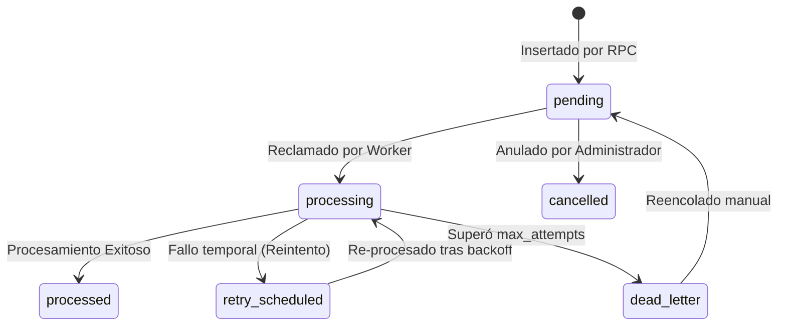

# Diseño del Patrón Transactional Outbox en Facturación SaaS

Este documento define el diseño arquitectónico y de base de datos para la implementación del patrón **Transactional Outbox** en el módulo de facturación de **BarberAgency**, con el objetivo de desacoplar las operaciones financieras críticas de los efectos secundarios externos (envío de correos, notificaciones de WhatsApp, registro en CRM, alertas).

---

## 1. Arquitectura del Sistema

```txt
  [ Operación Financiera (PostgreSQL) ]
                 │
                 ├─► 1. Asiento contable (factura, pago, sub)
                 ├─► 2. Escribir Log e Historial
                 └─► 3. Insertar Evento en public.billing_outbox
                 (Ejecutado de forma atómica en una Transacción SQL)
                 │
            [ COMMIT ]
                 │
     [ billing_outbox Table ] ◄──────┐
                 │                   │
                 │ (Polling)         │ (Liberar bloqueos caducados)
                 ▼                   │
    [ n8n Worker: Outbox Processor ] ┘
                 │
                 ├─► Enviar Correo (Resumen Factura)
                 ├─► Enviar WhatsApp (Confirmación Pago)
                 └─► Actualizar Métricas CRM
```

### Principio de Garantía de Entrega (At-Least-Once):
*   Si la operación en la base de datos se completa con éxito, el evento queda registrado de manera persistente en `billing_outbox`.
*   Si el consumidor externo (n8n, API de correo) falla o se cae la red, la transacción financiera **permanece intacta e inalterable**.
*   El worker de n8n reintentará de manera asíncrona el evento siguiendo políticas de backoff exponencial hasta que se complete con éxito o sea trasladado a la cola de fallos irrecuperables (*Dead-Letter Queue*).

---

## 2. Definición de la Tabla `public.billing_outbox`

Se diseñó la tabla física con los siguientes parámetros y restricciones:
*   **Identificación única:** `id` (UUID Primary Key) y `event_id` (UUID Unique).
*   **Asociación de Agregados:** Mapea el tipo (`aggregate_type`) y el ID del objeto de origen (`aggregate_id`), además de mantener llaves foráneas (`barberia_id`, `subscription_id`, `invoice_id`, `payment_transaction_id`) para facilitar consultas e integridad relacional.
*   **Idempotencia:** Restricción `UNIQUE(idempotency_key)` física para evitar duplicidad al momento de insertar eventos idénticos en paralelo.
*   **Cola de Prioridad:** Columna `priority` para procesar cobros de forma prioritaria frente a notificaciones informativas.

---

## 3. Máquina de Estados del Outbox

Los eventos de outbox transitarán a lo largo del siguiente ciclo de vida:



### Transiciones Permitidas:
*   `pending` -> `processing`, `cancelled`.
*   `processing` -> `processed`, `retry_scheduled`, `dead_letter`.
*   `retry_scheduled` -> `processing`.
*   `dead_letter` -> `pending` (Reencolado manual tras corregir el error externo).
*   **Regra de Inmutabilidad:** El trigger `tr_block_outbox_processed_change` bloquea cualquier cambio de estado o mutación una vez el evento pasa a `processed`.

---

## 4. Concurrencia y Consumo Seguro (Evitar Doble Procesamiento)

Para permitir que múltiples réplicas o ejecuciones simultáneas de n8n consuman de la cola sin procesar dos veces el mismo evento, el RPC de consumo utiliza bloqueos de registro no-bloqueantes:

```sql
SELECT id FROM public.billing_outbox
WHERE status IN ('pending', 'retry_scheduled') AND available_at <= now()
ORDER BY priority DESC, available_at ASC
LIMIT 10
FOR UPDATE SKIP LOCKED; -- Bloquea las filas y omite las ya bloqueadas por otros trabajadores
```

### Mecanismo de Control:
1.  **`locked_at` y `locked_by`:** El worker firma el lote con su ID y la hora del bloqueo.
2.  **Locks Caducados (Stale Locks):** Si un worker se cae a mitad de ejecución, el job `billing_outbox_release_stale_locks` identifica eventos en estado `processing` con bloqueo mayor a 5 minutos, liberándolos automáticamente para su reprocesamiento.
3.  **Límite de Reintentos:** Se establece un máximo de `5` intentos.
4.  **Backoff Exponencial:** Si el intento número $N$ falla, se programa el siguiente reintento sumando un retardo calculado como:
    $$\text{Retardo} = \text{p\_backoff\_seconds} \times 2^{N-1}$$
    *Ejemplo (con base de 10s):* Intento 1 -> reintento en 10s; Intento 2 -> 20s; Intento 3 -> 40s; Intento 4 -> 80s; Intento 5 -> 160s. Superado el quinto fallo, pasa a `dead_letter`.

---

## 5. Políticas de Retención de Datos y Privacidad (RLS)

### 5.1. Seguridad RLS Fail-Closed (Backend-Only)
*   **Configuración:** Se aplica `FORCE ROW LEVEL SECURITY` sobre `billing_outbox` y se revocan todos los privilegios a `PUBLIC`.
*   **Acceso:** No existe ninguna política que permita lectura o escritura al rol `public`, `anon` o `authenticated`. El frontend tiene prohibido consultar el outbox.
*   **Permiso de Consumo:** Exclusivo para el superusuario `postgres` que ejecuta los workflows de n8n.
*   **Privacidad:** El JSON del payload no guarda secretos, tokens de acceso ni datos de tarjeta.

### 5.2. Retención de Registros:
*   **Eventos `processed`:** Se conservan en base de datos durante **90 días** para fines de diagnóstico y conciliación. Pasado este periodo, un cron job de limpieza remueve los registros procesados.
*   **Eventos `dead_letter`:** Se conservan **indefinidamente** hasta que el administrador de la plataforma intervenga manualmente, diagnostique el error de red y llame al RPC requeue.
*   **Eventos `pending` / `processing`:** Nunca se eliminan.

---

## 6. Observabilidad y Métricas Críticas

Se definen los siguientes indicadores clave para el monitoreo del Outbox:

1.  **Eventos Pendientes (`pending_count`):** Cantidad de eventos acumulados sin procesar. Un pico indica caída del worker.
2.  **Evento Más Antiguo sin Procesar (`max_latency_seconds`):** Mide la latencia de procesamiento. Alerta si supera los 15 minutos.
3.  **Tasa de Fallos (`failure_ratio`):** Proporción de eventos que transicionan a `retry_scheduled` o `dead_letter`. Alerta si supera el 5% (indica caída de servicios de correo/WhatsApp).
4.  **Eventos en Dead-Letter (`dead_letter_count`):** Indica fallas duras que requieren intervención manual. Alerta inmediata si el contador es $> 0$.
