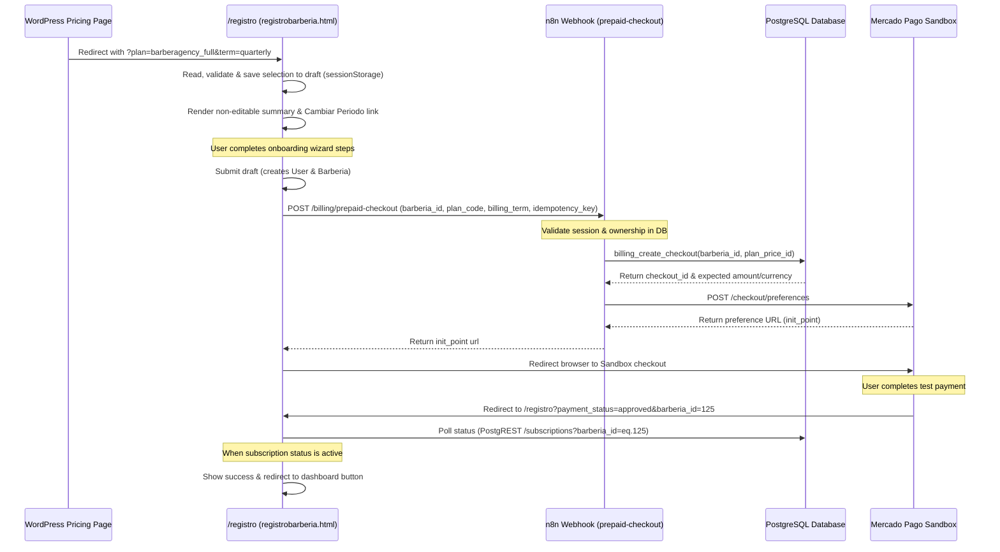

# Implementación de Conexión: Registro y Checkout Sandbox

Este documento detalla la arquitectura, flujos e implementación de la conexión end-to-end (E2E) entre las tarjetas de planes de WordPress, la página de registro `/registro` (`registrobarberia.html`), y el Sandbox de Mercado Pago.

---

## 1. Flujo de Trabajo Integrado



---

## 2. Detalles Técnicos de Implementación

### A. Lectura y Validación de Parámetros
En `registrobarberia.html`, la función `extractAndValidateBillingSelection()` lee los parámetros `plan` y `term` mediante `URLSearchParams`:
*   Acepta únicamente: `plan = barberagency_full` y `term = monthly | quarterly | semiannual | annual`.
*   Si se proporciona un `term` inválido o ausente pero el plan coincide, aplica un fallback seguro a `monthly`.
*   Ignora cualquier parámetro de precio (`amount` o `currency`) provisto externamente.
*   No confía en IDs numéricos de planes en el cliente.

### B. Persistencia del Estado
La selección se guarda dentro de la propiedad `billing_selection` del borrador (`draft`) del onboarding (almacenado bajo las claves de `localStorage` y `sessionStorage` `ba_wp_onboarding_v9` y `ba_landing_seed`):
```json
"billing_selection": {
  "plan_code": "barberagency_full",
  "billing_term": "quarterly",
  "selected_at": "2026-07-14T12:16:51Z",
  "source": "wordpress_pricing"
}
```
Esto garantiza que la selección sobreviva a:
*   Recargas de página.
*   Navegación entre los pasos del wizard.
*   Retornos de autenticación / Google Login.

### C. UI de Resumen y Modificación
El sidebar lateral (`renderLiveSummary`) incluye un bloque informativo no editable con los precios oficiales:
*   **Mensual:** 50.000 COP
*   **Trimestral:** 142.500 COP
*   **Semestral:** 270.000 COP
*   **Anual:** 510.000 COP

Se incluye el enlace **"Cambiar periodo"** que mediante un diálogo interactivo permite al usuario modificar el período seleccionado, recalculando de inmediato los valores informativos y guardando el cambio en el borrador local sin alterar el servidor de forma prematura.

### D. Creación de Checkout y Redirección
Una vez que el backend de onboarding crea con éxito la barbería, la función interceptora del frontend `triggerCheckoutFlow` entra en acción:
1.  Muestra un estado de carga: `"Redirigiendo a checkout..."` y bloquea los botones para evitar doble clic.
2.  Genera una `idempotency_key` única combinando el ID de barbería, período y timestamp para evitar checkouts duplicados en la misma ventana de tiempo.
3.  Llama al endpoint activo del workflow `BA_MP_CREATE_CHECKOUT_PREPAID_SANDBOX` enviando únicamente datos no manipulables: `barberia_id`, `plan_code`, `billing_term`, `idempotency_key` y la sesión de usuario.
4.  El workflow de n8n realiza la consulta a Postgres (ejecutada con el rol de base de datos `authenticated`) resolviendo el ID del precio y validando la propiedad de la barbería.
5.  Tras recibir el `init_point` desde Mercado Pago, redirige al usuario a la pasarela sandbox.

### E. Retorno y Monitoreo (Polling)
La misma URL `/registro` actúa como destino de retorno para Mercado Pago (`success`, `pending`, `failure`). El script intercepta la carga inicial de la página:
*   Si detecta los query parameters `payment_status` y `barberia_id`, dibuja una página de estado interactiva.
*   Muestra el mensaje correspondiente al estado (recibido, pendiente, rechazado).
*   Realiza consultas recurrentes (polling) cada 5 segundos al endpoint seguro `/subscriptions` de PostgREST.
*   Una vez que el webhook de Mercado Pago procesa el pago aprobado y activa la suscripción en base de datos (`status = 'active'`), la UI se actualiza con un mensaje de éxito y un botón para ingresar al Dashboard de BarberAgency.
