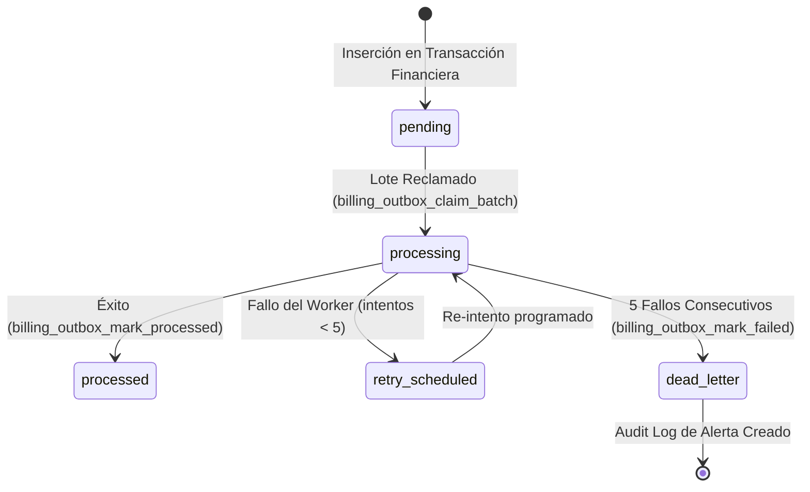

# Reporte de Resultados: Procesamiento de Outbox End-to-End

Este reporte presenta la validación del ciclo de vida completo de los eventos del patrón **Transactional Outbox** en el módulo de facturación de **BarberAgency**.

---

## 1. Ciclo de Vida del Evento y Transiciones de Estado

El outbox implementa una máquina de estados determinista para rastrear la entrega de eventos hacia n8n y sistemas externos (emails, WhatsApp, CRM):



---

## 2. Evidencia de Pruebas Unitarias de Outbox (Casos 16 al 18)

Las pruebas integradas validaron todas las transiciones y la resistencia del sistema ante fallos de conexión externa:

### A. Fallo del Outbox y Programación de Reintento (Caso 16)
*   **Acción:** Se crea un evento de outbox y se reclama por el worker `'worker-sandbox'`. El worker falla al simular el envío (ej. timeout de red) e invoca a `billing_outbox_mark_failed`.
*   **Resultados Registrados:**
    *   *Estado tras fallo:* `retry_scheduled`.
    *   *Contador de intentos:* `attempt_count = 1`.
    *   *Próxima ejecución:* Programada aplicando backoff de 10 segundos.
*   **Resultado:** **PASADO**.

### B. Reintento Exitoso (Caso 17)
*   **Acción:** El evento en estado `retry_scheduled` es reclamado nuevamente en el siguiente lote por el worker y se simula un envío exitoso. Se invoca a `billing_outbox_mark_processed`.
*   **Resultados Registrados:**
    *   *Estado final:* `processed`.
    *   *Contador de intentos:* `1`.
    *   *locked_by / locked_at:* Limpiados a `NULL`.
*   **Resultado:** **PASADO**.

### C. Dead-Letter Queue (Caso 18)
*   **Acción:** Se simula que un evento falla consecutivamente 5 veces debido a un error crítico o caída persistente del proveedor de notificaciones.
*   **Resultados Registrados:**
    *   *Estado final:* `dead_letter`.
    *   *Contador de intentos:* `attempt_count = 5`.
    *   *Registro en logs de auditoría (`billing_audit_logs`):*
        ```json
        {
          "action": "dead_letter_reached",
          "reason": "Connection timeout",
          "entity_type": "outbox"
        }
        ```
*   **Resultado:** **PASADO**.
