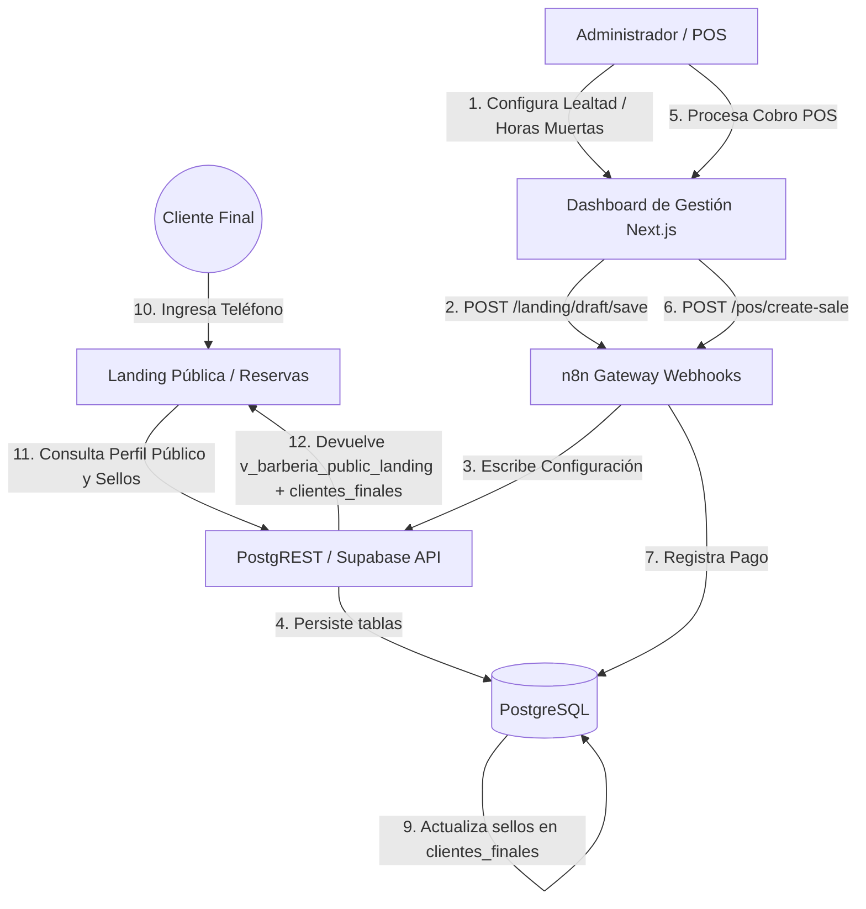

# 📐 Diseño Técnico: Integración del Programa de Lealtad con SSOT (PostgreSQL + n8n)
Este documento presenta el diseño de arquitectura, cambios de base de datos, lógica de negocio y plan de implementación para transicionar el Programa de Lealtad de BarberAgency desde su estado actual de mockup frontend hacia una integración con la Fuente Única de Verdad (SSOT) apta para producción.

---

## 1. Arquitectura Recomendada (Data Flow & SSOT)

Para erradicar los datos mock y garantizar la consistencia multi-tenant, los datos del programa de lealtad se estructuran en dos niveles de persistencia dentro de PostgreSQL:
1. **Configuración del Tenant (Barbería)**: Reglas globales del programa de lealtad por barbería (sellos requeridos, recompensa, horas muertas, activo/inactivo).
2. **Estado del Cliente**: El progreso específico de cada cliente final (sellos acumulados, recompensas listas).

### Diagrama de Flujo de Datos



---

## 2. Cambios Requeridos en PostgreSQL (DDL, Triggers & RLS)

Se propone la creación de una nueva tabla de configuración para el programa de lealtad, la extensión de la tabla de clientes, y un trigger automático que registre los sellos cuando se efectúe un pago.

### 2.1 Nueva Tabla: `public.barberia_loyalty_config`
Esta tabla contiene los parámetros globales del programa para cada barbería (relación 1:1 con `public.barberias`).

```sql
BEGIN;

CREATE TABLE IF NOT EXISTS public.barberia_loyalty_config (
  barberia_id INT PRIMARY KEY REFERENCES public.barberias(id) ON DELETE CASCADE,
  activo BOOLEAN NOT NULL DEFAULT false,
  sellos_requeridos INT NOT NULL DEFAULT 8 CHECK (sellos_requeridos BETWEEN 1 AND 12),
  recompensa TEXT NOT NULL DEFAULT 'Corte gratis',
  
  -- Recordatorios Automáticos
  recordatorio_activo BOOLEAN NOT NULL DEFAULT false,
  mensaje_recordatorio TEXT DEFAULT '¡Hola! Recuerda que tienes tu tarjeta de lealtad activa. ¡Te esperamos!',
  
  -- Horas Muertas
  horas_muertas_activo BOOLEAN NOT NULL DEFAULT false,
  horas_muertas_rango TEXT DEFAULT 'Lunes a Jueves · 2:00pm - 5:00pm',
  horas_muertas_descuento INT NOT NULL DEFAULT 15 CHECK (horas_muertas_descuento BETWEEN 1 AND 100),
  
  -- Cumpleaños
  cumpleanos_activo BOOLEAN NOT NULL DEFAULT false,
  mensaje_cumpleanos TEXT DEFAULT '¡Feliz cumpleaños! Tienes un beneficio especial hoy.',
  
  -- Reactivación de Inactivos
  reactivacion_activo BOOLEAN NOT NULL DEFAULT false,
  dias_inactivo_limite INT NOT NULL DEFAULT 30 CHECK (dias_inactivo_limite > 0),
  mensaje_reactivacion TEXT DEFAULT 'Hace tiempo no nos visitas. Tenemos un descuento especial para ti.',
  
  created_at TIMESTAMPTZ NOT NULL DEFAULT now(),
  updated_at TIMESTAMPTZ NOT NULL DEFAULT now()
);

-- Trigger de updated_at para mantener la auditoría técnica
DROP TRIGGER IF EXISTS trg_barberia_loyalty_config_set_updated_at ON public.barberia_loyalty_config;
CREATE TRIGGER trg_barberia_loyalty_config_set_updated_at
  BEFORE UPDATE ON public.barberia_loyalty_config
  FOR EACH ROW EXECUTE FUNCTION public.fn_set_updated_at();

COMMIT;
```

### 2.2 Extensión de Tabla: `public.clientes_finales`
Añadimos columnas para persistir el progreso de lealtad del cliente.

```sql
BEGIN;

ALTER TABLE public.clientes_finales
  ADD COLUMN IF NOT EXISTS sellos_actuales INT NOT NULL DEFAULT 0 CHECK (sellos_actuales >= 0),
  ADD COLUMN IF NOT EXISTS recompensas_acumuladas INT NOT NULL DEFAULT 0 CHECK (recompensas_acumuladas >= 0),
  ADD COLUMN IF NOT EXISTS fecha_nacimiento DATE;

COMMIT;
```

### 2.3 Automatización: Trigger de Acumulación de Sellos por Pago
Para evitar la doble escritura y sincronizar en tiempo real el POS con la base de datos, un trigger interceptará la inserción de nuevos registros en la tabla `public.pagos`.

```sql
CREATE OR REPLACE FUNCTION public.fn_acumular_sellos_por_pago()
RETURNS trigger AS $$
DECLARE
  v_cliente_id INT;
  v_barberia_id INT;
  v_loyalty_active BOOLEAN;
  v_sellos_requeridos INT;
  v_current_stamps INT;
  v_current_rewards INT;
  v_new_stamps INT;
  v_new_rewards INT;
BEGIN
  -- 1. Obtener cliente_id y barberia_id asociados a la cita del pago
  SELECT cliente_id, barberia_id INTO v_cliente_id, v_barberia_id
  FROM public.citas
  WHERE id = NEW.cita_id;

  -- Salir si la cita no tiene un cliente registrado en clientes_finales
  IF v_cliente_id IS NULL THEN
    RETURN NEW;
  END IF;

  -- 2. Consultar si la barbería tiene el programa de lealtad activo
  SELECT activo, sellos_requeridos INTO v_loyalty_active, v_sellos_requeridos
  FROM public.barberia_loyalty_config
  WHERE barberia_id = v_barberia_id;

  -- Salir si la configuración no existe o el programa está inactivo
  IF v_loyalty_active IS NOT TRUE THEN
    RETURN NEW;
  END IF;

  -- 3. Obtener el estado de lealtad actual del cliente
  SELECT sellos_actuales, recompensas_acumuladas INTO v_current_stamps, v_current_rewards
  FROM public.clientes_finales
  WHERE id = v_cliente_id;

  -- 4. Calcular el nuevo progreso
  v_new_stamps := v_current_stamps + 1;
  v_new_rewards := v_current_rewards;

  -- Si se completan los sellos configurados, se otorga una recompensa y reinician los sellos
  IF v_new_stamps >= v_sellos_requeridos THEN
    v_new_stamps := v_new_stamps - v_sellos_requeridos;
    v_new_rewards := v_new_rewards + 1;
  END IF;

  -- 5. Actualizar el registro del cliente
  UPDATE public.clientes_finales
  SET 
    sellos_actuales = v_new_stamps,
    recompensas_acumuladas = v_new_rewards
  WHERE id = v_cliente_id;

  RETURN NEW;
EXCEPTION
  WHEN OTHERS THEN
    -- Resiliencia en Producción: el fallo en lealtad no debe bloquear el cobro (POS)
    RAISE WARNING 'Fallo en fn_acumular_sellos_por_pago: %', SQLERRM;
    RETURN NEW;
END;
$$ LANGUAGE plpgsql;

-- Asignación del trigger
DROP TRIGGER IF EXISTS trg_acumular_sellos_por_pago ON public.pagos;
CREATE TRIGGER trg_acumular_sellos_por_pago
  AFTER INSERT ON public.pagos
  FOR EACH ROW EXECUTE FUNCTION public.fn_acumular_sellos_por_pago();
```

### 2.4 Seguridad (RLS) y Acceso a Datos
Debemos asegurar que las barberías no puedan leer ni editar configuraciones ajenas.

```sql
-- Forzar RLS en la nueva tabla
ALTER TABLE public.barberia_loyalty_config ENABLE ROW LEVEL SECURITY;
ALTER TABLE public.barberia_loyalty_config FORCE ROW LEVEL SECURITY;

-- Política: Propietarios pueden gestionar la lealtad de sus barberías
CREATE POLICY loyalty_config_owner_all ON public.barberia_loyalty_config
  FOR ALL TO authenticated
  USING (
    EXISTS (
      SELECT 1 FROM public.barberias br
      WHERE br.id = barberia_loyalty_config.barberia_id
        AND br.owner_id = public.jwt_user_id()
        AND br.deleted_at IS NULL
    )
  )
  WITH CHECK (
    EXISTS (
      SELECT 1 FROM public.barberias br
      WHERE br.id = barberia_loyalty_config.barberia_id
        AND br.owner_id = public.jwt_user_id()
        AND br.deleted_at IS NULL
    )
  );

-- Política: Clientes anónimos pueden ver configuraciones de lealtad activas
CREATE POLICY loyalty_config_anon_select ON public.barberia_loyalty_config
  FOR SELECT TO anon
  USING (activo = true);

-- Permisos PostgREST
GRANT SELECT, INSERT, UPDATE, DELETE ON public.barberia_loyalty_config TO authenticated;
GRANT SELECT ON public.barberia_loyalty_config TO anon;
```

---

## 3. Cambios en Frontend (dashboard/state)

### 3.1 Modelado en `src/types/dashboard-state.ts`
Añadimos la estructura de datos del Programa de Lealtad a la interfaz global del estado.

```typescript
// 1. Definir tipo de configuración
export type LoyaltyConfig = {
  activo: boolean;
  sellos_requeridos: number;
  recompensa: string;
  recordatorio_activo: boolean;
  mensaje_recordatorio: string;
  horas_muertas_activo: boolean;
  horas_muertas_rango: string;
  horas_muertas_descuento: number;
  cumpleanos_activo: boolean;
  mensaje_cumpleanos: string;
  reactivacion_activo: boolean;
  dias_inactivo_limite: number;
  mensaje_reactivacion: string;
};

// 2. Extender DashboardMerged en src/types/dashboard-state.ts
export type DashboardMerged = {
  // ... campos actuales
  loyalty: LoyaltyConfig;
};

// 3. Añadir estado inicial en EMPTY_MERGED
export const EMPTY_MERGED: DashboardMerged = {
  // ... campos actuales
  loyalty: {
    activo: false,
    sellos_requeridos: 8,
    recompensa: "Corte gratis",
    recordatorio_activo: false,
    mensaje_recordatorio: "",
    horas_muertas_activo: false,
    horas_muertas_rango: "Lunes a Jueves · 2:00pm - 5:00pm",
    horas_muertas_descuento: 15,
    cumpleanos_activo: false,
    mensaje_cumpleanos: "",
    reactivacion_activo: false,
    dias_inactivo_limite: 30,
    mensaje_reactivacion: ""
  }
};
```

### 3.2 Adaptación del Normalizador (`src/lib/dashboard-api.ts`)
Modificamos `normalizeMergedFromState` para extraer los campos del estado unificado (remoto o borrador local) y evitar fallbacks mockeados.

```typescript
export function normalizeMergedFromState(raw: DashboardStateResponse): DashboardMerged {
  const seed = raw.seed ?? {};
  const draft = raw.draft ?? {};
  const published = raw.published ?? {};
  const merged = raw.merged ?? {};

  // Resolución segura del objeto de lealtad
  const rawLoyalty = merged.loyalty || draft.loyalty || seed.loyalty || {};

  return {
    ...EMPTY_MERGED,
    // ... campos actuales
    loyalty: {
      activo: Boolean(rawLoyalty.activo ?? EMPTY_MERGED.loyalty.activo),
      sellos_requeridos: Number(rawLoyalty.sellos_requeridos ?? EMPTY_MERGED.loyalty.sellos_requeridos),
      recompensa: String(rawLoyalty.recompensa ?? EMPTY_MERGED.loyalty.recompensa).trim(),
      recordatorio_activo: Boolean(rawLoyalty.recordatorio_activo ?? EMPTY_MERGED.loyalty.recordatorio_activo),
      mensaje_recordatorio: String(rawLoyalty.mensaje_recordatorio ?? EMPTY_MERGED.loyalty.mensaje_recordatorio).trim(),
      horas_muertas_activo: Boolean(rawLoyalty.horas_muertas_activo ?? EMPTY_MERGED.loyalty.horas_muertas_activo),
      horas_muertas_rango: String(rawLoyalty.horas_muertas_rango ?? EMPTY_MERGED.loyalty.horas_muertas_rango).trim(),
      horas_muertas_descuento: Number(rawLoyalty.horas_muertas_descuento ?? EMPTY_MERGED.loyalty.horas_muertas_descuento),
      cumpleanos_activo: Boolean(rawLoyalty.cumpleanos_activo ?? EMPTY_MERGED.loyalty.cumpleanos_activo),
      mensaje_cumpleanos: String(rawLoyalty.mensaje_cumpleanos ?? EMPTY_MERGED.loyalty.mensaje_cumpleanos).trim(),
      reactivacion_activo: Boolean(rawLoyalty.reactivacion_activo ?? EMPTY_MERGED.loyalty.reactivacion_activo),
      dias_inactivo_limite: Number(rawLoyalty.dias_inactivo_limite ?? EMPTY_MERGED.loyalty.dias_inactivo_limite),
      mensaje_reactivacion: String(rawLoyalty.mensaje_reactivacion ?? EMPTY_MERGED.loyalty.mensaje_reactivacion).trim()
    }
  };
}
```

### 3.3 Integración en Vistas e Interfaces de Clientes
* **`src/app/clientes/page.tsx` y `src/app/citas/page.tsx`**:
  Se sustituye la hidratación estática de sellos del cliente (`stampCurrent: 0`) por campos dinámicos provenientes de la consulta real:
  ```typescript
  // En mapRealClients / renderizados
  stampCurrent: Number(item.sellos_actuales ?? 0),
  stampRequired: Number(merged.loyalty?.sellos_requeridos ?? 8),
  birthdayBenefit: merged.loyalty?.cumpleanos_activo ? merged.loyalty.mensaje_cumpleanos : "Sin beneficio activo",
  reactivationBenefit: merged.loyalty?.reactivacion_activo ? merged.loyalty.mensaje_reactivacion : "Sin automatización activa",
  offPeakBenefit: merged.loyalty?.horas_muertas_activo ? `${merged.loyalty.horas_muertas_descuento}% OFF en Horas Muertas` : "Sin beneficio activo"
  ```
* **`src/app/finanzas/page.tsx` (Configurador)**:
  Sustituir el estado local `useState` mock por llamadas al contexto global `useDashboard()`. Al accionar el botón de guardado en la interfaz, se gatillará `saveDraft()` pasando la estructura estructurada `loyalty` actualizada.
* **`src/components/dashboard-editor.tsx` (Inicio)**:
  Reemplazar los textos estáticos ("4 / 6 sellos completados", "+15%", etc.) por datos reales extraídos del estado de lealtad general de la barbería (`merged.loyalty`).

---

## 4. Cambios en n8n Workflows (Webhooks & Notificaciones)

### 4.1 Modificación en `dashboard/state` Webhook
* **Paso Actual**: Hace consultas sql en PostgreSQL por PostgREST para armar la semilla (`seed`), borrador (`draft`) y publicado (`published`).
* **Cambio Requerido**: Añadir una consulta a la tabla `public.barberia_loyalty_config` vinculada por `barberia_id`. El webhook inyectará el objeto `loyalty` dentro de la clave `merged`, `draft` y `published` de la respuesta JSON para que el normalizador frontend lo reciba de forma transparente.

### 4.2 Modificación en Webhooks de Escritura (`landing/draft/save` y `landing/save-v2`)
* **Cambio Requerido**: Extraer el nodo `loyalty` del payload entrante. Utilizar un nodo PostgreSQL en n8n para insertar/actualizar (`ON CONFLICT (barberia_id) DO UPDATE`) las configuraciones correspondientes en la tabla `public.barberia_loyalty_config`.

### 4.3 Nuevo Workflow: Notificaciones de Lealtad (WhatsApp / SMS)
* **Trigger**: Webhook gatillado desde PostgreSQL (vía trigger/notify o escucha directa de inserción en pagos que altera los sellos de un cliente).
* **Lógica**:
  1. Comparar el valor de `sellos_actuales` previo con el posterior.
  2. Si `sellos_actuales` incrementa en 1: Enviar mensaje tipo *"¡Felicidades, has acumulado un sello! Llevas 4/8 sellos para tu recompensa"*.
  3. Si `recompensas_acumuladas` incrementa en 1: Enviar mensaje tipo *"¡Has completado tu tarjeta! Obtienes: Corte gratis en tu próxima visita"*.

### 4.4 Nuevo Workflow: Automatizaciones Programadas (Cron Jobs)
* **Cumpleaños (Diario, 8:00 AM)**:
  - Consulta clientes en la base de datos cuya fecha de cumpleaños coincida con hoy (`EXTRACT(month FROM fecha_nacimiento) = EXTRACT(month FROM CURRENT_DATE) AND EXTRACT(day FROM fecha_nacimiento) = EXTRACT(day FROM CURRENT_DATE)`).
  - Envía la plantilla de WhatsApp configurada en `mensaje_cumpleanos` (si `cumpleanos_activo` es verdadero).
* **Reactivación de Clientes Inactivos (Semanal)**:
  - Consulta clientes de la barbería cuya última visita supere el límite de `dias_inactivo_limite` días y que no tengan citas futuras agendadas.
  - Envía el mensaje de reactivación personalizado (`mensaje_reactivacion`).

---

## 5. Cambios en Landing Pública

Para que los clientes finales puedan consumir el estado del programa y reservar con los beneficios configurados de horas muertas:

1. **Extensión de la Vista Pública**:
   La vista `public.v_barberia_public_landing` debe incluir mediante un `LEFT JOIN` las columnas configuradas en `public.barberia_loyalty_config`:
   ```sql
   CREATE OR REPLACE VIEW public.v_barberia_public_landing AS
   SELECT
     p.slug,
     p.nombre_publico,
     -- ... campos de perfil público
     l.activo AS loyalty_activo,
     l.sellos_requeridos AS loyalty_sellos_requeridos,
     l.recompensa AS loyalty_recompensa,
     l.horas_muertas_activo,
     l.horas_muertas_rango,
     l.horas_muertas_descuento
   FROM public.barberia_public_profiles p
   LEFT JOIN public.barberia_loyalty_config l ON l.barberia_id = p.barberia_id
   WHERE p.enabled = true;
   ```
2. **Reservas (Módulo Widget)**:
   * El sistema de agendamiento público leerá `horas_muertas_activo`. Si está habilitado, comparará la fecha y hora seleccionada por el usuario con el rango estipulado (`horas_muertas_rango`).
   * Si la reserva coincide (ej. Martes a las 3:00 PM), aplicará dinámicamente un descuento visual en el checkout (`horas_muertas_descuento`) y guardará el precio final con el descuento en la base de datos.
3. **Consulta de Tarjeta del Cliente**:
   * Al loguearse el usuario final con su teléfono (vía OTP) en la landing, la interfaz consumirá el valor de `sellos_actuales` de `clientes_finales` y los renderizará usando el componente visual de tijeras/sellos para que el cliente verifique su balance antes de asistir.

---

## 6. Riesgos de Migración en Producción

> [!CAUTION]
> 1. **Downtime del n8n**: Si el webhook de guardado de lealtad falla, la barbería no podrá salvar configuraciones. Se implementará un mecanismo de reintentos con colas de mensajes y un visualizador de errores explícito en Next.js (no silencioso).
> 2. **Rendimiento y Bloqueos en POS**: El trigger `AFTER INSERT ON public.pagos` se ejecuta síncronamente. Si falla o genera demoras por un bloqueo de transacciones, detendrá los cobros de la barbería.
>    * *Mitigación:* Se ha envuelto la lógica del trigger en un bloque `EXCEPTION` robusto para que cualquier error de cálculo de sellos registre un warning en el log del motor SQL pero nunca detenga la inserción del pago ni rompa la experiencia del cajero.
> 3. **Seguridad y RLS**: Un error en la consulta JWT podría permitir a un owner editar configuraciones de lealtad de otro.
>    * *Mitigación:* Las políticas de RLS en `public.barberia_loyalty_config` se enlazan estrictamente al identificador `owner_id` de la tabla `public.barberias` mediante `public.jwt_user_id()`.
> 4. **Retroactividad**: Clientes existentes con visitas completadas previamente no tendrán sellos cargados.
>    * *Decisión:* Se debe definir si se ejecuta un script de migración masivo que asigne sellos históricos basados en las citas pasadas en estado 'confirmada' con pago en `public.pagos`.

---

## 7. Plan de Implementación Priorizado

```
                     FASE 1: PERSISTENCIA Y SEGURIDAD (P0)
                                      │
                                      ▼
                        FASE 2: CONECTIVIDAD n8n (P1)
                                      │
                                      ▼
                       FASE 3: INTEGRACIÓN FRONTEND (P1)
                                      │
                                      ▼
                      FASE 4: CAPA PÚBLICA Y AUTOMACIÓN (P2)
```

### Fase 1: Base de Datos, Seguridad y Triggers (P0)
* **Objetivo:** Sentar las bases del almacenamiento y cálculo automático de sellos.
* **Acciones:**
  1. Ejecutar el script SQL para crear `public.barberia_loyalty_config`.
  2. Añadir las columnas de lealtad en `public.clientes_finales`.
  3. Crear la función del trigger y activarla sobre la tabla `public.pagos`.
  4. Habilitar y validar las políticas RLS.

### Fase 2: Conectividad en n8n (P1)
* **Objetivo:** Sincronizar la API con el nuevo estado del negocio.
* **Acciones:**
  1. Modificar el flujo de n8n `dashboard/state` para incluir la consulta a la configuración de lealtad.
  2. Modificar los flujos `draft/save` y `save-v2` para persistir el nodo `loyalty` recibido del frontend.

### Fase 3: Integración Frontend en el Dashboard (P1)
* **Objetivo:** Hacer que la interfaz administrativa consuma y envíe datos reales.
* **Acciones:**
  1. Actualizar las definiciones en `src/types/dashboard-state.ts` y el normalizador en `src/lib/dashboard-api.ts`.
  2. Conectar el configurador en `src/app/finanzas/page.tsx` para leer y actualizar el contexto unificado.
  3. Conectar la tarjeta de lealtad de la home y de los listados de clientes/citas con los datos dinámicos.

### Fase 4: Capa Pública y Automatización de Notificaciones (P2)
* **Objetivo:** Desplegar el sistema al cliente final e iniciar envíos automáticos.
* **Acciones:**
  1. Actualizar la vista pública `v_barberia_public_landing`.
  2. Habilitar la sección de lealtad y el cálculo automático de horas muertas en la landing y widget de reservas.
  3. Desplegar los nuevos workflows n8n para envío de WhatsApp (diario/evento).
