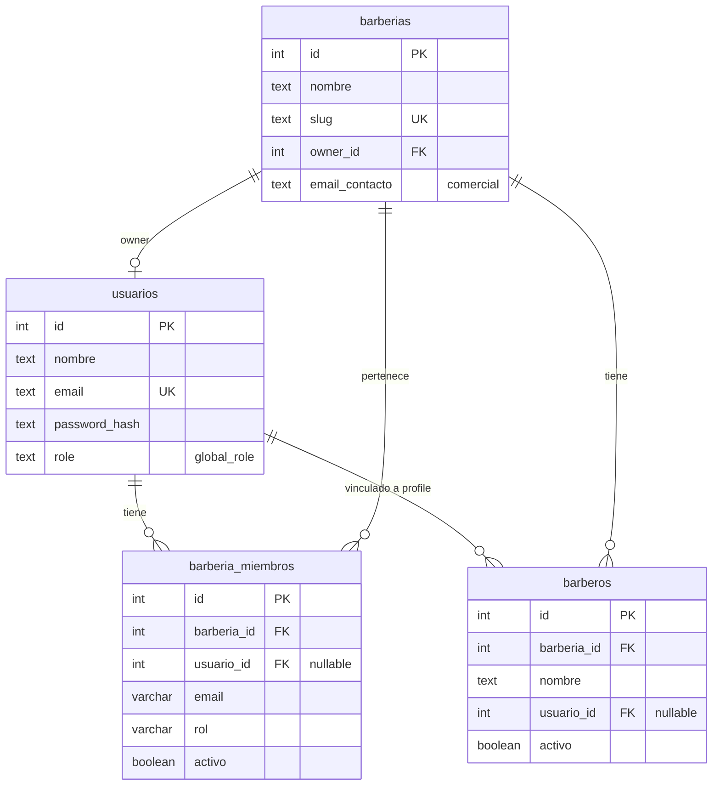
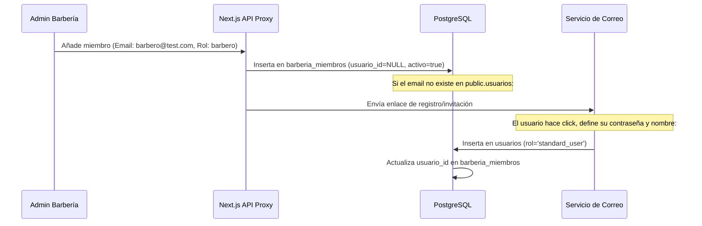

# Auditoría Completa de Usuarios y Accesos — BarberAgency

Este documento presenta la auditoría técnica detallada sobre la gestión de usuarios, roles y permisos en la plataforma **BarberAgency**, enfocada en garantizar la robustez, el aislamiento multi-tenant y la prevención de fallos de seguridad comunes.

---

## 1. Mapa Actual de Permisos (RBAC)

La aplicación implementa un sistema de control de acceso basado en roles (RBAC) con dos niveles de validación:
1. **Frontend (Cliente)**: Los permisos se agrupan en flags booleanos en [dashboard-access.ts](file:///C:/Users/calvi/OneDrive/n8n/Visual%20studio/barberagency-core/_work_panel_de_barberia/src/lib/dashboard-access.ts) y determinan la visualización de vistas y rutas del panel.
2. **Backend (Base de Datos / Webhooks n8n)**: Las consultas SQL en los webhooks principales determinan si un `user_id` autenticado (proveniente del JWT de la cookie `ba_session`) tiene permitido cargar el estado o guardar cambios para una barbería en particular.

### Matriz de Permisos por Rol

| Permiso / Capacidad | Super Admin | Owner | Admin | Cajero | Barbero | Guest |
| :--- | :---: | :---: | :---: | :---: | :---: | :---: |
| **Ver Dashboard** (`canViewDashboard`) | ✅ | ✅ | ✅ | ✅ | ✅ | ❌ |
| **Ver Agenda/Citas** (`canViewAppointments`) | ✅ | ✅ | ✅ | ✅ | ✅ | ❌ |
| **Ver Clientes** (`canViewClients`) | ✅ | ✅ | ✅ | ✅ | ❌ | ❌ |
| **Ver Barberos** (`canViewBarbers`) | ✅ | ✅ | ✅ | ❌ | ❌ | ❌ |
| **Ver Servicios** (`canViewServices`) | ✅ | ✅ | ✅ | ❌ | ❌ | ❌ |
| **Ver Programa Lealtad** (`canViewLoyalty`) | ✅ | ✅ | ✅ | ❌ | ❌ | ❌ |
| **Ver POS / Inventario** (`canViewPOS`) | ✅ | ✅ | ✅ | ✅ | ❌ | ❌ |
| **Cobrar en POS** (`canChargePOS`) | ✅ | ✅ | ✅ | ✅ | ❌ | ❌ |
| **Ver Configuración** (`canViewSettings`) | ✅ | ✅ | ✅ | ❌ | ❌ | ❌ |
| **Editar/Publicar Landing** (`canPublishLanding`) | ✅ | ✅ | ✅ | ❌ | ❌ | ❌ |
| **Finanzas Globales** (`canViewGlobalFinance`) | ✅ | ✅ | ✅ | ❌ | ❌ | ❌ |

---

## 2. Tablas Involucradas en el Control de Acceso

La lógica de autenticación y permisos depende de cuatro tablas en el esquema `public`:

### 2.1. `public.usuarios`
- Almacena las credenciales globales y la identidad del usuario.
- Campo crítico `role`: Determina el rol predeterminado en el sistema (por ejemplo: `super_admin`, `barbero`, `cajero`).

### 2.2. `public.barberias`
- Almacena los metadatos comerciales y la landing.
- Campo crítico `owner_id`: Apunta al usuario propietario de la barbería. Es la máxima autoridad del tenant.
- Campo crítico `email_contacto`: Correo puramente informativo/comercial de la barbería.

### 2.3. `public.barberia_miembros`
- Tabla multi-tenant que mapea los accesos específicos de usuarios/correos a cada barbería.
- Campos clave: `barberia_id`, `usuario_id` (enlazado si está registrado), `email` (utilizado para invitaciones/emparejamiento), `rol` (rol específico dentro del tenant) y `activo`.

### 2.4. `public.barberos`
- Define los perfiles comerciales de los barberos que se muestran en la landing y agenda.
- Campo clave `usuario_id` (nullable): Liga el perfil de catálogo comercial con un usuario autenticable de la tabla `public.usuarios`.

---

## 3. Matriz de Riesgos Identificados

Hemos auditado los flujos de producción (los JSONs de los webhooks de n8n) y los scripts de desarrollo/despliegue localizados en `pruebas/`. A continuación se detallan los riesgos de seguridad y consistencia:

### ⚠️ Riesgo 1: Código Inseguro en Scripts de Despliegue (Riesgo de Regresión)
* **Descripción**: Los archivos de flujo en producción (`login_workflow.json` y `dashboard_state_workflow.json`) fueron corregidos previamente para usar `barberia_miembros`. Sin embargo, los scripts automatizados de despliegue en la carpeta del desarrollador ([update_login_workflow.js](file:///C:/Users/calvi/OneDrive/n8n/Visual%20studio/barberagency-core/pruebas/update_login_workflow.js) y [update_session_me_workflow.js](file:///C:/Users/calvi/OneDrive/n8n/Visual%20studio/barberagency-core/pruebas/update_session_me_workflow.js)) **aún contienen la query SQL obsoleta** que otorga permisos de administrador basados en `email_contacto`:
  `AND (tb.owner_id = u.id OR lower(COALESCE(tb.email_contacto, '')) = lower(u.email))`
* **Impacto**: Si algún desarrollador o pipeline de CI/CD vuelve a ejecutar estos scripts para actualizar los webhooks, sobrescribirá la base de datos de n8n en producción con la lógica vulnerable, re-introduciendo la falla de `email_contacto`.
* **Severidad**: **CRÍTICA (P0)**.

### ⚠️ Riesgo 2: Vinculación Indebida de Barberos Existentes por Email
* **Descripción**: En la query de actualización de configuración (`config_update_workflow.json`), cuando un administrador crea un barbero nuevo declarando un correo electrónico, el backend busca si el correo ya existe en `public.usuarios`. Si existe, **asocia directamente ese usuario_id al nuevo perfil de barbero** sin requerir confirmación, verificación de clave ni permiso del usuario afectado.
* **Impacto**: Un administrador de la Barbería A podría "robar" el enlace de cuenta o asociar perfiles de barberos a cualquier dirección de correo registrada en la plataforma (por ejemplo, el correo del Super Admin o el de dueños de otras barberías). Aunque esto no le permite loguearse con la cuenta de la víctima, rompe la integridad referencial y asocia identidades ajenas.
* **Severidad**: **MEDIA-ALTA**.

### ⚠️ Riesgo 3: Rol Vacío por Defecto a `admin` (Implicit Admin Promotion)
* **Descripción**: En el webhook de login actual, existe la expresión:
  `COALESCE(NULLIF(u.role, ''), 'admin') IN ('admin', 'owner', 'super_admin')`
  Si la columna `role` de un usuario es nula o vacía en `public.usuarios`, el sistema le otorga por defecto el rol global `'admin'` al iniciar sesión.
* **Impacto**: Va en contra del principio de menor privilegio. Cualquier error en el onboarding o registro que deje la columna `role` vacía promoverá al usuario a administrador de forma implícita.
* **Severidad**: **MEDIA**.

### ⚠️ Riesgo 4: Desconexión de Datos entre Perfil Comercial e Identidad de Usuario
* **Descripción**: El nombre comercial del barbero se almacena en `public.barberos.nombre` y el nombre de su usuario de acceso en `public.usuarios.nombre`. Las actualizaciones de configuración modifican la tabla `public.barberos`, pero nunca actualizan `public.usuarios`.
* **Impacto**: Inconsistencias visuales en el panel donde el barbero ve su nombre de usuario antiguo en la esquina superior del panel, mientras que los clientes ven su nombre comercial modificado en la landing y agenda.
* **Severidad**: **BAJA**.

### 🔍 Mitigación / Estatus de los Requerimientos del Usuario:
* **¿Se pueden borrar emails de barberos?**: **NO**. La tabla `public.barberos` no tiene la columna `email`. Las direcciones de correo electrónico solo residen en `public.usuarios` y no existe ninguna sentencia de borrado o actualización de usuarios en el flujo de configuración comercial.
* **¿Se pueden borrar contraseñas?**: **NO**. El script de actualización de configuración utiliza `crypt(nba.password, gen_salt('bf', 8))` solo para insertar nuevos usuarios. No realiza sentencias `UPDATE` sobre la contraseña de usuarios existentes.
* **¿Se puede cambiar owner_id accidentalmente?**: **NO**. La sentencia `UPDATE public.barberias` en el webhook de configuración no incluye el campo `owner_id`.
* **¿Se otorgan permisos usando `email_contacto`?**: **NO en producción actualmente**, pero existe un **alto riesgo de regresión** si se ejecutan los scripts de automatización de despliegue antes mencionados.

---

## 4. Diseño Productivo de Usuarios y Accesos (Propuesta)

Para eliminar definitivamente la fragilidad del control de acceso multi-tenant, proponemos las siguientes directrices y reestructuraciones a implementar a futuro:

### A. Desacoplamiento Completo del Rol Global
El rol de un usuario debe ser de contexto de negocio (a nivel de barbería), no global en `public.usuarios.role` (excepto para administradores de la plataforma / `super_admin`):
* El inicio de sesión sólo verifica credenciales globales (email + hash).
* La autorización de accesos se delega estrictamente a `public.barberia_miembros`.
* Si un usuario no posee membresía en una barbería, su rol por defecto es `guest` (403).

### B. Flujo Seguro de Invitación de Miembros (En lugar de creación implícita)
En lugar de crear usuarios automáticamente en el catálogo comercial, implementar un flujo de invitación asíncrona:

### C. Restricción de Vinculación de Barberos Existentes
* Modificar el comportamiento de la actualización de barberos: si el correo proporcionado ya pertenece a un usuario, no asociar el `usuario_id` de forma inmediata. Se debe generar un estado `pendiente_confirmacion` que requiera que el usuario acepte la invitación a la barbería en su propio panel antes de ligar la cuenta.
